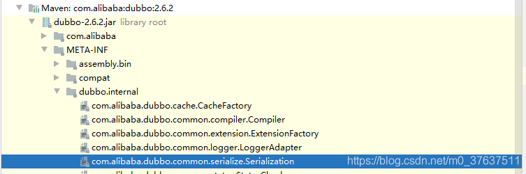
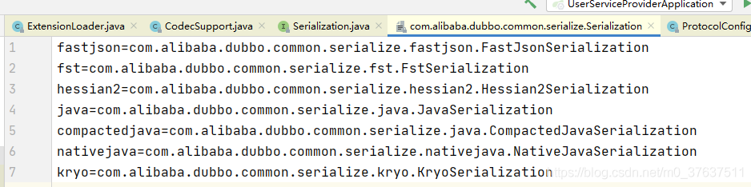
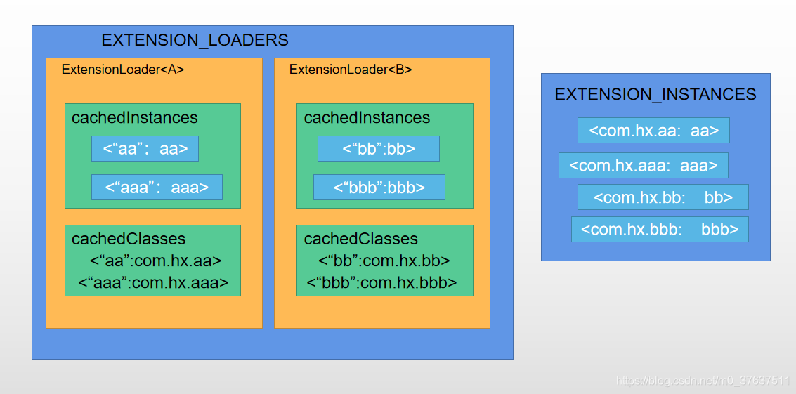

# 前言
`Dubbo`通过`ExtensionLoader`实现了`SPI`机制，给整个框架提供了扩展性，看源码过程中发现用了很多次`synchronized`以及`ConcurrentHashMap`，粗略思考了原因，记录下这篇笔记

# 使用
简单说一下使用
```java
Serialization serialization = ExtensionLoader.getExtensionLoader(Serialization.class).getExtension("kryo");
```
上述代码加载了下述路径下对应文件中由`kryo`指向的`com.alibaba.dubbo.common.serialize.kryo.KryoSerialization`





如果要自定义，则自己实现一个接口，并将实现类放入上述相似路径的对应文件中即可，从而实现对每个接口实现类的可拔插扩展，说白了本质就还是一个工厂模式，与IOC一样

# 源码浅析
## 流程梳理
源码部分主要就是看`getExtensionLoader`与`getExtension`两个方法了，`Dubbo`该机制还能够自适应地导入实现类，对应方法为`getAdaptiveExtension`，这部分以后有空再看了

首先，将今天要解析的部分抽离出来，可以实现最基本的拔插功能，这篇文章重点主要在于线程安全问题的分析，因为整个流程代码比较易懂，但为什么要上锁不太容易理解
```java

import lombok.extern.slf4j.Slf4j;

import java.io.BufferedReader;
import java.io.IOException;
import java.io.InputStreamReader;
import java.net.URL;
import java.util.Enumeration;
import java.util.HashMap;
import java.util.Map;
import java.util.concurrent.ConcurrentHashMap;

import static java.nio.charset.StandardCharsets.UTF_8;

/**
 * refer to dubbo spi: https://dubbo.apache.org/zh-cn/docs/source_code_guide/dubbo-spi.html
 */
@Slf4j
public final class ExtensionLoader<T> {

    private static final String SERVICE_DIRECTORY = "META-INF/extensions/";
    private static final Map<Class<?>, ExtensionLoader<?>> EXTENSION_LOADERS = new ConcurrentHashMap<>();
    private static final Map<Class<?>, Object> EXTENSION_INSTANCES = new ConcurrentHashMap<>();

    private final Class<?> type;
    private final Map<String, Holder<Object>> cachedInstances = new ConcurrentHashMap<>();
    private final Holder<Map<String, Class<?>>> cachedClasses = new Holder<>();

    private ExtensionLoader(Class<?> type) {
        this.type = type;
    }

    public static <S> ExtensionLoader<S> getExtensionLoader(Class<S> type) {
        if (type == null) {
            throw new IllegalArgumentException("Extension type should not be null.");
        }
        if (!type.isInterface()) {
            throw new IllegalArgumentException("Extension type must be an interface.");
        }
        if (type.getAnnotation(SPI.class) == null) {
            throw new IllegalArgumentException("Extension type must be annotated by @SPI");
        }
        // firstly get from cache, if not hit, create one
        ExtensionLoader<S> extensionLoader = (ExtensionLoader<S>) EXTENSION_LOADERS.get(type);
        if (extensionLoader == null) {
            EXTENSION_LOADERS.putIfAbsent(type, new ExtensionLoader<S>(type));
            extensionLoader = (ExtensionLoader<S>) EXTENSION_LOADERS.get(type);
        }
        return extensionLoader;
    }

    public T getExtension(String name) {
        if (name == null || name.isEmpty()) {
            throw new IllegalArgumentException("Extension name should not be null or empty.");
        }
        // firstly get from cache, if not hit, create one
        Holder<Object> holder = cachedInstances.get(name);
        if (holder == null) {
            cachedInstances.putIfAbsent(name, new Holder<>());
            holder = cachedInstances.get(name);
        }
        // create a singleton if no instance exists
        Object instance = holder.get();
        if (instance == null) {
            synchronized (holder) {
                instance = holder.get();
                if (instance == null) {
                    instance = createExtension(name);
                    holder.set(instance);
                }
            }
        }
        return (T) instance;
    }

    private T createExtension(String name) {
        // load all extension classes of type T from file and get specific one by name
        Class<?> clazz = getExtensionClasses().get(name);
        if (clazz == null) {
            throw new RuntimeException("No such extension of name " + name);
        }
        // 根据类型从全局获取
        T instance = (T) EXTENSION_INSTANCES.get(clazz);
        if (instance == null) {
            try {
                EXTENSION_INSTANCES.putIfAbsent(clazz, clazz.newInstance());
                instance = (T) EXTENSION_INSTANCES.get(clazz);
            } catch (Exception e) {
                log.error(e.getMessage());
            }
        }
        return instance;
    }

    private Map<String, Class<?>> getExtensionClasses() {
        // get the loaded extension class from the cache
        Map<String, Class<?>> classes = cachedClasses.get();
        // double check
        // 这里加锁是避免重复类加载，必须保证每个类全局只加载一次
        if (classes == null) {
            synchronized (cachedClasses) {
                classes = cachedClasses.get();
                if (classes == null) {
                    classes = new HashMap<>();
                    // load all extensions from our extensions directory
                    loadDirectory(classes);
                    cachedClasses.set(classes);
                }
            }
        }
        return classes;
    }

    private void loadDirectory(Map<String, Class<?>> extensionClasses) {
        String fileName = ExtensionLoader.SERVICE_DIRECTORY + type.getName();
        try {
            Enumeration<URL> urls;
            ClassLoader classLoader = ExtensionLoader.class.getClassLoader();
            urls = classLoader.getResources(fileName);
            if (urls != null) {
                while (urls.hasMoreElements()) {
                    URL resourceUrl = urls.nextElement();
                    loadResource(extensionClasses, classLoader, resourceUrl);
                }
            }
        } catch (IOException e) {
            log.error(e.getMessage());
        }
    }

    private void loadResource(Map<String, Class<?>> extensionClasses, ClassLoader classLoader, URL resourceUrl) {
        try (BufferedReader reader = new BufferedReader(new InputStreamReader(resourceUrl.openStream(), UTF_8))) {
            String line;
            // read every line
            while ((line = reader.readLine()) != null) {
                // get index of comment
                final int ci = line.indexOf('#');
                if (ci >= 0) {
                    // string after # is comment so we ignore it
                    line = line.substring(0, ci);
                }
                line = line.trim();
                if (line.length() > 0) {
                    try {
                        final int ei = line.indexOf('=');
                        String name = line.substring(0, ei).trim();
                        String clazzName = line.substring(ei + 1).trim();
                        // our SPI use key-value pair so both of them must not be empty
                        if (name.length() > 0 && clazzName.length() > 0) {
                            Class<?> clazz = classLoader.loadClass(clazzName);
                            extensionClasses.put(name, clazz);
                        }
                    } catch (ClassNotFoundException e) {
                        log.error(e.getMessage());
                    }
                }

            }
        } catch (IOException e) {
            log.error(e.getMessage());
        }
    }
}
```
其中包括两个静态变量，可以理解为全局变量
* `EXTENSION_LOADERS`
* `EXTENSION_INSTANCES`

两个成员变量
* `cachedInstances`
* `cachedClasses`

假设现在有`interfaceA`,`interfaceB`,分别拥有两个实现类，`aa\aaa`与`bb\bbb`，上述结构的作用对应下图，浅蓝色小框表示被实例化的实例对象，尽管有重复的框，但表示的都是同一个对象


根据源码与上图，我们可以得出执行流程，当调用```ExtensionLoader.getExtensionLoader(A.class).getExtension("aa");```时
1. `getExtensionLoader(A.class)`先从`EXTENSION_LOADERS`中获取```ExtensionLoader<A>```
2. 如果获取不到，则新建一个，并加入`EXTENSION_LOADERS`中
3. 接着执行```ExtensionLoader<A>```的`getExtension("aa")`，从`cachedInstances`中获取`"aa"`对应的实例
4. 有则返回，没有则通过`createExtension`创建
5. `createExtension`创建过程中，查询`cachedClasses`是否有内容，没有则从配置文件中加载内容，并完成类的加载
6. 有则获取`“aa”`对应的类，并返回
7.  `createExtension`过程从`cachedClasses`获取到对应的类后，通过类名从`EXTENSION_INSTANCES`进行获取，如果能够获取到实例，则返回，不能则进行实例化，并将结果同步到`EXTENSION_INSTANCES`中

## 并发问题分析
在上述过程中，哪些步骤会有并发安全问题呢？最常见的就是先查询再插入这一过程，我们挨个进行分析

首先，上述四个结构中，四个都是`Map`，除了`cachedClasses`，其余三个都为`ConcurrentMap`
源码中常常是这么使用`ConcurrentMap`的

```java
            concurrentMap.putIfAbsent(name, new Object(name));
            object = concurrentMap.get(name);
```
* 这种方式相当于`CAS`，看谁占位成功，就用谁的结果，这样能够保证插入与获取的一致性，以及保证线程安全
* 例如，假设同时有两个线程执行上述操作，`线程A`创建了`实例a`，`线程B`创建了`实例b`，两者同时进行插入，由于`concurrentMap`插入是上了`同步锁`的，因此只有一个线程能够成功，另一个会失败，假设`实例a`插入成功了，则`线程B`获取到的也是`实例a`
* 如果使用`HashMap`，很可能在`线程A`刚插入`实例a`，`线程B`获取插入位置的状态还是无内容，从而也进行插入，`线程A`就会丢失修改了
* 理解了上述道理，就能够理解
```java
        ExtensionLoader<S> extensionLoader = (ExtensionLoader<S>) EXTENSION_LOADERS.get(type);
        if (extensionLoader == null) {
            EXTENSION_LOADERS.putIfAbsent(type, new ExtensionLoader<S>(type));
            extensionLoader = (ExtensionLoader<S>) EXTENSION_LOADERS.get(type);
        }
```

接着进入`getExtension`这一步
```java
    public T getExtension(String name) {
        if (name == null || name.isEmpty()) {
            throw new IllegalArgumentException("Extension name should not be null or empty.");
        }
        // firstly get from cache, if not hit, create one
        Holder<Object> holder = cachedInstances.get(name);
        if (holder == null) {
            cachedInstances.putIfAbsent(name, new Holder<>());
            holder = cachedInstances.get(name);
        }
        // create a singleton if no instance exists
        Object instance = holder.get();
        if (instance == null) {
            synchronized (holder) {
                instance = holder.get();
                if (instance == null) {
                    instance = createExtension(name);
                    holder.set(instance);
                }
            }
        }
        return (T) instance;
    }
```
这一步的实现有点奇怪，你可能会问`Holder`有啥用？

为什么不直接  ```cachedInstances.putIfAbsent(name,createExtension(name))```，还要搞这么多步

先放着这个问题，我们先看看`createExtension`(name)怎么创建实例对象的
```java
    private T createExtension(String name) {
        // load all extension classes of type T from file and get specific one by name
        Class<?> clazz = getExtensionClasses().get(name);
        if (clazz == null) {
            throw new RuntimeException("No such extension of name " + name);
        }
        // 根据类型从全局获取
        T instance = (T) EXTENSION_INSTANCES.get(clazz);
        if (instance == null) {
            try {
                EXTENSION_INSTANCES.putIfAbsent(clazz, clazz.newInstance());
                instance = (T) EXTENSION_INSTANCES.get(clazz);
            } catch (Exception e) {
                log.error(e.getMessage());
            }
        }
        return instance;
    }
```
首先调用`getExtensionClasses().get(name)`获取需要被实例化的类
```java
    private Map<String, Class<?>> getExtensionClasses() {
        // get the loaded extension class from the cache
        Map<String, Class<?>> classes = cachedClasses.get();
        // double check
        // 这里加锁是避免重复类加载，必须保证每个类全局只加载一次
        if (classes == null) {
            synchronized (cachedClasses) {
                classes = cachedClasses.get();
                if (classes == null) {
                    classes = new HashMap<>();
                    // load all extensions from our extensions directory
                    loadDirectory(classes);
                    cachedClasses.set(classes);
                }
            }
        }
        return classes;
    }
```
* `loadDirectory`会根据配置文件，将对应类进行类加载，如果在这里我们不加锁，那么并发操作发生时，多个线程同时判断`classes`为空，就会进行多次类初始化
* 那么这里为什么不用`concurrentMap.putIfAbsent(name, loadDirectory(classes))`;的方式？因为这样`loadDirectory`还是会被并发执行，无法保证类只加载一次
* 所以上述方案为必须，因为用了`synchronized`，所以不需要使用`ConcurrentHashMap`

那么从`getExtensionClasses().get(name)`获取到对应类名后，先查看`EXTENSION_INSTANCES`中是否已经有对应实例了，因为在其他`ExtensionLoader`中可能也会实例化该类型，这种方式能够保证实例全局唯一，即单例

如果获取不到，则通过`putIfAbsent`方法进行实例化并插入，保证线程安全

最终`createExtension`能够返回全局唯一单例实例

我们继续思考为什么不直接  ```cachedInstances.putIfAbsent(name,createExtension(name))```，还要搞这么多步？
* 该方法会使得`createExtension`执行多次
* 导致`getExtensionClasses`()也会执行多次
	* 但该方法使用`synchronized+双重检查`，因此`loadDirectory`无论如何也只会执行一次，故没问题
* 导致`EXTENSION_INSTANCES.putIfAbsent(clazz, clazz.newInstance())`会执行多次，即`clazz.newInstance()`会执行多次
	* 但由于类似`CAS`机制，最后也只会留下第一个占位成功的`instance`，故没问题
* 所以我其实并不能明白为什么不直接```cachedInstances.putIfAbsent(name,createExtension(name))```

至于为什么要用`Holder`，是便于后面加锁`synchronized (holder)` ，细化锁的粒度，如果不`new` 一个`Holder`，那么加锁的时候就没有锁不到map的Value这个粒度了

但目前分析下来感觉没必要

# 总结
从上面的分析，我们大概可以知道
* 同一`ExtensionLoader`下，并发加载类时，保证只进行一次类加载，但如果同一个类出现在不同`ExtensionLoader`中，那么就会出现重复加载
* 最终所有线程获取到的实例都是`全局唯一单例`，并存储在`EXTENSION_INSTANCES`中