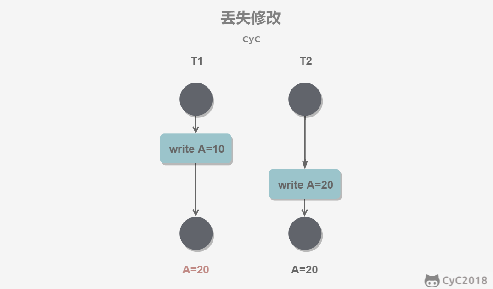

# 前言

[周瑜老师的mysql讲解](https://www.bilibili.com/video/BV1W64y1u761?p=9&spm_id_from=pageDriver)

[数据结构查询工具](www.cs.usfca.edu/~galles/visualization/Algorithms.html)

看了视频讲解才知道，原来mysql的设计如此巧妙，且B+树索引结构是mysql的根基，为了巩固知识，故做此笔记

# 索引

mysql的索引底层实现就是一棵B+树，那么为什么要用B+树，以及有什么好处，在了解了其实现原理后，就都能够想明白了

为了便于理解，以InnoDB引擎的索引实现为例

## 单页

mysql将数据持久化在磁盘中，当我们执行查询语句时，mysql会将数据从磁盘读取到内存中，CPU再进行比较和判断

如果每次只从磁盘中读取一条数据，意味着如果目标数据在最后一行，则要进行频繁多次的IO，这显然是不可行的

因此，设计了页这一数据结构，默认大小为`16kb`，读取和写入都以页为单位，也就意味着当我们执行查询语句时，mysql从磁盘读取一整个数据页到内存，进行判断和比较，页的数据结构如下图所示


* 页头：pre和next分别指向其前一页与后一页
* 用户数据区域：根据索引列，有序地将每行数据连起来
* 页目录：加快查找速度，类似mini索引

可以见得，由于页目录结构的存在，```用户数据必须指定主键```，不然页目录就没法使用了，这也是InnoDB为什么建议用户一定要使用自增主键的原因之一

为了保证页结构的正常执行，即使用户没有定义主键，InnoDB也会自动判断并找出某个自增列作为主键，如果没有自增列，则使用rowId作为主键

那么对于一个mini表而言，假如数据刚好使用一页就能容纳，这时候如果要根据主键进行查询某条数据

1. 将整页从磁盘读入内存
2. 使用二分查找遍历页目录，锁定该记录范围
3. 根据页目录指向从用户数据区域中找到该数据

## 多页

随着一张表的数据增多，16kb的单页没办法满足存储需求，因此需要增加页，如下图所示


为了保证页目录的有效性，需要保证用户数据必须是有序地，那么当新的数据进来时，如果主键不是自增的，意味着需要修改前一页或者前n页的数据，最终页目录也得更新，这明显是效率低下的，为此，InnoDB建议主键是自增的，当主键自增时，就不需要修改前面的数据了

多页串连存储数据也有问题，随着页数越来越多，单靠每个页里面的页目录提升查找性能是不够的，因此，就有了B+树的结构

## B+ 树


上图我只画了2层结构，但已经很清晰了，这便是B+树的由来

可以看到第一层也是一个页结构，但其中存放的数据为真正存储表数据的页的地址，以及对应页的第一个索引值，从而我们能够顺理成章地得到B+树的性质

* 非叶子节点存放索引地址
* 叶子节点存放表数据，并且为一个循环链表
* 索引与数据一起存储

基于这一数据结构，我们可以计算一下三层B+树能够存放多大数据量的索引，假设索引就是一个int类型的自增主键，一个int类型4b，一页16kb，则一页能存4096个int主键，由于第三层的页中除了索引还有表数据，算个100个，三层一共就是4096 x 4096 x 100个索引

基于这一数据结构，我们重新梳理一下查询流程

* 根据索引条件查询单条数据
* mysql先读取B+树的根节点，单页，进入内存
* 根据二分法查询页目录，锁定目标范围，并根据页地址进入B+树的下一层
* 将该层对应页读入内存
* 重复上述操作，最终锁定目标范围
* 进入第三层，再查一次页目录，就能锁定最终目标范围
* 进入范围遍历查找即可

## 聚集索引与非聚集索引

上述使用B+树管理数据有没有问题呢？

还是有问题的，当我以数据表的第二列作为新的索引时，我还建立一个上述的B+树吗？这会导致重复记录了表数据，在叶子节点中

因此，为了解决非主键索引的创建问题，我们可以让非主键索引创建时，叶子节点的用户数据存储的是主键值，而不是所有数据，那么这就是常说的`非聚集索引`，而主键作为索引的，就是`聚集索引`

这也是为什么说一定且只有一个聚集索引，而非聚集索引能有多个的原因了

那么这意味着，当我们根据非聚集索引进行条件查询时

* 同样是进行B+树的查找过程
* 最终在叶子节点匹配到对应的主键值
* 通过匹配的主键值到聚集索引中再进行一次查找
* 最终在聚集索引上匹配到数据返回

至此，关于索引部分基本梳理完成，可见页结构是核心

从而也解答了我之前的疑惑，即表数据和索引是分开管理和存储的吗？

* 答案为否。
* mysql会为每个表根据主键创建一个聚集索引，将索引和数据一起放在B+树进行管理

# Buffer Pool

前面提到，mysql在处理sql时，都会先从磁盘中读取整页数据到内存中，这里的内存主要指的就是Buffer Pool

`Buffer Pool`是一个数组，默认大小为`128M`，因此内存能够容纳的页是有限的

那么mysql如何知道从磁盘读取的页应该放置到Buffer Pool的哪个位置呢？由于数组固定长度，肯定不能一直往尾部添加，并且部分页使用完后会写回磁盘，那怎么才能知道BufferPool什么位置空闲可用了呢？

在mysql中，使用一个`free链表`来管理空闲的BufferPool，并进行定位，这样，当从磁盘读取了页数据后，根据`free链表`就能找到可以插入Buffer Pool的位置了

当用户执行了update操作时，会对内存中的页进行修改，从而变成脏页，为了保持一致性，需要将脏页刷回磁盘，而刷盘这一过程并不是脏页产生就立刻执行的，而是使用一个定时任务将脏页刷盘，那么问题在于怎么知道Buffer Pool哪些位置的页变成了脏页需要被刷盘呢？用`flush链表`来管理需要被刷盘的脏页

由于涉及页的置换，肯定要考虑页的置换算法，一般采用lru，因此也有一个`lru链表`，整个示意图如下

-1624023015332.png)

# 日志与持久化

上面说到，当用户执行update产生脏页之后，是不会立刻刷盘的，那如果此时mysql已经告诉用户update成功，下一秒宕机了，重启后怎么保证一致性呢？

为了清楚日志的作用，我们从持久化方案一步步探讨

## 持久化方案一

1. 用户提交update至mysql
2. mysql从磁盘读取对应页到Buffer Pool
3. mysql执行update，产生脏页
4. mysql等待定时线程将脏页刷盘
5. 刷盘成功说明持久化成功，mysql告诉用户提交完成

上述流程是最简单的持久化流程，存在什么问题？

* 虽然能保证一致性，但等待刷盘时间较长，用户体验差

## 持久化方案二

1. 用户提交update至mysql
2. mysql从磁盘读取对应页到Buffer Pool
3. mysql执行update，产生脏页
4. mysql立刻刷盘
5. 刷盘成功说明持久化成功，mysql告诉用户提交完成

存在什么问题？

* 虽然能保证一致性，但频繁刷盘意味着多次IO，效率低下

## 持久化方案三

1. 用户提交update至mysql
2. mysql从磁盘读取对应页到Buffer Pool
3. mysql执行update，产生脏页
4. mysql将update操作记录到 redo log中
5. 记录成功，mysql告诉用户提交完成
6. 定时任务慢悠悠刷盘，完成持久化
7. 如果定时任务刷盘时宕机，持久化失败，重启时根据redo log仍能保证一致性

上述流程是最终方案，好处？

* 高并发下效率高，相当于消息队列机制
* 不仅能保证效率，还能保证一致性

所以这便是`redo log`的作用，这也是常说的`WAL`即`Write Ahead logging`技术，他的关键点是先写日志，再写磁盘

## InnoDB架构图

综合上述，可以看一下InnoDB的架构图，如下


写入Redo log之前会先写入Log Buffer，最终经过OperatingSystem Cache进行刷盘刷到Redo log文件中

可以看到Redo Log由两个文件ib_logfile0和ib_logfile1组成，并且两个文件循环调用

* 相当于log先写入ib_logfile0
* 写满后写入ib_logfile1
* ib_logfile1写满后试图写入ib_logfile0，此时由于ib_logfile0已经写满，触发checkpoint
* checkpoint会执行刷盘，将redo log的内容更新到磁盘中，更新完成后清空原来的内容
* 进行下一轮的redo log写入

可见redo log由于大小固定，在某一时刻（log文件满了）会触发刷盘，将更新内容真正更新到磁盘中，更新成功也就意味着不需要redo log保证一致性了，因此可以将redo log的内容删除

也正是由于这一点，不能依靠redo log完成mysql的主从复制，mysql使用bin log，记录从mysql初始化至今的操作，根据bin log就能够复制一个mysql，这也是redo log与bin log的主要区别

除此之外两者区别还包括

| 不同之处 |               redo log               |            bin log             |
| :------: | :----------------------------------: | :----------------------------: |
|   隶属   |                InnoDB                |             Mysql              |
| 日志类型 | 物理的。如某地址记录更新后的值为多少 | 逻辑的。对某记录执行了什么操作 |
| 存活时间 |              刷盘后清空              |            一直保留            |
|   效率   |      基于物理地址，恢复效率很高      |              较慢              |
| 主从复制 |                 不能                 |               能               |

## undo log

综上所述，WAL模式能够保证mysql持久化效率高，且能保证数据一致，但不能完成事务

要完成事务功能，还得需要第三个日志，undo log

undo log 记录的内容与redo log正好相反，比如 redo log记录的是update之后，a的地址&a中的值为10，undo log记录的是a的地址&a中的值未进行update时是9

则当事务要求回滚时，只需要执行undo log即可回到上一时刻的状态

同样地，当回滚过程中发生了宕机，重启后继续执行undo log依然能够保证一致性

# 事务

* 原子性（Atomicity）
  * 事务被视为不可分割的最小单元，事务的所有操作要么全部提交成功，要么全部失败回滚。
  * 回滚可以用回滚日志（Undo Log）来实现，回滚日志记录着事务所执行的修改操作，在回滚时反向执行这些修改操作即可。

* 一致性（Consistency）
  * 数据库在事务执行前后都保持一致性状态。在一致性状态下，所有事务对同一个数据的读取结果都是相同的。

* 隔离性（Isolation）
  * 一个事务所做的修改在最终提交以前，对其它事务是不可见的。

* 持久性（Durability）
  * 一旦事务提交，则其所做的修改将会永远保存到数据库中。即使系统发生崩溃，事务执行的结果也不能丢失。

# 并发一致性

并发+事务就会出现并发一致性的问题

并发分为 写写、读读、读写，读读不会修改数据因此不会出现一致性问题

写写

* 
* 丢失修改

读写

* 1写1读1回（脏读）
  * 
* 1写2读（不可重复读）
  * 
* 1写2查（幻读）
  * 执行范围查询，其中某条记录发生修改
  * 

# 隔离级别

## 四种类型

高并发与一致性不可兼得，只能在追求某种程度的一致性下保证高并发的性能

对应mysql四种隔离级别


* 可串行化意味着不存在一致性问题，但并发性能低

* 未提交读虽然并发性能高但存在一系列一致性问题

* 一般使用提交读与可重复读作为事务的隔离级别

## 具体实现

上述四个隔离级别，未提交读mysql啥也不用干，可串行化直接加悲观锁，因此实现上主要考虑提交读与可重复读的实现

### 提交读

提交读解决了脏读，所谓脏读，是在A事务未提交时，B事务就能够进行读取，当A事务回滚了，B事务就读到了脏数据，解决办法很简单，即让所有事务只能读取到其他事务完成提交后的数据

那么如何完成**让所有事务只能读取到其他事务完成提交后的数据？**

* 定义一个`快照`，`快照`表示**当前时刻所有已提交事务的最终结果**
* 当事务每次执行读取时，都获取一次当前时刻的快照

### 可重复读

提交读能够解决脏读，但对于1写2读的不可重复读问题并不能解决

解决办法同样很简单，在定义好的`快照`基础上，**让所有事务在执行过程中只能够使用第一次读取时获取到的快照**

注意这与提交读不同，提交读是每次读取都获取一次`快照`

# MVCC

上述提到，使用`快照`来实现提交读与可重复读，那么`多版本并发控制（Multi-Version Concurrency Control, MVCC）`就是`快照`的底层实现，我们只需要去体会`MVCC`怎么实现快照的功能——**表示当前时刻所有已提交事务的最终结果**

由于MVCC的实现能新建一篇文章，在此就不详细梳理了，参考[MVCC介绍](https://www.jianshu.com/p/8845ddca3b23)

简述快照实现流程

* mysql每条记录会有隐藏字段
  * DB_TRX_ID： 用于记录最近执行操作的事务ID
  * DB_ROLL_PTR：回滚指针，指向上一个版本的undo log地址
* undo log我们前面也提过，它就是用来记录发生修改之前的记录内容，那么将其用于存储上一版本的记录再合适不过，其中undo log内部以链表结构进行组织，便于能够不断追溯到上上个版本
* 结合以上两点，当多个事务对某条记录进行操作后，能够得到如下结构
* 

* 如果想要返回某一时刻的快照，只需要判断当前时刻哪些事务已完成，哪些未完成，从undo log中获取最新已完成的事务ID对应的记录即可
* 因此还需要有个数据结构来管理当前时刻事务的状态，`MVCC`中称之为`trx_list`，而我所定义的`快照`在`MVCC`中就是`Read View`

至此，MVCC梳理完成

