### 前言
继之前写了一篇Proxy源码浅析后打算去看AOP，由于本人刚学java不久，Spring看得很粗，以至于看源码比较慢，不过在学习过程中逐渐提高了探索源码的能力，觉得整个过程也挺有趣，故做此记录。

主要记录一下作为一名java初学者是怎么探索Spring框架的
### 预备知识
所谓磨刀不误砍柴功，在探索源码之前，我通过B站以下两个系列视频稍微了解了一下Spring的大体框架，但听的时候似懂非懂
1.	雷神的注解驱动开发（IOC和AOP部分）
2.	周瑜老师的手写Spring

看完视频后能够大概掌握
* 注解开发以及AOP的使用
* Spring底层是如何利用注解进行不同操作的
	* 如怎么通过Componen注解得知当前类为bean对象的
		* 先由Context获取Config.class
		* 获取Config.class上的注解，发现有ComponenScan
		* 获取ComponenScan对应的扫描路径
		* 扫描该路径下的类，并一次遍历是否有Componen注解
		* 有则新建beanDefinition存储各种注解信息
		* getBean的时候根据bd即可创建
		* 其他注解都是类似的，基本都要通过反射获取各种属性各种注解，包括自动注入也是
		* 所以控制反转也就是主要靠反射，这下深有体会
* 怎么进行debug探索源码
* 什么是bean?beanFatory？beandefinition?beanPostProcessor?
	* bean可以理解成是spring基于java对象创建的对象，对其创建可以自定义很多步骤
	* beanFatory是管理bean的
	* beandefinition相当于存储了每个bean的元信息，便于创建，为此还设计beandefinitionMap来存储所有的bd，这些都是属于beanFatory的
* bean创建时的生命周期？
	* 实例化
	* 属性注入
	* awared
	* 初始化前
	* 初始化
	* 初始化后

其他知识
* CGLIB怎么实现动态代理的
	* 这部分跟Proxy差不多，只是它通过继承变成被代理对象的子类的方式进行代理
	* Proxy只能代理接口
	* 由于我比较了解Proxy，这部分也比较好理解

### AOP
我探索源码的方式主要分为以下几步
* 源码实现了什么功能？
* 如果是我，会怎么实现？
* 源码是怎么实现的？

#### AOP怎么用？
专业术语我没看，就大概说一下
1.	定义一个要被切的bean，一个负责切的bean
2.	在配置类开启AOP注解

这部分不是重点，直接上代码了
定义一个被切的计算器
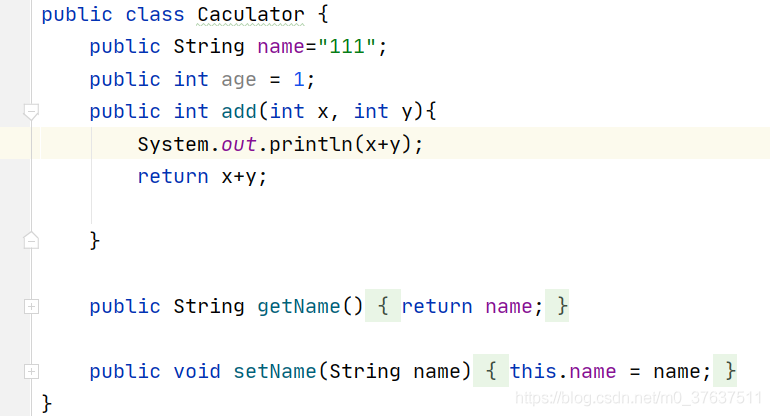

一个要去切的
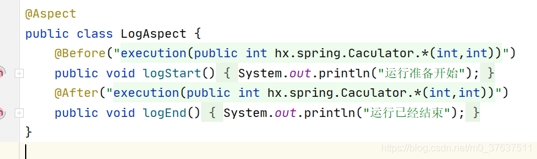
配置类
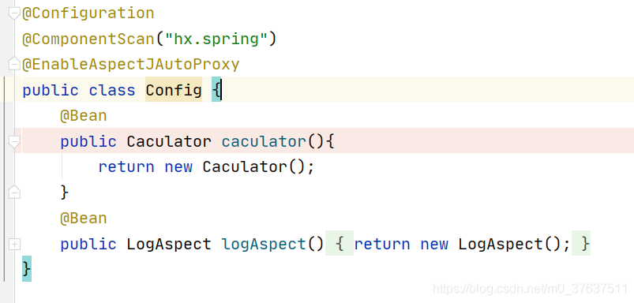
main方法
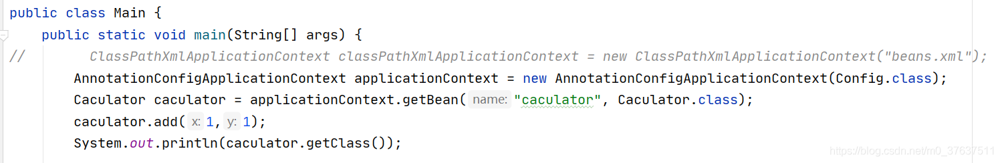
执行一下
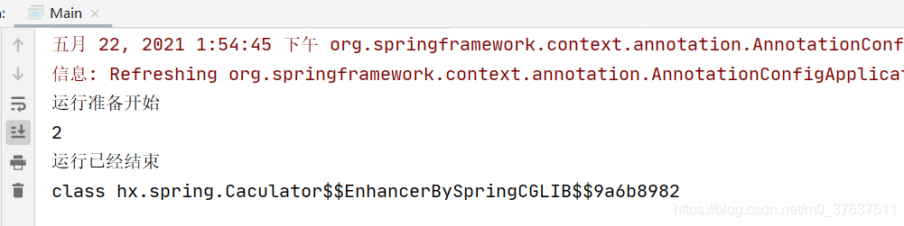
可以看到成功运行，并且获取的bean实例为CGLIB代理的对象

#### 提出问题
对于上述结果，我提出几个问题（前提是已经了解了动态代理机制）
* 为什么我调add方法时就会输出自定义的内容？
* 代理对象是在什么时候被生成的？怎么生成的？

回答完上述两个问题我认为AOP应该算搞懂了

#### 解决问题1
我们先思考，调add方法时怎么才能输出自定义的内容？
熟悉动态代理的可以很快写出下面的demo
```java
public class CglibDemo {
    public static void main(String[] args) {
        Enhancer eh = new Enhancer();
        eh.setSuperclass(Caculator.class);
        eh.setCallback(new Interceptor0());

        Caculator r = (Caculator)eh.create();
        int result = r.add(1, 1);

    }
}
class Interceptor0 implements MethodInterceptor {
    @Override
    public Object intercept(Object obj,
                            Method method,
                            Object[] args,
                            MethodProxy proxy) throws Throwable {
        System.out.println("运行准备开始");
        Object re = proxy.invokeSuper(obj, args);
        System.out.println("运行已经结束");
        return re;
    }
}
```
```java
运行准备开始
2
运行已经结束
```
我们需要思考上述方式会是Spring生成的代理调用的方式吗？
* 上述方法自定义的方式是死的
* 每个方法都会调用一次
* 所以肯定不是这样

那么如果要改进上述方式怎么改？
* 很容易想到就是beforeMethod弄一个容器存放
* afterMethod也弄一个容器存放
* 并且执行不同方法时，去判断该方法应该使用哪些beforeMethod,哪些afterMeathod

我们去探索一下Spring是怎么做的
1.	首先，在add方法上加上断点
2.	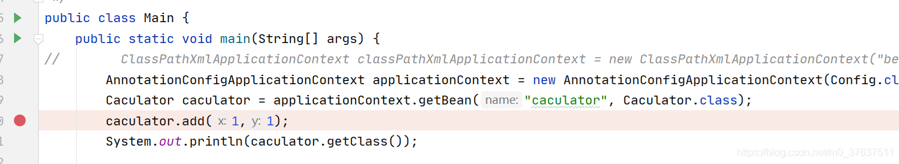
3.	以debug模式运行
4.	我们进入add方法发现就会调用动态代理中的intercept，我们看看做了哪些事情
5.	执行到下述方法后，我们可以看到chain中出现了三个方法，其中就包括我们定义的before和after
6.	所以通过getInterceptorsAndDynamicInterceptionAdvice()可以获得add方法对应的before和after方法
7.	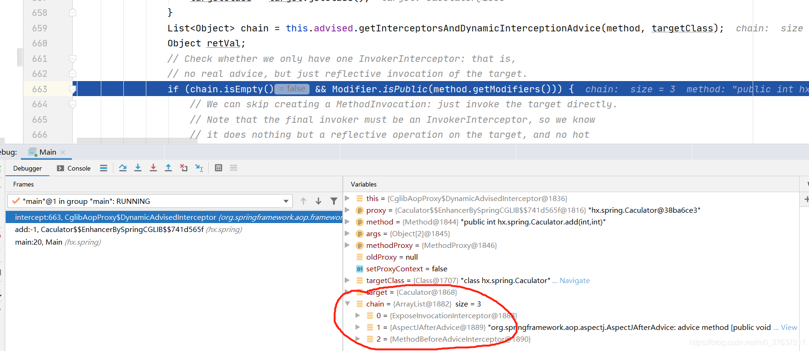
8.	继续执行会发现进入```retVal = new CglibMethodInvocation(proxy, target, method, args, targetClass, chain, methodProxy).proceed();```这一行获取最终的返回值，也就意味着该方法负责执行所有方法
9.	也就应了我们一开始的思路，即根据待执行方法获取到其before和after，然后再执行
10.	如何执行的就不展开了，探索源码不能一直深入地看下去，不然已经看的就会忘记

至此我们能够解决第一个问题，即Spring生成的代理对象怎么调用我们自定义方法的
* 通过调用方法获取对应before和after，然后按顺序执行即可

到这里我会思考，那么这些before和after方法是什么时候被放入代理对象中的？所以我们继续看第二个问题
	
#### 解决问题2
代理对象何时生成？
1.	首先对配置类中caculator方法打一个断点，我们就能停在其刚被创建的时候
2.	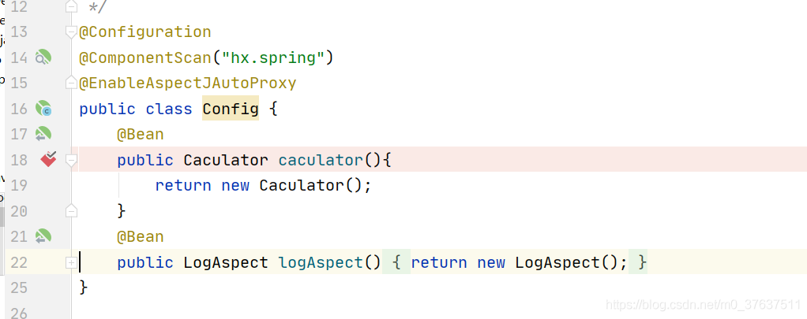
3.	进入debug模式，我们可以顺着debug方法栈的顺序一步一步地看怎么执行的
4.	大概就是去getBean，发现没有在单例池中，需要调createBean去创建
5.	中间探索过程就不记录了直接到关键代码段，
6.	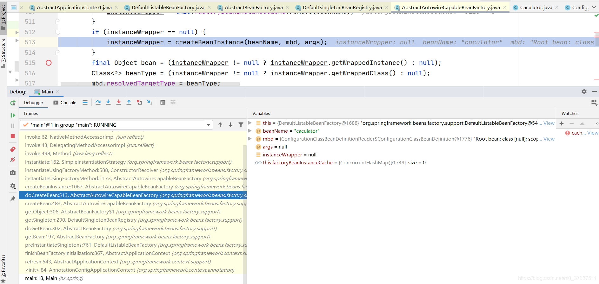
7.	我们根据方法栈以及方法名可以知道，该方法的作用就是根据beanName和bd进行实例化，并用instanceWrapper包装起来
8.	通过这个方式我找到了createBean这一核心代码块，它应该就是创建bean的主方法了，那么只需要看看这里面怎么生成代理对象的
9.	我们通过step Out让debug指针来到createBean这一方法中
10.	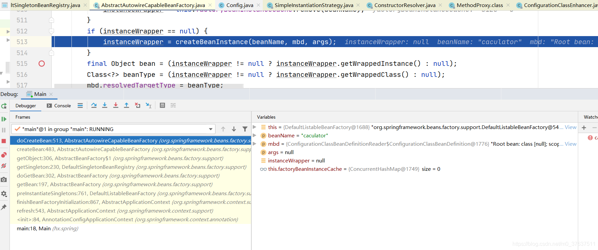


11.	接着在该方法页继续执行debug
12.	执行到下一行后我们可以看到instanceWrapper中并没有生成代理对象，所以推断代理对象的生成应该在后半段方法
13.	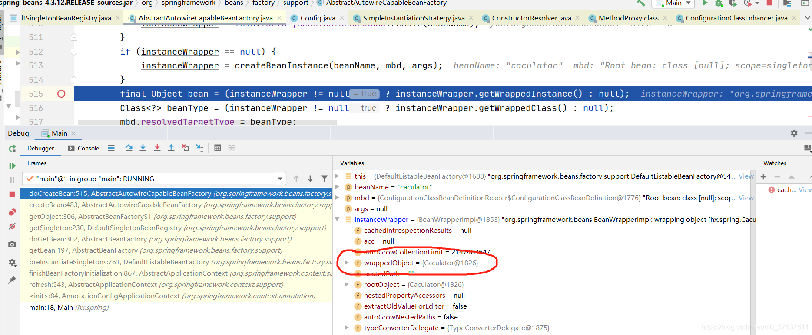
14.	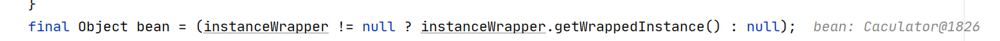
15.	执行到这一步可以发现通过getWrappedInstance获取到bean实例，而获取方法获取的字段就是上上个图圈出来的wrappedObject
16.	所以我们就看bean这个对象类型什么时候变成代理对象类型，就能够推出哪一步完成了代理
17.	后来bean赋值给了exposedObject，我们可以发现在经过initializeBean后，exposedObject变成了代理对象，因此与AOP相关的实现就在该方法中
18.	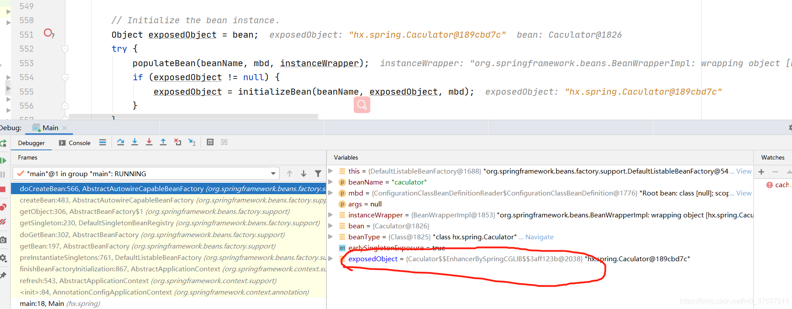
19.	所以我们得重新debug，让指针指向该方法，并进入（除了重复上述方法外还可以在debug开启后，在该方法行设置断点，点击左边绿色按钮，或者F9直接跳转至断点）
20.	进入该方法后使用判断对象是否变成代理对象的方式，推出关键行在于
21.	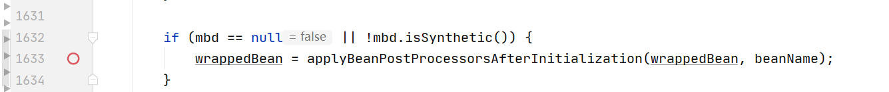
22.	看名字表示调用后处理器执行初始化后方法
23.	点开继续看
24.	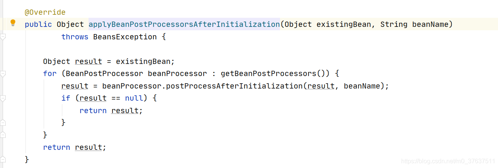
25.	可以看出，该方法其实就是遍历所有的后置处理器，来处理当前bean对象
26.	那么同样的，我们继续用上述方法，可以推出当beanProcessor为AnnotationAwareAspectAutoProxyCreator时，代理对象发生更改变
27.	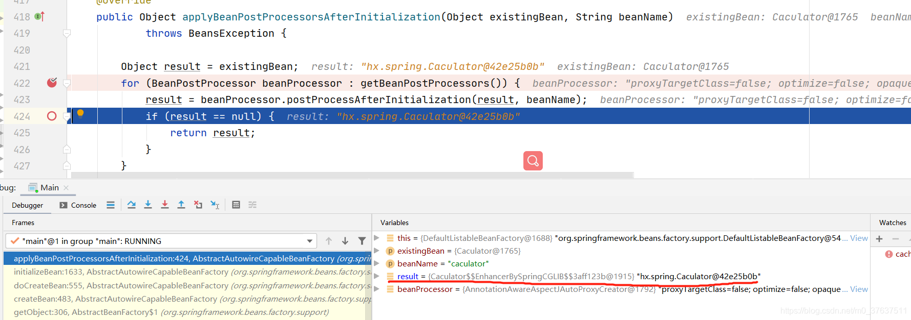
28.	所以我们最终锁定到该方法，继续看如何代理的
29.	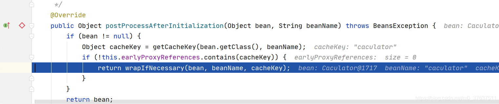
30.	执行到下一步，看方法名可以知道创建代理就是使用createPtoxy这个方法了，除此之外，前一个方法getAdvicesAndAdvisorsForBean获得了画红圈标识的那三个方法，这三个方法就是最开始我们探究代理对象执行方法时会用到的方法，也就意味着这一步就将他们绑起来了
31.	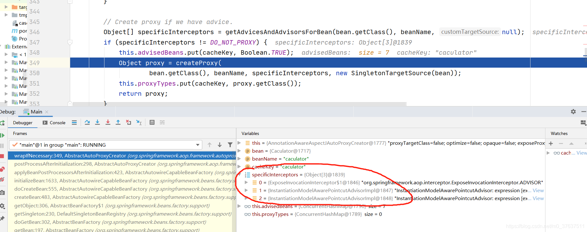
32.	createPtoxy内就是CGlib的一些东西了，都比较简单
33.	至此，代理对象探究到此结束

上述就是我通过debug的方式，有目的地去寻找关键代码段的流程，我自己实践过程中受益匪浅，并且通过如此探索，对整个Spring流程有了大致了解。是个蛮有意思的过程，举一反三可以去推其他方法。

对于上面探究进行小总结
1.	AOP是在实例初始化之后才进行对象代理的
2.	AOP进行对象代理主要靠的是AnnotationAwareAspectAutoProxyCreator这一后置处理器
3.	通过方法栈我们对一个bean实例的创建生命周期也更清楚了
	4.	先去单例池getbean
	5.	get不到就create
	6.	create中会用```createBeanInstance```先通过构造方法生成一个对象实例
	7.	然后```populateBean```进行属性注入
	8.	再利用```initializeBean```进行初始化
	9. 初始化过程中，先```invokeAwareMethods```
	10. 再```applyBeanPostProcessorsBeforeInitialization```调用后置处理器执行初始化前的方法
	11. 然后初始化```invokeInitMethods```
	12. 最后```applyBeanPostProcessorsAfterInitialization```

探究到此为止了吗？
其实还不够，还有很多细节需要继续探究
如

1.	AnnotationAwareAspectAutoProxyCreator什么时候加载进来的？
	*	这部分就是雷神讲解AOP的角度，先从该后置处理器入手进行讲解
	*	而我是从代理对象入手，现在回过去再看雷神的视频会很清晰
	*	
2.	那三个adervised方法又是怎么来的
3.	生命周期的细节

诸如此类的问题
不过时间关系就先探究到这

最后再补充一个点，但由于今天写累了就简单提一下
掌握AOP底层实现后，可以去思考循环依赖的解决办法，通过三级缓存解决，其中会涉及提前进行AOP，我当时的问题是，提前进行AOP又对原对象进行属性注入后，AOP怎么获取到属性注入的新值？我带着这个问题探究了代理对象的结构，可以看到代理对象有个targetSource会存储原始对象的引用，因此如果原始对象在AOP之后改了，由于代理对象的调用方法我们可以知道，是会动态获取值的，所以通过targetSource获取到的原始对象就是被属性注入完成的对象
上述写得很乱，可以无视哈，主要写给自己看的


### AnnotationAwareAspectAutoProxyCreator
今天继续探究一些细节，比如AnnotationAwareAspectAutoProxyCreator是什么时候被放进后置处理器的

1.	点开@EnableAspectJAutoProxy可以看到@Import(AspectJAutoProxyRegistrar.class)
2.	所以去看AspectJAutoProxyRegistrar.class干了什么
3.	给其中用于注册的方法打上断点，看spring怎么执行的
4.	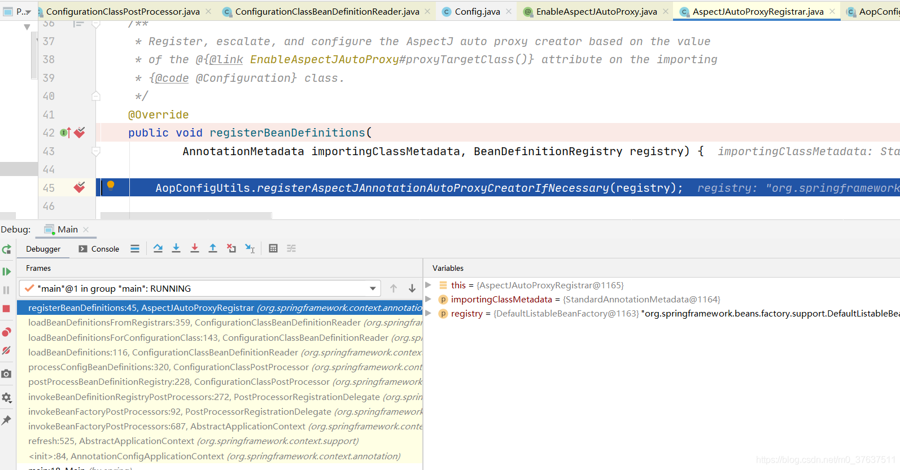
5.	根据registerAspectJAnnotationAutoProxyCreatorIfNecessary方法名可以直到该方法就是会给容器中注册一个AspectJAnnotationAutoProxyCreator
6.	后面就不继续分析了，所以AspectJAnnotationAutoProxyCreator是通过启动AOP注释导入的注册器注入容器中的
7.	这个注册器肯定是在创建bean之前调用，这部分就不在这里细讲了