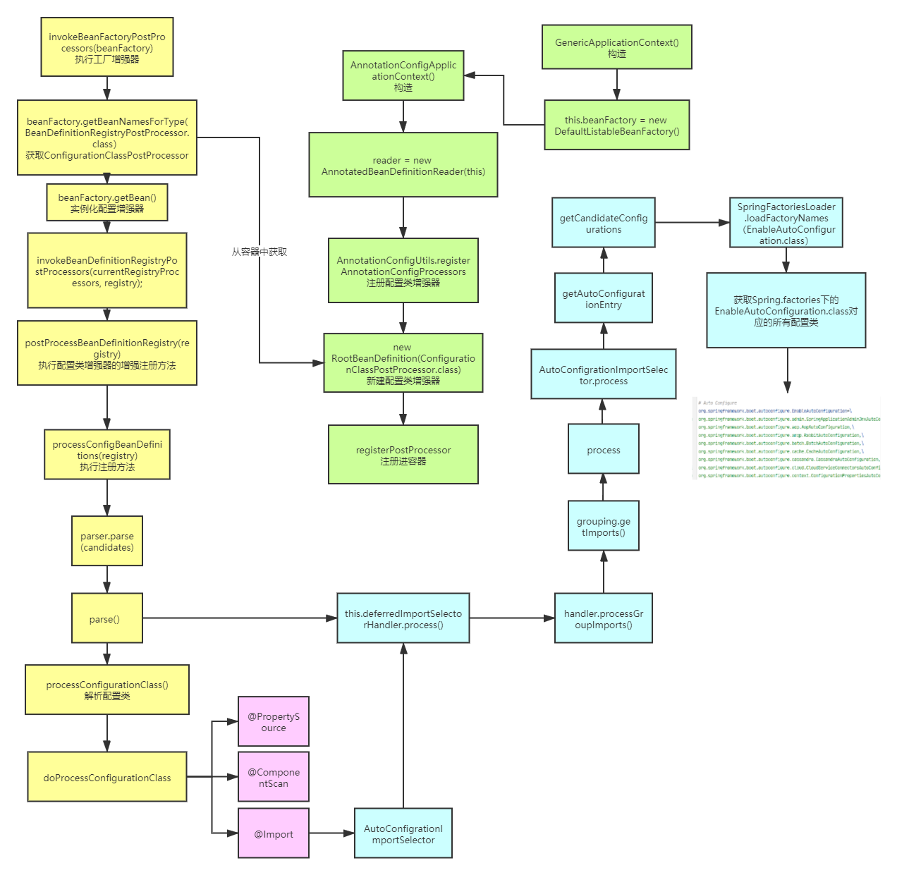

### 前言
在弄清楚Spring如何解析注释后，去探究了一下Springboot的自动装配，做下记录
### 自动装配
接着spring注释解析的流程图，我们可以得到自动装配的流程图

* 蓝色部分为自动装配过程
* 主要先由配置类增强器解析配置类上的@Import注解
* 能够解析得到AutoConfigrationImportSelector
* 回到parse这一步的下一步，就是执行ImportSelector的process方法
* 该方法的作用就是读取spring.factories文件下的EnableAutoConfigration.class相关配置类，并生成bd
* 从而完成自动装配各个配置类


为什么是AutoConfigrationImportSelector?
因为点开```@SpringBootApplication```的```@EnableAutoConfiguration```会出现```@Import(AutoConfigurationImportSelector.class)```，所以配置类增强器就能够通过```@Import```注解解析到ImportSelector