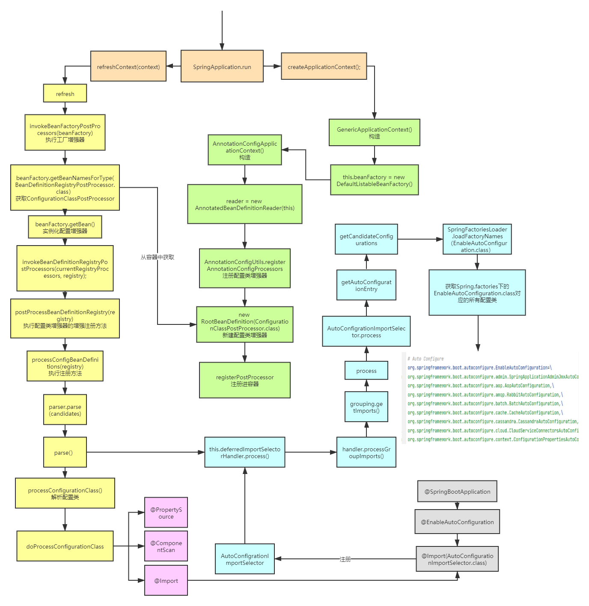

### 前言
在弄清楚Spring如何解析注释后，去探究了一下`Springboot`的自动装配，做下记录
### 自动装配
接着spring注释解析的流程图，我们可以得到自动装配的流程图

橙色部分（入口）
* 主要做了两件事情
* 初始化`Context`
* 进行`refresh`

绿色部分（初始化Context）
* 该部分主要是给容器中注入一个`ConfigurationClassPostProcessor`
* 该`ConfigurationClassPostProcessor`是一个`BeanDefinitionRegistryPostProcessor`
* `BeanDefinitionRegistryPostProcessor`我们知道，就是用来解析一些注释，并且生成`BeandefinitionMap`的

绿色部分（refresh）
* `refresh`部分在探究IOC容器原理时已经很熟了
* 要利用`BeanDefinitionRegistryPostProcessor`那肯定是在`invokeBeanFactoryPostProcessors`这一步
* 最终会执行`ConfigurationClassPostProcessor`的`postProcessBeanDefinitionRegistry`的`parse`方法
* 该方法会完成大部分注释的解析（粉色部分），如@`Import`
* 从而能够解析灰色部分的`@Import(AutoConfigurationImportSelector.class)`，获取`AutoConfigurationImportSelector.class`
* 回到`parse`,`parse`结束后会调用 `deferredImportSelectorHandler.process`()，该方法会将前面解析`@Import`得到的`Selector`进行执行，从而进入蓝色部分

蓝色部分（执行Selector）
* 执行`AutoConfigrationImportSelector`的`process`方法
* 该方法最终通过`SpringFactoriesLoader.loadFactoryNames（EnableAutoConfiguration.class）`能够获得`META-INF/spring.factories`路径下定义好的与`EnableAutoConfiguration`相关的所有配置类
* 最终加载到容器，完成自动配置