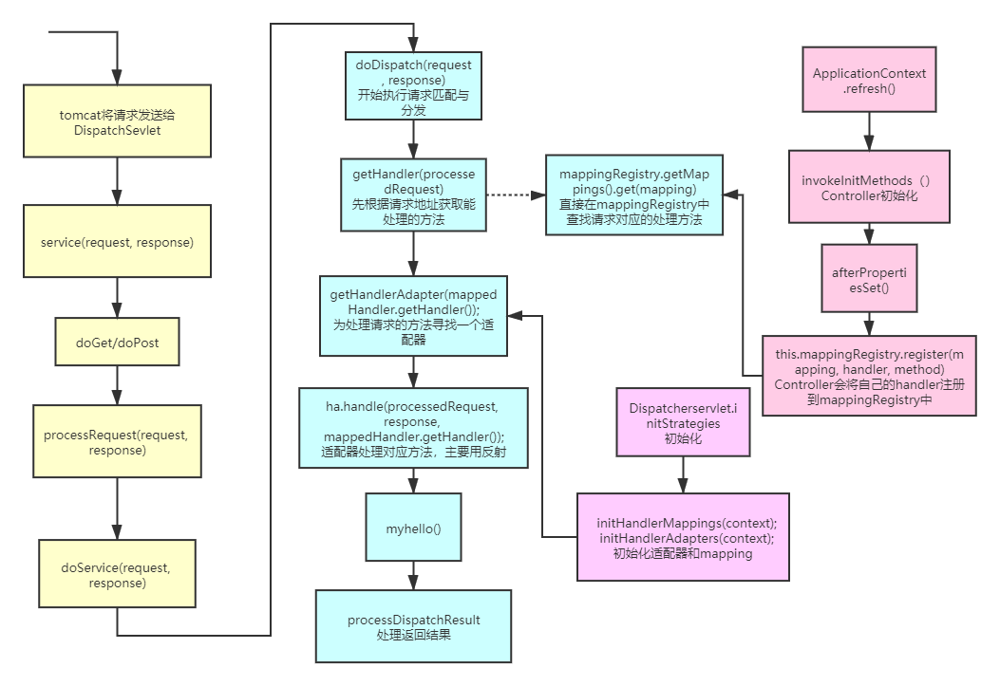
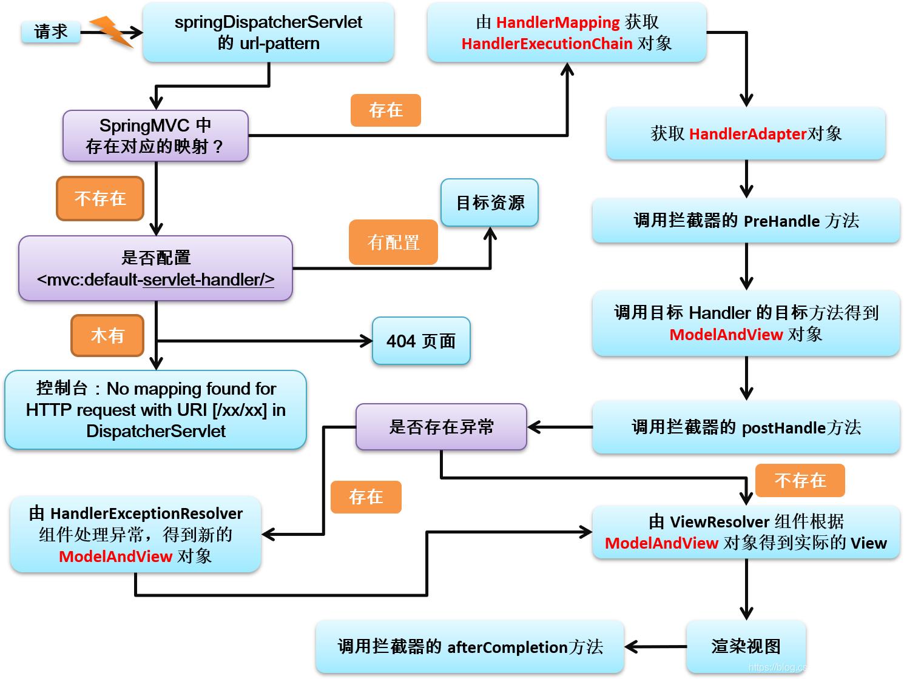

### 前言
今天简单看了一点SpringMVC的源码，做一下记录

### 流程分析
我们知道springMVC的关键点在于使用了前端控制器Dispatcherservlet进行请求的分发，而不再需要定义其余servlet实现业务逻辑，那么它是怎么实现的呢？
为此，我依旧是对Controller某个方法打了断点，利用逐步deubg的方式进行探究，对整个流程总结如下


黄色部分

* tomcat将请求分配给Dispatcherservlet
* Dispatcherservlet主要调用了dispatch方法

蓝色部分

* 这部分是MVC的核心，也就是dispatch方法，类似于SpringContext的refresh方法
* 先根据请求获取到对应的Handler，所谓Handler指的就是某个Controller下定义的处理该请求路径的方法
* 接着根据Handler获取对应的适配器，所谓适配器，可以理解成一个反射工具，主要对handler进行反射调用
* 适配器通过handle方法就能反射调用对应的handler方法处理请求，至于怎么进行参数解析的有时间再看
* handle返回一个ModelAndView对象，通过processDispatchResult处理返回值以及跳转页面

粉色部分
* 主要进行一些初始化的工作
* 比如在初始化Controller的时候，就会把其中所有标了RestMapping等注释的方法存到mappingResgistry中，即 Map<"请求路径","ControllerName+方法名">
* 所以在蓝色部分进行getHandler时，只需要根据请求路径去获取对应方法即可
* 除此之外，适配器等候选项是在DispatchSevlet创建时就初始化好的


从上述流程我们大概知道了
* 其实每个请求过来，都会调用DispatcherServlet来进行处理，通过反射去执行不同的方法，而不是像javaWeb时，对于每个请求，都使用一个不同的Servlet来执行，这么封装可以说很巧妙了
* 用Spring完成MVC的好处还在于，我们在调用Controller方法时，可以直接通过自动注入的方式获取其他组件，这就能简化开发

最后挖两个坑，日后有时间再填
* handle的具体流程，如怎么进行参数解析
* 返回值，视图怎么解析和处理


### 视图解析
* 不管handler方法是什么返回类型（String,ModelAndView,View)，经过handle返回的都是ModelAndView
* 通过调用```processDispatchResult()```方法，会使用视图解析器```ViewResolver```进行解析
* 最终还是会调用最底层的，```req.getRequestDispatcher("/index.jsp").forward(req,resp);```方法来进行请求转发
* 所以其实我们用SpringMVC很方便是因为框架写好了很多判断与处理操作


我自己画的流程图少了拦截器preHandle方法，在此贴上尚硅谷的流程图


 