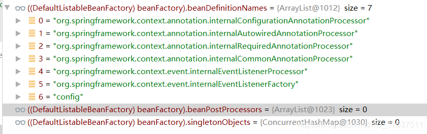
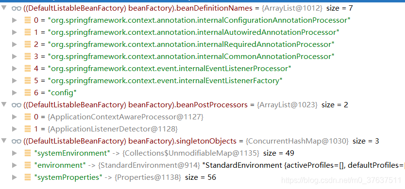
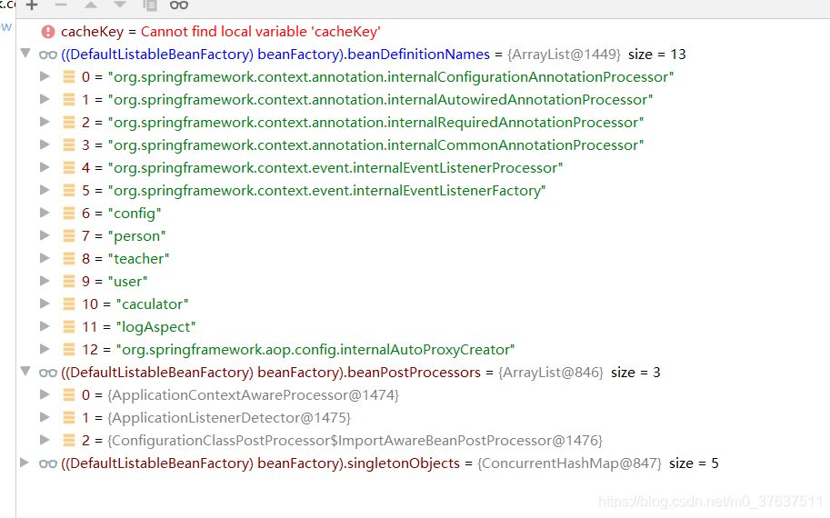
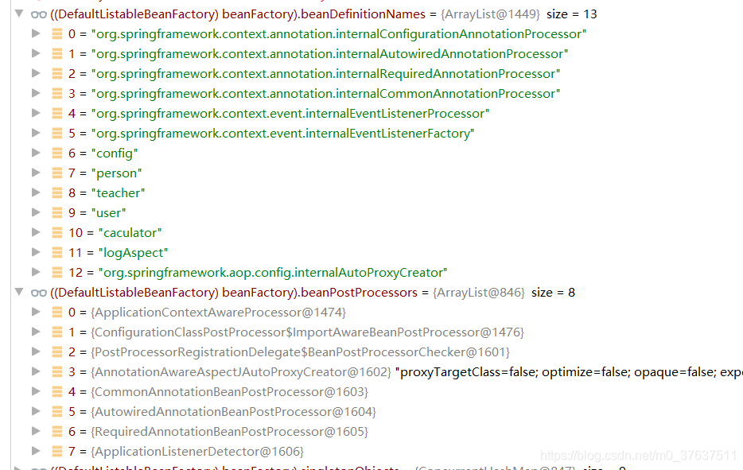
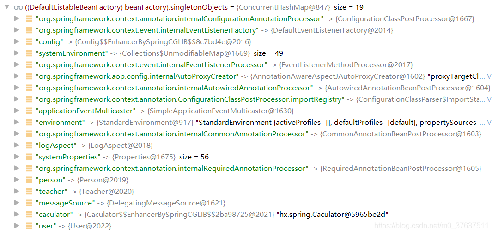

### 前言
通过上一篇文章对AOP的初步探究，慢慢理清了bean的创建流程，找时间从头粗略读了一遍源码，在此做一个记录。感觉Spring源码挺好读的，注释也写得很详细，我从零阅读spring源码用了一天多的时间，下一篇对读源码心得进行一个自我总结吧

### 背景知识
关于spring源码，有人觉得苦涩难懂，有人享受探索的乐趣，我认为区别就在于底子是否牢，如果动态代理都不了解就想去看懂AOP的源码那肯定是不行的。
建议先了解
* Spring的使用(注解开发)
* bean的概念
* bean的生命周期
* beanFactory
* beanDefinition
* beanPosrProcessor
* 单例池

由于我也才学java一个多月，但我比较喜欢看源码来学习，所以曾试过在了解spring使用方法后立马去看源码，结果一头雾水，觉得很难，后来我发现，其实spring源码很简单，框架就是一条流水线，不像之前阅读juc源码需要思考很多，那么既然是流水线，只有先弄懂每个部件干嘛的，才好理解整个流水线。阅读spring源码就好比阅读一篇英文文章，如果单词都不认识，当然觉得难，所以得先把单词弄懂。这也是我给初学者的建议，那么上面几个就是“单词”。

这时候就有人说了，我来看你的博客不就是啥都不知道才看的吗？
好叭，那我就我自己理解的方式对上述概念进行说明，并解析一下源码

### 概念说明
* bean
	* bean就是一个对象
	* bean与普通对象不同在于，普通对象只需要new一下就出来了
	* 而create一个bean需要经过很多步骤，这些步骤由spring统一管理
	* 而这些步骤就是生命周期
* bean的生命周期
	* 最简单的是   实例化--》初始化--》销毁
	* 也可以对bean的创建过程进行diy，比如实例化前做点事情，实例化后做点事情
	* 所以通用的是   实例化前--》实例化--》实例化后--》初始化前--》初始化--》初始化后--》销毁
	* 生命周期是理解代码的关键
* beanFactory
	* beanFactory包括很多东西，凡是与bean创建有关的东西都可以从它这里找到
	* 比如beanDefinition,postProcessor等
* beanDefintion
	* 这个的作用也很大，主要记录了一个bean的属性，比如是否单例是否懒加载等
	* 如果要创建一个bean，那么只需要从beanFactory中获取beanName对应的beanDefinition简称bd
	* 根据属性完成创建，相当于bean的身份证吧可以这么理解
* beanPostProcessor
	* spring会在实例化和初始化前后去寻找beanPostProcessor，来执行对应的方法
	* 也就是说这玩意儿就是用来对bean的创建进行diy的
* singletonObjects单例池
	* 是用于存放生成好的单例bean的
	* 创建时如果单例池已经有了，则直接获取并返回

那么我们可以模拟一下怎么实现aop的，简单点，就实现一个代理对象的功能即可，我们利用上面的组件实现下述伪代码
* 以Car为例，我希望Spring能返回一个bean为代理好的Car
* 那么先给Car弄一个Spring身份证，bd
* 在bd中存放Car的所有信息，除了Class和Name外还要存需要被代理，bd被存放于beanFactory中保管
* 接着就执行bean的生命周期
	* 先判断单例池中是否有bean,没有则创建
	* 实例化前，我查看beanPostProcessor有没有要在此刻完成的任务，有则执行，没有则继续
	* 实例化开始
		* 通过beanFactory我获得了我要创建的bd
		* 拿出bd的Class以及name，我知道我需要创建Car
		* 那么我就new 一个Car
	* 实例化后，继续查看beanPostProcessor看有没有任务
	* 初始化也去beanPostProcessor判断
	* 然后初始化
	* 初始化后，去查看beanPostProcessor，发现有一个bpp要求对创建的Car进行代理
	* 那么就执行bpp来生成一个代理的car
	* 将代理的car最终返回，这就是从spring中获得的bean
	* 将bean加入singletonObjects

Spring无非干的就是上面的事情，只是添加更多的beanPostProcessor，diy得更牛逼一点罢了，所以很简单，那么我们可以进入源码了

### 源码解析
emmm,打开源码时，发现真的没什么好解析的。。。单词都懂了，文章还需要别人教你看吗？
所以我就不解析了吧，可以去看看雷神的注解驱动开发，IOC容器源码部分
我将其笔记拿来，并加以修改，以备自己以后看

关键点写在前面
1. prepareRefresh()刷新前的预处理
2. obtainFreshBeanFactory();获取BeanFactory；
	3. 可以看一下此时bf中关于上面提到的几个属性
	4. 
	5. 可以看到bd有7个bean的定义了，但singleObject以及bpps都没东西，说明都还没创建
	6. 这是初始化beanFactory做的事
3. prepareBeanFactory(beanFactory);BeanFactory的预准备工作（BeanFactory进行一些设置）；
	4. 
	5. 可以看到bpps多了两个元素，以及单例池有bean了
	6. 还要注意的是，bpps中的元素并不在bd中，意味着不是通过bd创建的
4. postProcessBeanFactory(beanFactory);BeanFactory准备工作完成后进行的后置处理工作
5. invokeBeanFactoryPostProcessors(beanFactory);执行BeanFactoryPostProcessor的方法；
	6. 

	6. 这一步就会把自己定义的bean给扫描进bd
	7. debug可以锁定到invokeBeanDefinitionRegistryPostProcessors(currentRegistryProcessors, registry);调用了config的BeanDefinitionRegistryPostProcessors
	8. 所以这里是实现ComponenScan类似逻辑的
6. registerBeanPostProcessors(beanFactory);注册BeanPostProcessor（Bean的后置处理器）【 intercept bean creation】
	7. 
	8. 可以看到这一步相当于把bd中定义了却未生成的processor进行创建，并放入bpps中
	9. 所以方法名叫注册后置处理器
7. finishBeanFactoryInitialization(beanFactory);初始化所有剩下的单实例bean；
	8. 
	9. 可以看到singletonObjects中确实把自定义的对象都创建了

整个流程就是这么简单
* 还可以看到，继上一篇讲的AOP，其中涉及到的internalAutoProxyCreator就是在invokeBeanFactoryPostProcessors(beanFactory)这一步被添加进bd的，其对应的AnnotationAwareAspectJAutoProxtCreator在registerBeanPostProcessors(beanFactory)被生成，后续创建bean的时候就能用了，就这么简单
* 看源码我们还可以看到对于beanFactory也是有生命周期的，在创建前后也可以进行diy，调用beanFactoryPostProcessor


```java
1、prepareRefresh()刷新前的预处理;
	1）、initPropertySources()初始化一些属性设置;子类自定义个性化的属性设置方法；
	2）、getEnvironment().validateRequiredProperties();检验属性的合法等
	3）、earlyApplicationEvents= new LinkedHashSet<ApplicationEvent>();保存容器中的一些早期的事件；
2、obtainFreshBeanFactory();获取BeanFactory；
	1）、refreshBeanFactory();刷新【创建】BeanFactory；
			创建了一个this.beanFactory = new DefaultListableBeanFactory();
			设置id；
	2）、getBeanFactory();返回刚才GenericApplicationContext创建的BeanFactory对象；
	3）、将创建的BeanFactory【DefaultListableBeanFactory】返回；
3、prepareBeanFactory(beanFactory);BeanFactory的预准备工作（BeanFactory进行一些设置）；
	1）、设置BeanFactory的类加载器、支持表达式解析器...
	2）、添加部分BeanPostProcessor【ApplicationContextAwareProcessor】
	3）、设置忽略的自动装配的接口EnvironmentAware、EmbeddedValueResolverAware、xxx；
	4）、注册可以解析的自动装配；我们能直接在任何组件中自动注入：
			BeanFactory、ResourceLoader、ApplicationEventPublisher、ApplicationContext
	5）、添加BeanPostProcessor【ApplicationListenerDetector】
	6）、添加编译时的AspectJ；
	7）、给BeanFactory中注册一些能用的组件；
		environment【ConfigurableEnvironment】、
		systemProperties【Map<String, Object>】、
		systemEnvironment【Map<String, Object>】
4、postProcessBeanFactory(beanFactory);BeanFactory准备工作完成后进行的后置处理工作；
	1）、子类通过重写这个方法来在BeanFactory创建并预准备完成以后做进一步的设置
======================以上是BeanFactory的创建及预准备工作==================================
5、invokeBeanFactoryPostProcessors(beanFactory);执行BeanFactoryPostProcessor的方法；
	BeanFactoryPostProcessor：BeanFactory的后置处理器。在BeanFactory标准初始化之后执行的；
	两个接口：BeanFactoryPostProcessor、BeanDefinitionRegistryPostProcessor
	1）、执行BeanFactoryPostProcessor的方法；
		先执行BeanDefinitionRegistryPostProcessor
		1）、获取所有的BeanDefinitionRegistryPostProcessor；
		2）、看先执行实现了PriorityOrdered优先级接口的BeanDefinitionRegistryPostProcessor、
			postProcessor.postProcessBeanDefinitionRegistry(registry)
		3）、在执行实现了Ordered顺序接口的BeanDefinitionRegistryPostProcessor；
			postProcessor.postProcessBeanDefinitionRegistry(registry)
		4）、最后执行没有实现任何优先级或者是顺序接口的BeanDefinitionRegistryPostProcessors；
			postProcessor.postProcessBeanDefinitionRegistry(registry)
			
		
		再执行BeanFactoryPostProcessor的方法
		1）、获取所有的BeanFactoryPostProcessor
		2）、看先执行实现了PriorityOrdered优先级接口的BeanFactoryPostProcessor、
			postProcessor.postProcessBeanFactory()
		3）、在执行实现了Ordered顺序接口的BeanFactoryPostProcessor；
			postProcessor.postProcessBeanFactory()
		4）、最后执行没有实现任何优先级或者是顺序接口的BeanFactoryPostProcessor；
			postProcessor.postProcessBeanFactory()
6、registerBeanPostProcessors(beanFactory);注册BeanPostProcessor（Bean的后置处理器）【 intercept bean creation】
		不同接口类型的BeanPostProcessor；在Bean创建前后的执行时机是不一样的
		BeanPostProcessor、
		DestructionAwareBeanPostProcessor、
		InstantiationAwareBeanPostProcessor、
		SmartInstantiationAwareBeanPostProcessor、
		MergedBeanDefinitionPostProcessor【internalPostProcessors】、
		
		1）、获取所有的 BeanPostProcessor;后置处理器都默认可以通过PriorityOrdered、Ordered接口来执行优先级
		2）、先注册PriorityOrdered优先级接口的BeanPostProcessor；
			把每一个BeanPostProcessor；添加到BeanFactory中
			beanFactory.addBeanPostProcessor(postProcessor);
		3）、再注册Ordered接口的
		4）、最后注册没有实现任何优先级接口的
		5）、最终注册MergedBeanDefinitionPostProcessor；
		6）、注册一个ApplicationListenerDetector；来在Bean创建完成后检查是否是ApplicationListener，如果是
			applicationContext.addApplicationListener((ApplicationListener<?>) bean);
7、initMessageSource();初始化MessageSource组件（做国际化功能；消息绑定，消息解析）；
		1）、获取BeanFactory
		2）、看容器中是否有id为messageSource的，类型是MessageSource的组件
			如果有赋值给messageSource，如果没有自己创建一个DelegatingMessageSource；
				MessageSource：取出国际化配置文件中的某个key的值；能按照区域信息获取；
		3）、把创建好的MessageSource注册在容器中，以后获取国际化配置文件的值的时候，可以自动注入MessageSource；
			beanFactory.registerSingleton(MESSAGE_SOURCE_BEAN_NAME, this.messageSource);	
			MessageSource.getMessage(String code, Object[] args, String defaultMessage, Locale locale);
8、initApplicationEventMulticaster();初始化事件派发器；
		1）、获取BeanFactory
		2）、从BeanFactory中获取applicationEventMulticaster的ApplicationEventMulticaster；
		3）、如果上一步没有配置；创建一个SimpleApplicationEventMulticaster
		4）、将创建的ApplicationEventMulticaster添加到BeanFactory中，以后其他组件直接自动注入
9、onRefresh();留给子容器（子类）
		1、子类重写这个方法，在容器刷新的时候可以自定义逻辑；
10、registerListeners();给容器中将所有项目里面的ApplicationListener注册进来；
		1、从容器中拿到所有的ApplicationListener
		2、将每个监听器添加到事件派发器中；
			getApplicationEventMulticaster().addApplicationListenerBean(listenerBeanName);
		3、派发之前步骤产生的事件；
11、finishBeanFactoryInitialization(beanFactory);初始化所有剩下的单实例bean；
	1、beanFactory.preInstantiateSingletons();初始化后剩下的单实例bean
		1）、获取容器中的所有Bean，依次进行初始化和创建对象
		2）、获取Bean的定义信息；RootBeanDefinition
		3）、Bean不是抽象的，是单实例的，是懒加载；
			1）、判断是否是FactoryBean；是否是实现FactoryBean接口的Bean；
			2）、不是工厂Bean。利用getBean(beanName);创建对象
				0、getBean(beanName)； ioc.getBean();
				1、doGetBean(name, null, null, false);
				2、先获取缓存中保存的单实例Bean。如果能获取到说明这个Bean之前被创建过（所有创建过的单实例Bean都会被缓存起来）
					从private final Map<String, Object> singletonObjects = new ConcurrentHashMap<String, Object>(256);获取的
				3、缓存中获取不到，开始Bean的创建对象流程；
				4、标记当前bean已经被创建
				5、获取Bean的定义信息；
				6、【获取当前Bean依赖的其他Bean;如果有按照getBean()把依赖的Bean先创建出来；】
				7、启动单实例Bean的创建流程；
					1）、createBean(beanName, mbd, args);
					2）、Object bean = resolveBeforeInstantiation(beanName, mbdToUse);让BeanPostProcessor先拦截返回代理对象；
						【InstantiationAwareBeanPostProcessor】：提前执行；
						先触发：postProcessBeforeInstantiation()；
						如果有返回值：触发postProcessAfterInitialization()；
					3）、如果前面的InstantiationAwareBeanPostProcessor没有返回代理对象；调用4）
					4）、Object beanInstance = doCreateBean(beanName, mbdToUse, args);创建Bean
						 1）、【创建Bean实例】；createBeanInstance(beanName, mbd, args);
						 	利用工厂方法或者对象的构造器创建出Bean实例；
						 2）、applyMergedBeanDefinitionPostProcessors(mbd, beanType, beanName);
						 	调用MergedBeanDefinitionPostProcessor的postProcessMergedBeanDefinition(mbd, beanType, beanName);
						 3）、【Bean属性赋值】populateBean(beanName, mbd, instanceWrapper);
						 	赋值之前：
						 	1）、拿到InstantiationAwareBeanPostProcessor后置处理器；
						 		postProcessAfterInstantiation()；
						 	2）、拿到InstantiationAwareBeanPostProcessor后置处理器；
						 		postProcessPropertyValues()；
						 	=====赋值之前：===
						 	3）、应用Bean属性的值；为属性利用setter方法等进行赋值；
						 		applyPropertyValues(beanName, mbd, bw, pvs);
						 4）、【Bean初始化】initializeBean(beanName, exposedObject, mbd);
						 	1）、【执行Aware接口方法】invokeAwareMethods(beanName, bean);执行xxxAware接口的方法
						 		BeanNameAware\BeanClassLoaderAware\BeanFactoryAware
						 	2）、【执行后置处理器初始化之前】applyBeanPostProcessorsBeforeInitialization(wrappedBean, beanName);
						 		BeanPostProcessor.postProcessBeforeInitialization（）;
						 	3）、【执行初始化方法】invokeInitMethods(beanName, wrappedBean, mbd);
						 		1）、是否是InitializingBean接口的实现；执行接口规定的初始化；
						 		2）、是否自定义初始化方法；
						 	4）、【执行后置处理器初始化之后】applyBeanPostProcessorsAfterInitialization
						 		BeanPostProcessor.postProcessAfterInitialization()；
						 5）、注册Bean的销毁方法；
					5）、将创建的Bean添加到缓存中singletonObjects；
				ioc容器就是这些Map；很多的Map里面保存了单实例Bean，环境信息。。。。；
		所有Bean都利用getBean创建完成以后；
			检查所有的Bean是否是SmartInitializingSingleton接口的；如果是；就执行afterSingletonsInstantiated()；
12、finishRefresh();完成BeanFactory的初始化创建工作；IOC容器就创建完成；
		1）、initLifecycleProcessor();初始化和生命周期有关的后置处理器；LifecycleProcessor
			默认从容器中找是否有lifecycleProcessor的组件【LifecycleProcessor】；如果没有new DefaultLifecycleProcessor();
			加入到容器；
			
			写一个LifecycleProcessor的实现类，可以在BeanFactory
				void onRefresh();
				void onClose();	
		2）、	getLifecycleProcessor().onRefresh();
			拿到前面定义的生命周期处理器（BeanFactory）；回调onRefresh()；
		3）、publishEvent(new ContextRefreshedEvent(this));发布容器刷新完成事件；
		4）、liveBeansView.registerApplicationContext(this);
```