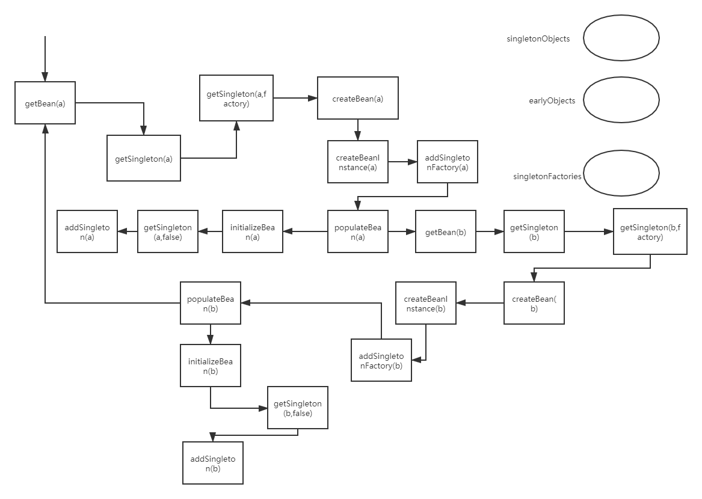

### 前言
今天学习了循环依赖，做下记录，顺便体会以下spring框架的巧妙之处
### 背景知识
* 对Spring源码有所了解
* 对bean的创建周期比较熟悉

推荐视频：b站马士兵老师的spring循环依赖

### 循环依赖是什么？
定义如下两个类，并互相依赖
```java
public class A {
    private B b;

    public B getB() {
        return b;
    }

    public void setB(B b) {
        this.b = b;
    }
}
```
```java
public class B {
    private A a;

    public A getA() {
        return a;
    }

    public void setA(A a) {
        this.a = a;
    }

}
```
beans.xml
```java
<?xml version="1.0" encoding="UTF-8"?>
<beans xmlns="http://www.springframework.org/schema/beans"
       xmlns:xsi="http://www.w3.org/2001/XMLSchema-instance"
       xsi:schemaLocation="http://www.springframework.org/schema/beans http://www.springframework.org/schema/beans/spring-beans.xsd">

<!--    <bean id="user1" class="hx.spring.User"></bean>-->
<!--    <bean id="user2" class="hx.spring.User"></bean>-->
    <bean id="a" class="hx.spring.A">
        <property name="b" ref="b"></property>
    </bean>
    <bean id="b" class="hx.spring.B">
        <property name="a" ref="a"></property>
    </bean>
</beans>
```
Main
```java
public class TestCircle {
    public static void main(String[] args) {
        ClassPathXmlApplicationContext classPathXmlApplicationContext = new ClassPathXmlApplicationContext("beans.xml");
        A a = (A) classPathXmlApplicationContext.getBean("a");
        B b = (B) classPathXmlApplicationContext.getBean("b");
    }
}
```
循环依赖就是a中有b，b中有a
当往a中注入b时，发现b不存在，则去getBean(b)，又会创建b，而b得注入a，变成死循环
那么这篇文章主要是探究spring如何解决这个问题的
其实视频讲得很好了，我只不过再进行一个总结

### 循环依赖流程解析
以例子的整个getBean流程为例，走一遍就能知道spring怎么解决了
自己debug跟源码的时候觉得调用太多有点乱，所以绘制了一个简单的流程图，可以跟着流程图以及流程解析一步步看循环依赖的过程

除了流程图外，还需要关注右上角三个数据结构，分别对应常说的一级缓存，二级缓存，三级缓存，需要留意在整个过程中，其值变化，从而更好的理解spring如何通过三级缓存解决循环依赖的问题。建议用debug的模式一边跟流程一遍check这三个缓存内容变化。

多补充一点，一级缓存存放已经生成好的bean,二级缓存放只生成了一半，未进行属性注入的半成品bean，三级缓存放AOP的调用（这部分后面会再解释一遍）。

还应注意传入不同参数的getSingleton方法分别有什么作用
* 只传name的
	* 用于判断是否命中缓存
	* 若命中，则看命中哪个缓存，如果是三级缓存则调用factory方法进行AOP，将得到的结果放入二级缓存
* 多传了factory的，可以看源码，作用就是createBean，以及addSingleton，在图中addSingleton分开画了，便于理解

那么现在开始流程说明，从左上角进入
1.	getBean(a)
2.	调用getSingleton(a)，看a是否在缓存中
3.	不在，则调用gerSingleton(a,factory)
4.	其中会进行create(a)
5.	先实例化a，createBeanInstance(a)
6.	实例化完后，调用addSingletonFactory(a)将a关于执行AOP的factory放入三级缓存中
	7.	三级缓存---》a
	8.	二级缓存---》
	9.	一级缓存---》
7. 通过populate(a)对a执行属性注入
8. 注入时，发现需要注入b，故getBean(b)
9.	调用getSingleton(b)，看b是否在缓存中
10.	不在，则调用gerSingleton(b,factory)
11.	其中会进行create(b)
12.	先实例化b，createBeanInstance(b)
13.	实例化完后，调用addSingletonFactory(b)将b关于执行AOP的factory放入三级缓存中
	7.	三级缓存---》a,b
	8.	二级缓存---》
	9.	一级缓存---》
14. 通过populate(b)对b执行属性注入
15. 注入时，发现需要注入a，故getBean(a)
16. 调用getSingleton(a)，看a是否在缓存中
17. 发现a在三级缓存中，则调用factory方法，执行AOP逻辑，如果没AOP则返回原始对象，并从三级缓存中删除a，由于未赋值，放入二级缓存
	18. 三级缓存---》b
	19. 二级缓存---》a
	20. 一级缓存---》
18. 这步就能够直接返回a了，注意此时的a是半成品
19. 接着回到15，完成b的赋值
20. 接着回到14，属性注入完成，可以初始化initializeBean(b)
21. 得到完整的b后，回到getSingleton(b,factory)中的addSingleton(b)将b放入一级缓存
	18. 三级缓存---》
	19. 二级缓存---》a
	20. 一级缓存---》b
22. 接着就回到populateBean(a)中完成a对象的b属性注入
23. a同样是初始化后，完成，调用addSingleton(a)放入一级缓存
 	18. 三级缓存---》
	19. 二级缓存---》
	20. 一级缓存---》b，a
24. 至此，a创建完成
25. 接着会继续getBean(b)，发现b就在一级缓存中，直接返回，结束整个过程

=

那么接着，再举一个开启了AOP的例子，注意两个流程的区别
```java

getBean(a)
27.	调用getSingleton(a)，看a是否在缓存中
28.	不在，则调用gerSingleton(a,factory)
29.	其中会进行create(a)
30.	先实例化a，createBeanInstance(a)
31.	实例化完后，调用addSingletonFactory(a)将a关于执行AOP的factory放入三级缓存中
	7.	三级缓存---》a
	8.	二级缓存---》
	9.	一级缓存---》
32. 通过populate(a)对a执行属性注入
33. 注入时，发现需要注入b，故getBean(b)
34.	调用getSingleton(b)，看b是否在缓存中
35.	不在，则调用gerSingleton(b,factory)
36.	其中会进行create(b)
37.	先实例化b，createBeanInstance(b)
38.	实例化完后，调用addSingletonFactory(b)将b关于执行AOP的factory放入三级缓存中
	7.	三级缓存---》a,b
	8.	二级缓存---》
	9.	一级缓存---》
39. 通过populate(b)对b执行属性注入
40. 注入时，发现需要注入a，故getBean(a)
41. 调用getSingleton(a)，看a是否在缓存中
42. 发现a在三级缓存中，则调用factory方法，执行AOP逻辑，得到AOP代理后的对象Proxy_a，并从三级缓存中删除a，由于未赋值，放入二级缓存
	18. 三级缓存---》b
	19. 二级缓存---》Proxy_a
	20. 一级缓存---》
43. 这步就能够直接返回Proxy_a了，注意此时的Proxy_a是半成品
44. 接着回到15，完成b的赋值
45. 接着回到14，属性注入完成，可以初始化initializeBean(b)，初始化完成进行AOP代理，得到proxy_b
46. 得到完整的proxy_b后，回到getSingleton(b,factory)中的addSingleton(proxy_b)将proxy_b放入一级缓存，并删除三级缓存
	18. 三级缓存---》
	19. 二级缓存---》Proxy_a
	20. 一级缓存---》proxy_b
47. 接着就回到populateBean(a)中完成a对象的b属性注入（注意了这里是a对象，不是proxy_a）
48. a接着开始初始化，注意了，此时a是否还会被AOP呢？答案是不会的，因为执行beanProcessor.postProcessAfterInitialization时，会先判断二级缓存中是否命中!this.earlyProxyReferences.contains(cacheKey)，此时二级缓存中会命中，所以不继续代理
49. 那么此时a还是a，如何返回proxy_a呢？看源码可知，初始化后又调了一次Object earlySingletonReference = getSingleton(beanName, false)，此时会返回二级缓存中的proxy_a,最终返回proxy_a
50. 同样是初始化后，完成，调用addSingleton(proxy_a)放入一级缓存
 	18. 三级缓存---》
	19. 二级缓存---》
	20. 一级缓存---》proxy_a,proxy_b
51. 至此，proxy_a创建完成
52. 接着会继续getBean(b)，发现proxy_b就在一级缓存中，直接返回，结束整个过程

```
所以我再完善以下流程图如下

启动AOP进行循环依赖时，需要注意的是，a在b注入的时候已经被AOP变成proxy_a了，因此真正到a执行AOP时是不需要再AOP的，可以直接从二级缓存拿

不得不说，看spring源码能学到很多很妙的设计思路

最后回答一下几个问题吧
* 只用一级缓存行不行？
	* 意味着要把半成品和完全品放在一起，不可以
	* 你如果是说一级缓存用不同的key区分半成品和完全品，也行，但没必要，不如弄两个缓存结构
* 只用二级缓存行不行？
	* 如果不用AOP那第三级缓存存放的factory是多余的，此时用二级缓存就可以
	* 如果用AOP，必须三级缓存
* 整个过程会有几次调用getSingleton，作用分别是什么？
	* getBean的时候会调用一次，判断是否在缓存中
	* 如果不在缓存中，则再调一次，此时执行createBean
	* 初始化结束后再调一次，此时判断二级缓存是否有代理好的对象

循环依赖，over~