# 前言
最近在看RPC框架，选择先看dubbo，再看netty，最后手写一个RPC的学习路线，结合雷神关于dubbo的讲解，对源码流程进行一个简单的记录

# 原理
所谓RPC就是远程服务调用的意思，那么dubbo怎么完成远程调用的呢？

原理图如下


**Provider**：被调用方

**Consumer**：调用方

**Registry**：注册中心

**Container**：启动容器


服务暴露：Provider注册到Registry中，并绑定端口，监听请求

服务引用：Consumer从Registry中获取到

# 使用

以SpringBoot框架整合为例

1. 导入dubbo的starter依赖

   1. ```java
      <dependency>
          <groupId>com.alibaba.boot</groupId>
          <artifactId>dubbo-spring-boot-starter</artifactId>
          <version>0.2.0</version>
      </dependency>
      ```

# 源码浅析

## 注释解析

我们知道，通过@Service（dubbo的不是spring的）可以让被注释的类被识别为Provider，并将服务暴露出去

那么dubbo是怎么做到的呢？

1. ```@EnableDubbo```—>```@Import(DubboComponentScanRegistrar.class)```

2. ```DubboComponentScanRegistrar```

   1. ```java
      @Override
      public void registerBeanDefinitions(AnnotationMetadata importingClassMetadata, BeanDefinitionRegistry registry) {
      
          Set<String> packagesToScan = getPackagesToScan(importingClassMetadata);
      
          registerServiceAnnotationBeanPostProcessor(packagesToScan, registry);
      
          registerReferenceAnnotationBeanPostProcessor(registry);
      
      }
      ```

   2. registerServiceAnnotationBeanPostProcessor实际上是ServiceAnnotationBeanPostProcessor，其实现了BeanDefinitionRegistryPostProcessor接口

   3. 熟悉Spring源码的可以知道，BeanDefinitionRegistryPostProcessor是一个FactoryPostProcessor

   4. 所以会在invokeBeanFactoryPostProcessors(beanFactory)的时候被调用

3. FactoryPostProcessor会被调用其```postProcessBeanDefinitionRegistry```方法，也就意味着registerServiceAnnotationBeanPostProcessor的该方法会被调用

4. 而registerServiceAnnotationBeanPostProcessor的postProcessBeanDefinitionRegistry方法就会扫描包，将带有@Service注解的类注册为一个Bean，类型为```ServiceBean```加入到BeanDefinitionMap中

   1. 详细调用链为：postProcessBeanDefinitionRegistry-》registerServiceBeans-》registerServiceBean-》registry.registerBeanDefinition

5. 至此，@Service注解被解析完成，创建该ServiceBean的时候，就会进行服务暴露

## 服务暴露

我们知道@Service注释了一个Provider，需要被注册到registry中才能被Consumer感知，并且还要启动netty监听Consumer的请求，即注册到注册中心和开启服务器称为服务暴露，那么dubbo怎么做的？

1. 接着上面的，此时BeanDefinitionMap中已经有Provider的信息了

2. 因此Spring执行```finishBeanFactoryInitialization(beanFactory)``时会创建单例Bean

3. 熟悉 IOC 原理的可以知道，创建 Bean 时会经过 ```实例化-》初始化 ```的过程，并且在初始化时，会调用Bean的```afterPropertiesSet()```方法

   1. ```java
      protected void invokeInitMethods(String beanName, Object bean, @Nullable RootBeanDefinition mbd)
            throws Throwable {
                 ·····························
            }
            else {
               ((InitializingBean) bean).afterPropertiesSet();
            }
         }
      ```

4. 从注释解析过程中我们知道，Provider对应的Bean的类型为```ServiceBean```，其通过afterPropertiesSet()方法中调用了```export()```完成暴露

5. 但debug时并不是在这一步完成的暴露，可以发现```ServiceBean```还实现了```ApplicationListener<ContextRefreshedEvent>```接口

   1. 因此```Refresh```结束后还会调用```onApplicationEvent```，其中也完成了暴露

   2. ```java
          @Override
          public void onApplicationEvent(ContextRefreshedEvent event) {
              if (isDelay() && !isExported() && !isUnexported()) {
                  if (logger.isInfoEnabled()) {
                      logger.info("The service ready on spring started. service: " + getInterface());
                  }
                  export();
              }
          }
      ```

   3. debug时，暴露入口主要是这个

6. 从上述入口进入，会来到```doExportUrls()```方法，该方法视为总暴露的入口，接下来我们看看该方法如何完成注册中心注册以及服务器开启

   1. 一路debug会发现最核心的代码如下，可自行根据```左边方法栈+行号```找到
   2. 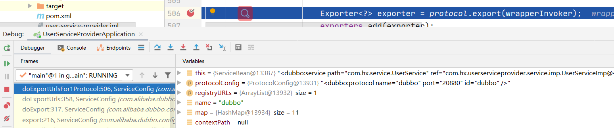

7. 此处的protocol是通过SPI机制获得的，在此不是重点，但可以知道的是此时的protocol指的是``` RegistryProtocol```，该类的export中的```register```方法能够完成注册中心的注册

   1. ```java
      @Override
      public <T> Exporter<T> export(final Invoker<T> originInvoker) throws RpcException {
          //export invoker
           ···························
          if (register) {
              register(registryUrl, registedProviderUrl);
          }
      }
      ```

8. 而```RegistryProtocol```的```export```中还有```doLocalExport(originInvoker);```方法，完成服务器的开启

   1. ```java
      @SuppressWarnings("unchecked")
      private <T> ExporterChangeableWrapper<T> doLocalExport(final Invoker<T> originInvoker) {
          String key = getCacheKey(originInvoker);
          ExporterChangeableWrapper<T> exporter = (ExporterChangeableWrapper<T>) bounds.get(key);
          if (exporter == null) {
              synchronized (bounds) {
                  exporter = (ExporterChangeableWrapper<T>) bounds.get(key);
                  if (exporter == null) {
                      final Invoker<?> invokerDelegete = new InvokerDelegete<T>(originInvoker, getProviderUrl(originInvoker));
                      exporter = new ExporterChangeableWrapper<T>((Exporter<T>) protocol.export(invokerDelegete), originInvoker);
                      bounds.put(key, exporter);
                  }
              }
          }
          return exporter;
      }
      ```

   2. 可以看到同样调用了```protocol.export```

   3. 此时的```protocol```为```DubboProtocol```

9. ```DubboProtocol```的```export```方法如下

   1. ```java
      @Override
      public <T> Exporter<T> export(Invoker<T> invoker) throws RpcException {
      	·······························
          openServer(url);
          optimizeSerialization(url);
          return exporter;
      }
      ```

   2. 开启服务器的入口为```openServer()```

   3. 就不展开了，会一直调用到```nettyServer```并```bind```一个端口

10. 至此```服务暴露```就完成了，我们回到第 6 步，这里将```exporter```即```provider```放入一个集合中，用于接受请求后进行匹配，这在服务调用时会用到

    1. 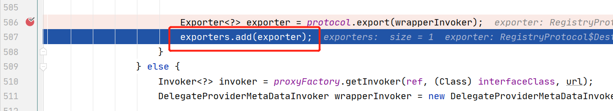


## 服务引用

我们知道，Consumer只需要像@Autowired一样使用@Reference注解，Spring会为其修饰的变量注入一个代理对象，通过该代理对象就能够在调用方法时调用远程对应的方法，那么这个过程是如何实现的呢？

- 首先，@Reference像@Autowired一样如果标注在变量上，那么就无需使用```@EnableDubbo```方法了，如果使用的话，则会像扫描@Service一样，扫描类上是否有@Reference
- 从IOC原理上我们知道，@Reference如果注释在变量上，那么只有当该变量所在Bean被实例化后，进入到初始化时会调用```populateBean```方法完成属性注入
- 那么注入属性时会判断属性上有什么注释，如果是@Autowired，则会调用```AutowireAnnotationBeanPostProcessor```来进行自动注入，如果注入过程中发现待注入的bean没有被实例化，那么会先实例化（这部分属于循环依赖的原理）
- 所以我们可以思考，对于@Reference，则肯定有一个类似```AutowireAnnotationBeanPostProcessor```的处理器，通过debug我们发现了，为```ReferenceAnnotationBeanPostProcessor```
- 因此，我们可以从```ReferenceAnnotationBeanPostProcessor```开始源码解析
- 除此之外，我们还可以发现，@Reference对应的代理对象类型为ReferenceBean，其实现了```FactoryBean```的接口，因此可以通过对getObject方法打断点来查看整个方法调用链
  - 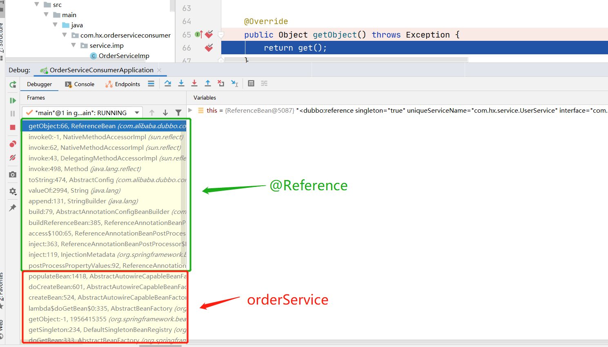

* 可以看到在对```orderService```进行属性注入时，通过```ReferenceAnnotationBeanPostProcessor```解析了```@Reference```，从而创建了对应的```ReferenceBean```

上述记录了一下如何探索源码的，那么接下来就从头分析源码，我们以下述代码为例，往order服务中注入user服务，而user服务是一个已经暴露好的Provider

* ```java
  @Service
  @Component
  public class OrderServiceImp implements OrderService {
      @Reference
      UserService userService;
      @Override
      public String getOrder(Long orderId) {
          return "已获取到订单";
      }
      @Override
      public String getUser(Long userId){
          return userService.getUser(userId);
      }
  }
  ```

---

### 正文

1. ```finishBeanFactoryInitialization```根据BeanDefinitionMap(BDM)创建Bean

2. 实例化orderServiceImp后，会调用```populateBean```方法进行属性输入

3. ```populateBean```方法中，对每个属性的```xx```注解会根据对应的 ```xxAnnotationBeanPostProcessor```进行解析，该过程对应下述代码段的``bp``变量，主要调用```postProcessPropertyValues```方法完成解析

   1. ```java
      protected void populateBean(String beanName, RootBeanDefinition mbd, @Nullable BeanWrapper bw) {
          ··········
            for (InstantiationAwareBeanPostProcessor bp : getBeanPostProcessorCache().instantiationAware) {
               PropertyValues pvsToUse = bp.postProcessProperties(pvs, bw.getWrappedInstance(), beanName);
               if (pvsToUse == null) {
                  if (filteredPds == null) {
                     filteredPds = filterPropertyDescriptorsForDependencyCheck(bw, mbd.allowCaching);
                  }
                  pvsToUse = bp.postProcessPropertyValues(pvs, filteredPds, bw.getWrappedInstance(), beanName);
                  if (pvsToUse == null) {
                     return;
                  }
               }
               pvs = pvsToUse;
            }
      ```

   2. 可以debug查看bp可能的取值，其中就包括了常见的```@Autowired```和```@Reference```的```PostProcessor```

      1. 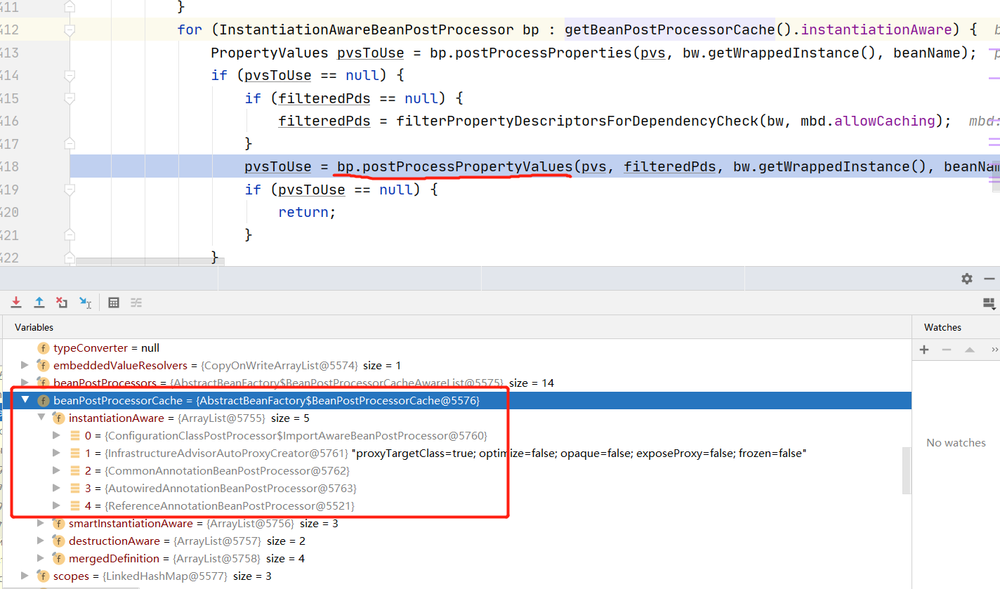

4. 对于```@Reference```注解，会调用```ReferenceAnnotationBeanPostProcessor```完成注入，其对应的```postProcessPropertyValues()```最终会调用```ReferenceBean```的```getObejct()```方法获取一个代理对象

5. 而获取时要进行初始化，调用链为```getObejct()```->```get()```->```init()```，我们从```init()```中看看dubbo是怎么生成一个代理对象的

6. ```init()```整个方法都在往```map```中设置属性，最后调用```createProxy(map)```，看方法名可知，该方法能够根据map创建一个代理对象

7. 在```createProxy(map)```中我们又看见类似与服务暴露时的protocol对象，```invoker = refprotocol.refer(interfaceClass, urls.get(0))```，同样的，这里也是先调用了```RegistryProtocol```的```refer```方法然后调用```DubboProtocol```的```refer```方法，继续探究

   1. consumer何时从注册中心获取对应Provider信息
   2. consumer何时根据信息建立与provider建立连接

8. 先进入```RegistryProtocol```的```refer()->dorefer()```

   1. ```registry.register(subscribeUrl)``` 将```subscribeUrl```注册到注册中心，subscribeUrl为自己consumer的url

   2. ```directory.subscribe(subscribeUrl)```根据```subscribeUrl```向注册中心获取```provider```的地址

   3. ```java
      private <T> Invoker<T> doRefer(Cluster cluster, Registry registry, Class<T> type, URL url) {
          ·······························
          if (!Constants.ANY_VALUE.equals(url.getServiceInterface())
                  && url.getParameter(Constants.REGISTER_KEY, true)) {
              registry.register(subscribeUrl.addParameters(Constants.CATEGORY_KEY, Constants.CONSUMERS_CATEGORY,
                      Constants.CHECK_KEY, String.valueOf(false)));
          }
          directory.subscribe(subscribeUrl.addParameter(Constants.CATEGORY_KEY,
                  Constants.PROVIDERS_CATEGORY
                          + "," + Constants.CONFIGURATORS_CATEGORY
                          + "," + Constants.ROUTERS_CATEGORY));
      
          Invoker invoker = cluster.join(directory);
          ProviderConsumerRegTable.registerConsumer(invoker, url, subscribeUrl, directory);
          return invoker;
      }
      ```

9. 我们看看```directory.subscribe()->dosubscribe()```做了什么

   1. 截取关键方法```zkClient.addChildListener()```传入providers路径```path```以及```zk```，能够获取到providers的地址```children```
   2. 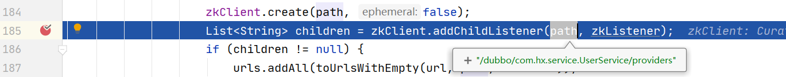

10. 从注册中心获取到地址后，会进入到```DubboProtocol```的```refer```方法(发布与订阅模式，如果获取不到地址是不会跳转到DubboProtocol的，因此debug时得开启Provider)

    1. 该方法最终能够获得一个```invoker```，其中封装了与provider服务器建立的连接

    2. ```java
           @Override
           public <T> Invoker<T> refer(Class<T> serviceType, URL url) throws RpcException {
               optimizeSerialization(url);
               // create rpc invoker.
               DubboInvoker<T> invoker = new DubboInvoker<T>(serviceType, url, getClients(url), invokers);
               invokers.add(invoker);
               return invoker;
           }
       ```

    3. ```getClients(url)```就是通过url与provider服务建立起连接，注意了，在服务引用时dubbo就已经将连接建立起来

12. 最终，invoker会被返回到第六步，作为ReferenceBean的代理对象保存在Spring容器中

13. 也就意味着，当```orderServiceImp```要调用```userService```的方法时，会使用到其建立好的连接，直接向provider发送请求获取方法调用的结果，这部分在服务调用部分会说明

## 服务调用

1. 当调用到```userService.getUser(userId)```时就会执行代理对象的```invoke```方法（Proxy动态代理的基础内容不赘述）

2. 进而调用```invoker.invoke(new RpcInvocation(method, args)).recreate()```，可以见得RpcInvocation对象将方法名和参数存了起来

   1. 进而```list(invocation)```从```directory```获得能够处理invocation的invokers，并进行doInvoke

   2. 相当于```directory```在服务引用阶段，就将invocation与invokers做了某种关联，以至于可以匹配

   3. ```java
      @Override
      public Result invoke(final Invocation invocation) throws RpcException {
          checkWhetherDestroyed();
          LoadBalance loadbalance = null;
          List<Invoker<T>> invokers = list(invocation);
          if (invokers != null && !invokers.isEmpty()) {
              loadbalance = ExtensionLoader.getExtensionLoader(LoadBalance.class).getExtension(invokers.get(0).getUrl()
                      .getMethodParameter(invocation.getMethodName(), Constants.LOADBALANCE_KEY, Constants.DEFAULT_LOADBALANCE));
          }
          RpcUtils.attachInvocationIdIfAsync(getUrl(), invocation);
          return doInvoke(invocation, invokers, loadbalance);
      }
      ```

3. ```doInvoke()```为服务调用的核心方法

   1. ```Invoker<T> invoker = select(loadbalance, invocation, copyinvokers, invoked)```传入负载均衡器```loadbalance```，根据负载均衡策略从```copyinvokers```中选出一个``` invoker```

   2. ```invoker.invoke(invocation)```进行执行，其中invocation有对应的方法名和参数

   3. ```java
      @Override
      @SuppressWarnings({"unchecked", "rawtypes"})
      public Result doInvoke(Invocation invocation, final List<Invoker<T>> invokers, LoadBalance loadbalance) throws RpcException {
          //////////////////////////////////////////////////
              Invoker<T> invoker = select(loadbalance, invocation, copyinvokers, invoked);
              invoked.add(invoker);
              RpcContext.getContext().setInvokers((List) invoked);
              try {
                  Result result = invoker.invoke(invocation);
           //////////////////////////////////////////////////////
                  return result;
              } catch (RpcException e) {
       			//////////////////////////////////////////////
      ```

4. 而```invoker.invoke(invocation)```就是使用服务引用时绑定好的```client```与```Provider```进行交互
5. 需要注意的是，```Provider```只是暴露了整个服务类，并没有暴露具体方法，因此当```Consumer```通过invoker将invocation发送给Provider时，Provider需要根据invocation传进来的方法名找到服务类中对应的方法进行处理
6. 我们给Provider被调用方法打上断点，令Consumer进行调用，即可看到Provider的调用链
7. 根据netty的原理，现在channel已经创建好了，那么channel上的事件一旦发生，会交由handler进行处理
8. 请求先是到达```HeaderExchangeHandler```，其中```handleRequest```方法完成请求处理
9. ```handleRequest```调用了```Object result = handler.reply(channel, msg)```获取最终结果，handler为```DubboProtocol```
   1. ```getInvoker```选出invoker
   2. 遍历methods找到匹配的```method```
   3. ```invoker.invoke```完成远程调用
   4. 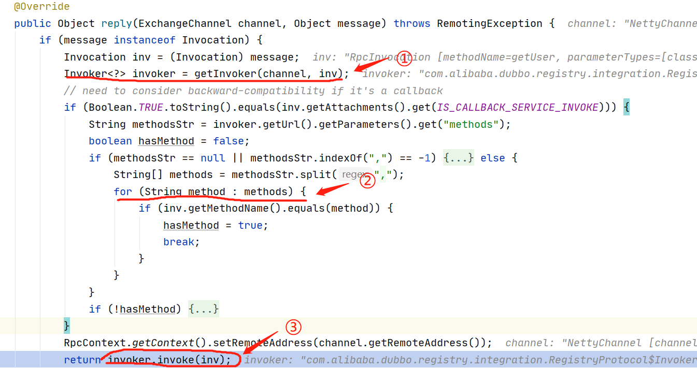

10. 至此，服务调用完结


## 小结

服务暴露

* @Service注解将userService注册到Spring容器中，类型为ServiceBean
* 创建userService单例时会将Provider服务器打开并且将userService注册到注册中心
* userService会与服务器client绑定到一起

服务引用

* 给orderService注入属性时，会发现带了@Reference的userService变量，会先根据对应的Reference注解后置处理器生成一个userService代理对象再赋值给orderService
* 生成代理的过程中，会去注册中心进行订阅，注册中心会发布相关provider地址，拿到provider地址后与服务器建立连接，将连接保存在代理中
* 下次使用代理对象的方法时，就能够直接使用保存好的连接往provider发送请求获取数据

服务调用

* 调用代理对象的方法时，会拿到绑定好的连接，往连接发送请求
* Provider服务器收到请求后会根据请求中指定的方法找到与之匹配的已经暴露的服务
* 服务再找到与之匹配的方法完成调用并返回结果

# 手写RPC框架

## 框架总结

看完dubbo源码，可以感觉到RPC其实整个流程不算很复杂，那么根据上述小结可以仿着写一个RPC框架。在这里参考的是javaguide的rpc框架，主要进行一个解析，并对比其与dubbo哪些地方不同

我们先简化RPC三个步骤主要完成哪些事情

服务暴露

* @Sevice标识Provider
* 创建带@Sevice注释的bean时，完成服务器开启以及registry注册

服务引用

* @Reference标识consumer
* 为consumer创建代理对象，并根据registry找到provider地址与之建立连接client
* client与consumer绑定

服务调用

* consumer调用代理方法时，使用绑定好的client发送请求给provider获取结果
* provider接到请求后匹配并找出能够执行请求的方法进行执行


## 服务暴露

1. 自定义一个BeanPostProcessor，并重写 postProcessBeforeInitialization
   1. 在每个Bean初始化前判断是否被@RpcService修饰
   2. 如果被修饰，则将相关配置记录，并通过serviceProvider.publishService注册到registry中
   3. publishService调用了serviceRegistry.registerService，而该方法为
   4. 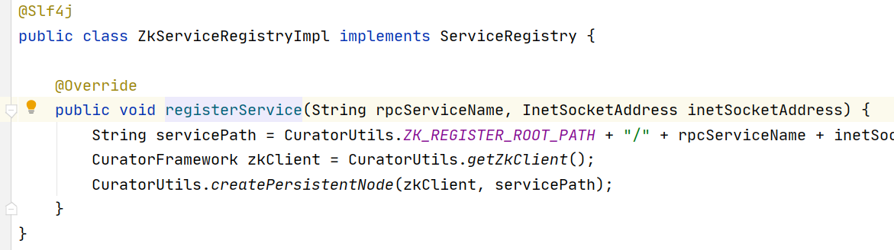
2. 服务器是手动主动完成启动的，通过从容器中获取nettyRpcServer调用其start方法
   1. 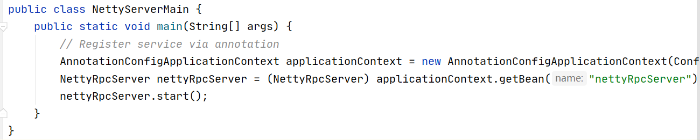

3. 至此服务暴露功能结束

## 服务引用

1. 自定义一个BeanPostProcessor(与服务暴露用同一个)，并重写postProcessAfterInitialization
   1. 在每个Bean初始化之后利用反射，判断每个Bean的属性上是否被@RpcReference修饰
   2. 如果被修饰，则将相关配置记录，并通过```new RpcClientProxy(rpcClient, rpcServiceConfig)```生成一个代理对象并绑定Client
   3. 并将该代理对象通过反射注入到被修饰的变量中```declaredField.set(bean, clientProxy)```
   4. Client在BeanPostProcesser被初始化时就通过SPI机制初始化
      1. 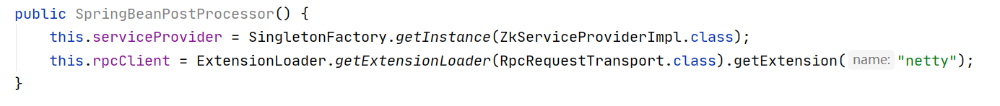

2. 一个BeanPostProcessor基本完成了引用的功能

## 服务调用

1. invoke方法中，先根据参数以及方法名构建一个请求rpcRequest
2. ```rpcRequestTransport.sendRpcRequest(rpcRequest);```异步将请求发送给当前代理对象绑定好的client
   1. 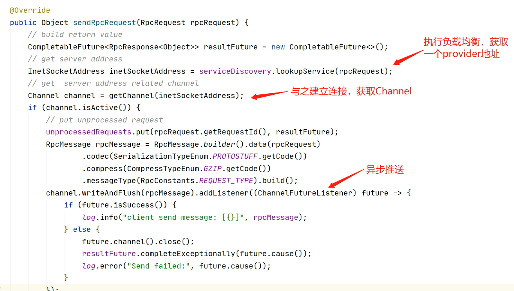

3. consumer与provider服务器建立连接后，consumer发送数据，provider服务器监听到事件，转发给某个eventloop中的Handler完成处理，在这里是NettyRpcServerHandler

   1. NettyRpcServerHandler.channelRead

   2. 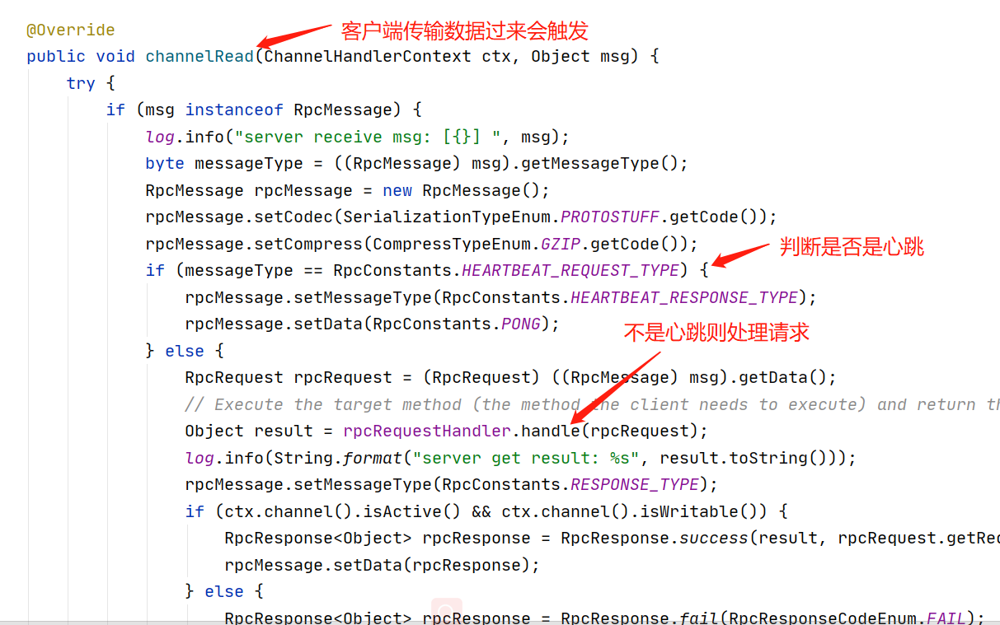

   3. 其中，rpcRequestHandler.handle为

      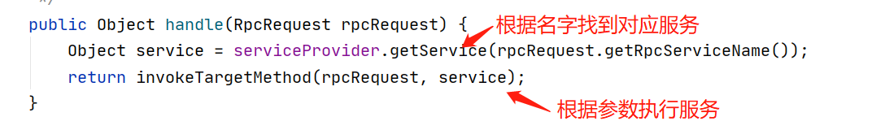

   4. 这里的serviceProvider是服务暴露时，在Bean后置处理器处理时存好的

# 比较

## 服务暴露

1. dubbo为@Service注解标识的类生成一个ServiceBean并注册到容器中
2. 手写的只是通过BeanPostProcessor判断是否有注释
3. 虽然都能实现服务暴露，但dubbo能够真正生成一个bean，后续还能进行自动注入完成调用

## 服务引用

1. dubbo为@Reference注解标识的属性会生成一个代理对象ReferenceBean并注册到容器中，并且ReferenceBean会绑定好一个已经建立的连接connection
2. 手写的只是通过BeanPostProcessor判断是否有注释，为orderService临时生成了一个代理对象注入到属性中，该代理对象并不会被注册到容器，意味着其他服务想注入时还得重新生成对应的代理对象，并且此时代理对象不会绑定一个connection，只是绑定了一个bootstrap，并没有进行connect
3. dubbo的做法会更妥，当然手写的比较简单

## 服务调用

1. 由于服务引用时，dubbo已经为每个consumer建立好connection，所以调用时直接使用connection完成调用
2. 手写框架中，consumer进行invoke的时候，会使用绑定好的client(bootstrap)建立connection，获取channel，再进行远程调用
3. 先建立连接的好处在于初始化就完成连接的创建，符合IOC的风格

