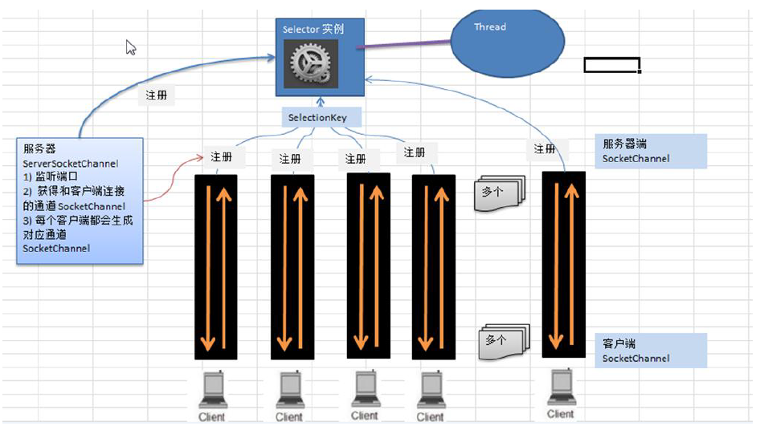

# 前言

看Netty源码，主要是顺着Netty流程图，摸清具体使用NIO是如何实现的，因此主要是看NIO关键代码在Netty哪个执行阶段会被调用

# 启动流程

## NIO模拟

熟悉Netty流程的，都能够知道启动Bootstrap只需要NIO完成下述几件事情

```java
// 创建并配置ServerSocketChannel
ServerSocketChannel serverSocketChannel = ServerSocketChannel.open();
serverSocketChannel.configureBlocking(false);

// 创建selector
Selector selector = Selector.open();

// 将ServerSocketChannel注册到Selector上，并添加监听Accept事件
SelectionKey selectionKey = serverSocketChannel.register(selector, 0);
selectionKey.interestOps(SelectionKey.OP_ACCEPT);

// Channel开始监听某个端口
serverSocketChannel.socket().bind(new InetSocketAddress(6666));

```

## bind

bind方法作为ServerBootstrap的入口来进行源码浅析，最终锁定关键代码块为doBind()

```java
    private ChannelFuture doBind(final SocketAddress localAddress) {
        // 初始化与注册
        final ChannelFuture regFuture = initAndRegister();
        final Channel channel = regFuture.channel();
        if (regFuture.cause() != null) {
            return regFuture;
        }
       
		// regFuture对应注册过程的future，如果成功则直接在main线程中doBind
        if (regFuture.isDone()) {
            // At this point we know that the registration was complete and successful.
            ChannelPromise promise = channel.newPromise();
            doBind0(regFuture, channel, localAddress, promise);
            return promise;
        } else {
            // 否则，将doBind交给Nio线程
  final PendingRegistrationPromise promise = new PendingRegistrationPromise(channel);
            regFuture.addListener(new ChannelFutureListener() {
                @Override
                public void operationComplete(ChannelFuture future) throws Exception {
                    Throwable cause = future.cause();
                    if (cause != null) {

                        promise.setFailure(cause);
                    } else {
  
                        promise.registered();
						// 开始监听
                        doBind0(regFuture, channel, localAddress, promise);
                    }
                }
            });
            return promise;
        }
    }
```

### initAndRegister

```java
    final ChannelFuture initAndRegister() {
        Channel channel = null;
        try {
            // 1. 根据反射机制创建NioServerSocketChannel，并绑定ServerSocketChannel
            channel = channelFactory.newChannel();
            // 2. 初始化一些属性，并往NioServerSocketChannel对应的Pipiline中添加AcceptorHandler
            init(channel);
        } catch (Throwable t) {
            if (channel != null) {
                channel.unsafe().closeForcibly();

                return new DefaultChannelPromise(channel, GlobalEventExecutor.INSTANCE).setFailure(t);
            }

            return new DefaultChannelPromise(new FailedChannel(), GlobalEventExecutor.INSTANCE).setFailure(t);
        }

        ChannelFuture regFuture = config().group().register(channel);
        if (regFuture.cause() != null) {
            if (channel.isRegistered()) {
                channel.close();
            } else {
                channel.unsafe().closeForcibly();
            }
        }

        return regFuture;
    }
```

* channelFactory.newChannel()方法完成了NioServerSocketChannel的创建，而NioServerSocketChannel会绑定一个ServerSocketChannel，NioServerSocketChannel在构造方法时完成ServerSocketChannel的创建与初始化
* init进行一些属性初始化，并为Pipline中添加一个ServerBootstrapAcceptor（该步骤不会立刻执行），此时Pipline中存在三个Handler，分别为 head->acceptor->tail
* register(channel)，会将SocketServerChannel注册到Selector中。一个NioEventLoop对应一个线程，也对应了一个Selector，这部分在《初识Netty》时分析过

#### init

```java
@Override
void init(Channel channel) {
    // 初始化一些属性
    setChannelOptions(channel, newOptionsArray(), logger);
    setAttributes(channel, newAttributesArray());

    ChannelPipeline p = channel.pipeline();

    final EventLoopGroup currentChildGroup = childGroup;
    final ChannelHandler currentChildHandler = childHandler;
    final Entry<ChannelOption<?>, Object>[] currentChildOptions = newOptionsArray(childOptions);
    final Entry<AttributeKey<?>, Object>[] currentChildAttrs = newAttributesArray(childAttrs);
	// 使用ChannelInitializer添加ServerBootstrapAcceptor，但该方法现在不会执行
    p.addLast(new ChannelInitializer<Channel>() {
        @Override
        public void initChannel(final Channel ch) {
            final ChannelPipeline pipeline = ch.pipeline();
            ChannelHandler handler = config.handler();
            if (handler != null) {
                pipeline.addLast(handler);
            }

            ch.eventLoop().execute(new Runnable() {
                @Override
                public void run() {
                    pipeline.addLast(new ServerBootstrapAcceptor(
                            ch, currentChildGroup, currentChildHandler, currentChildOptions, currentChildAttrs));
                }
            });
        }
    });
}
```

注意，该方法只是往pipline添加了一个ChannelInitializer，作用是使用channel绑定的唯一线程执行一个任务，该任务目的是将Acceptor加入pipline中，但现在不会运行

#### register

```java
public final void register(EventLoop eventLoop, final ChannelPromise promise) {
    ObjectUtil.checkNotNull(eventLoop, "eventLoop");
    if (isRegistered()) {
        promise.setFailure(new IllegalStateException("registered to an event loop already"));
        return;
    }
    if (!isCompatible(eventLoop)) {
        promise.setFailure(
                new IllegalStateException("incompatible event loop type: " + eventLoop.getClass().getName()));
        return;
    }

    AbstractChannel.this.eventLoop = eventLoop;
	// 判断当前线程是否为Channel对应的NioEventLoop
    // 是，则可以直接执行
    if (eventLoop.inEventLoop()) {
        register0(promise);
    } else {
        try {
            // 否，则获取到NioEventLoop，并用其execute提交register0，
            // 保证register0在channel对应的NioEventLoop中运行
            eventLoop.execute(new Runnable() {
                @Override
                public void run() {
                    register0(promise);
                }
            });
        } catch (Throwable t) {
            logger.warn(
                    "Force-closing a channel whose registration task was not accepted by an event loop: {}",
                    AbstractChannel.this, t);
            closeForcibly();
            closeFuture.setClosed();
            safeSetFailure(promise, t);
        }
    }
}
```

该方法保证register0一定在Channel对应的NioEventLoop中执行

register0中的doRegister()会通过

```selectionKey = javaChannel().register(eventLoop().unwrappedSelector(), 0, this)```

将javaChannel(SeverSocketChannel)注册到eventLoop对应的selector中，这里的unwrappedSelector指的是netty重新包装过的selector，与原来的区别在于selectionKey用数组来存储，加快遍历速度

```java
private void register0(ChannelPromise promise) {
    try {
      
        if (!promise.setUncancellable() || !ensureOpen(promise)) {
            return;
        }
        boolean firstRegistration = neverRegistered;
        // 将SeverSocketChannel绑定到selector中，但不注册事件
        doRegister();
        neverRegistered = false;
        registered = true;
		// 触发Channel上的初始化事件
        pipeline.invokeHandlerAddedIfNeeded();
		// 注册成功后，通过promise设置成功结果，告诉future已经注册成功。
        // 由于绑定了完成监听者，会立刻执行doBind0
        safeSetSuccess(promise);
        // 执行完bind0后，执行pipline中Handler的ChannelRegistered()方法
        pipeline.fireChannelRegistered();
      
        // 如果pipline已经bind了（一般这步都还没bind，因此isActive为false）
        if (isActive()) {
            if (firstRegistration) {
                // 那么执行pipline中Handler的ChannelActive()方法
                pipeline.fireChannelActive();
            } else if (config().isAutoRead()) {
                beginRead();
            }
        }
    } catch (Throwable t) {
        closeForcibly();
        closeFuture.setClosed();
        safeSetFailure(promise, t);
    }
}
```

### doBind0

该方法要一直跟下去invokeBind-->bind

```java
@Override
public final void bind(final SocketAddress localAddress, final ChannelPromise promise) {
    assertEventLoop();

    if (!promise.setUncancellable() || !ensureOpen(promise)) {
        return;
    }

    // See: https://github.com/netty/netty/issues/576
    if (Boolean.TRUE.equals(config().getOption(ChannelOption.SO_BROADCAST)) &&
        localAddress instanceof InetSocketAddress &&
        !((InetSocketAddress) localAddress).getAddress().isAnyLocalAddress() &&
        !PlatformDependent.isWindows() && !PlatformDependent.maybeSuperUser()) {
        // Warn a user about the fact that a non-root user can't receive a
        // broadcast packet on *nix if the socket is bound on non-wildcard address.
        logger.warn(
                "A non-root user can't receive a broadcast packet if the socket " +
                "is not bound to a wildcard address; binding to a non-wildcard " +
                "address (" + localAddress + ") anyway as requested.");
    }

    boolean wasActive = isActive();
    try {
        // 调用SeverSocketChannel绑定bind一个端口
        doBind(localAddress);
    } catch (Throwable t) {
        safeSetFailure(promise, t);
        closeIfClosed();
        return;
    }

    if (!wasActive && isActive()) {
        invokeLater(new Runnable() {
            @Override
            public void run() {
                // 调用对应pipline的所有Handler的ChannelActive()
                pipeline.fireChannelActive();
            }
        });
    }

    safeSetSuccess(promise);
}
```

doBind

* ```java
  protected void doBind(SocketAddress localAddress) throws Exception {
      if (PlatformDependent.javaVersion() >= 7) {
          javaChannel().bind(localAddress, config.getBacklog());
      } else {
          javaChannel().socket().bind(localAddress, config.getBacklog());
      }
  }
  ```

### fireChannelActive()

由于当前Pipline中只有三个Handler，head->acceptor->tail

因此先会进入HeadContext的ChannelActive()方法

```java
@Override
public void channelActive(ChannelHandlerContext ctx) {
    // 继续调用后续的ChannelActive方法，可以见是一个后序遍历
    ctx.fireChannelActive();
	// 为SeverSocketChannel将Accept事件注册到selector中
    readIfIsAutoRead();
}
```

readIfIsAutoRead()一直跟到doBeginRead()

```java
@Override
protected void doBeginRead() throws Exception {
    // Channel.read() or ChannelHandlerContext.read() was called
    final SelectionKey selectionKey = this.selectionKey;
    if (!selectionKey.isValid()) {
        return;
    }

    readPending = true;

    // 获取关注事件
    final int interestOps = selectionKey.interestOps();
    if ((interestOps & readInterestOp) == 0) {
        // 添加Accept事件，readInterestOp就是1<<4：Opt_ACCEPT
        selectionKey.interestOps(interestOps | readInterestOp);
    }
}
```

### 关键点总结

至此，服务端的启动流程就结束了，相当于完成了将ServerSocketChannel注册到对应的EventLoop对应的selector中，后续会接着分析accept事件触发后，该selector会将对应SocketChannel注册到另一个EventLoop中

* main线程只负责ServerSocketChannel的创建，channel向selector注册以及绑定端口都是ServerSocketChannel对应的NioServerSocketChannel对应的NioEventLoop来执行的，是一个异步过程。这也意味着在调用ServerBootstrap的bin方法时，要考虑异步是否完成，可以用sync来保证
* 整个启动流程，创建ServerChannel->注册到selector（未绑定事件）->bind->绑定Accept事件
  * 为什么注册时不绑定事件呢？因为注册后要执行pipeline.fireChannelRegistered()，并且严格意义上刚注册时就应该是什么事件都没监听的
  * 注意是先bind在绑定事件，也就意味着可能服务器已经bind了，这时有客户端进行连接，由于没有绑定事件，是不会进行操作的


# NioEventLoop

其职能就是一个单线程，既要处理io事件，也要处理提交的普通任务，同时又是一个selector，会绑定许多channel，并监听channel上的事件

源码部分主要看一看selector创建以及其如何执行任务的

## Selector

构造方法通过openSelector()完成了selector的创建，并且会有两个selector，其中selector就是原生的selector，而unwrappedSelector是netty修改后的，主要通过反射机制，将SelectionKeys的存储结构从HashSet换成了数组，这样遍历会更快一些

```java
NioEventLoop(NioEventLoopGroup parent, Executor executor, SelectorProvider selectorProvider,
             SelectStrategy strategy, RejectedExecutionHandler rejectedExecutionHandler,
             EventLoopTaskQueueFactory queueFactory) {
    super(parent, executor, false, newTaskQueue(queueFactory), newTaskQueue(queueFactory),
            rejectedExecutionHandler);
    this.provider = ObjectUtil.checkNotNull(selectorProvider, "selectorProvider");
    this.selectStrategy = ObjectUtil.checkNotNull(strategy, "selectStrategy");
    final SelectorTuple selectorTuple = openSelector();
    this.selector = selectorTuple.selector;
    this.unwrappedSelector = selectorTuple.unwrappedSelector;
}
```

## Execute

执行execute方法时就会创建线程

```java
private void execute(Runnable task, boolean immediate) {
    boolean inEventLoop = inEventLoop();
    // 将任务加入队列
    addTask(task);
    // 判断当前线程是不是Nio线程
    if (!inEventLoop) {
        // 否，则启动Nio线程
        startThread();
        if (isShutdown()) {
            boolean reject = false;
            try {
                if (removeTask(task)) {
                    reject = true;
                }
            } catch (UnsupportedOperationException e) {
            }
            if (reject) {
                reject();
            }
        }
    }

    if (!addTaskWakesUp && immediate) {
        wakeup(inEventLoop);
    }
}
```


```java
private void startThread() {
    if (state == ST_NOT_STARTED) {
        // 通过标志位+CAS，保证并发时只能创建一个线程
        if (STATE_UPDATER.compareAndSet(this, ST_NOT_STARTED, ST_STARTED)) {
            boolean success = false;
            try {
                doStartThread();
                success = true;
            } finally {
                if (!success) {
                    STATE_UPDATER.compareAndSet(this, ST_STARTED, ST_NOT_STARTED);
                }
            }
        }
    }
}
```

```java
private void doStartThread() {
    assert thread == null;
    // 通过内部的executor的execute方法直接启动一个线程
    executor.execute(new Runnable() {
        @Override
        public void run() {
            // 并让该线程把自己设入Nio线程对象的thread中，这样Nio线程就启动好了
            thread = Thread.currentThread();
            if (interrupted) {
                thread.interrupt();
            }

            boolean success = false;
            updateLastExecutionTime();
            try {
                // 该方法是Nio最重要的方法，是一个循环方法，负责循环处理io任务以及普通任务
                SingleThreadEventExecutor.this.run();
                success = true;
            } catch (Throwable t) {
                logger.warn("Unexpected exception from an event executor: ", t);
            } finally {
			// 省略善后处理逻辑，不是重点
        }
    });
}
```

## run

该方法是NioEvenLoop最重要的方法了，用于监听并执行Channel中的io事件以及普通任务

```java
@Override
protected void run() {
    int selectCnt = 0;
    // 永久循环
    for (;;) {
        try {
            int strategy;
            try {
                // 判断待会应该进行哪个处理步骤
                strategy = selectStrategy.calculateStrategy(selectNowSupplier, hasTasks());
                switch (strategy) {
                case SelectStrategy.CONTINUE:
                    continue;

                case SelectStrategy.BUSY_WAIT:
                    // fall-through to SELECT since the busy-wait is not supported with NIO
				// 执行select进行事件监听
                case SelectStrategy.SELECT:
                    long curDeadlineNanos = nextScheduledTaskDeadlineNanos();
                    if (curDeadlineNanos == -1L) {
                        curDeadlineNanos = NONE; // nothing on the calendar
                    }
                    nextWakeupNanos.set(curDeadlineNanos);
                    try {
                        // 任务队列中没有任务才会执行select监听io事件，因为该方法会阻塞
                        if (!hasTasks()) {
                            // 注意了，就算是select,也是带超时时间的select,意味着不会一直阻塞
                            strategy = select(curDeadlineNanos);
                        }
                    } finally {
                        // This update is just to help block unnecessary selector wakeups
                        // so use of lazySet is ok (no race condition)
                        nextWakeupNanos.lazySet(AWAKE);
                    }
                    // fall through
                default:
                }
            } catch (IOException e) {
                // If we receive an IOException here its because the Selector is messed up. Let's rebuild
                // the selector and retry. https://github.com/netty/netty/issues/8566
                rebuildSelector0();
                selectCnt = 0;
                handleLoopException(e);
                continue;
            }

            // 上述过程执行完后，要么获取到了io事件，以及任务队列中有普通任务在排队
            // 要么本来队列中就有普通任务在排队，没有执行select获取io事件，直接先到这一步
            selectCnt++;
            cancelledKeys = 0;
            needsToSelectAgain = false;
            final int ioRatio = this.ioRatio;
            boolean ranTasks;
            // ioRatio是控制处理IO事件还是普通任务的速度的，一般直接看else
            if (ioRatio == 100) {
                try {
                    if (strategy > 0) {
                        processSelectedKeys();
                    }
                } finally {
                    // Ensure we always run tasks.
                    ranTasks = runAllTasks();
                }
            } else if (strategy > 0) {
                final long ioStartTime = System.nanoTime();
                try {
                    // 先处理IO事件
                    processSelectedKeys();
                } finally {
                    final long ioTime = System.nanoTime() - ioStartTime;
                    // 最后处理普通任务
                    ranTasks = runAllTasks(ioTime * (100 - ioRatio) / ioRatio);
                }
            } else {
                ranTasks = runAllTasks(0); // This will run the minimum number of tasks
            }

            if (ranTasks || strategy > 0) {
                if (selectCnt > MIN_PREMATURE_SELECTOR_RETURNS && logger.isDebugEnabled()) {
                    logger.debug("Selector.select() returned prematurely {} times in a row for Selector {}.",
                            selectCnt - 1, selector);
                }
                selectCnt = 0;
            } else if (unexpectedSelectorWakeup(selectCnt)) { // Unexpected wakeup (unusual case)
                selectCnt = 0;
            }
        } catch (CancelledKeyException e) {
            // Harmless exception - log anyway
            if (logger.isDebugEnabled()) {
                logger.debug(CancelledKeyException.class.getSimpleName() + " raised by a Selector {} - JDK bug?",
                        selector, e);
            }
        } catch (Error e) {
            throw (Error) e;
        } catch (Throwable t) {
            handleLoopException(t);
        } finally {
            // Always handle shutdown even if the loop processing threw an exception.
            try {
                if (isShuttingDown()) {
                    closeAll();
                    if (confirmShutdown()) {
                        return;
                    }
                }
            } catch (Error e) {
                throw (Error) e;
            } catch (Throwable t) {
                handleLoopException(t);
            }
        }
    }
}
```

所以主要关注三个方法

selectStrategy.calculateStrategy(selectNowSupplier, hasTasks());

processSelectedKeys();

runAllTasks(ioTime * (100 - ioRatio) / ioRatio)

### calculateStrategy

```java
@Override
public int calculateStrategy(IntSupplier selectSupplier, boolean hasTasks) throws Exception {
    return hasTasks ? selectSupplier.get() : SelectStrategy.SELECT;
}
// selectSupplier.get()
private final IntSupplier selectNowSupplier = new IntSupplier() {
    @Override
    public int get() throws Exception {
        return selectNow();
    }
};
```

* 判断任务队列中是否有任务
* 没有则SelectStrategy.SELECT，待会就会走select进行带超时的阻塞
* 有，则selectNow()，不阻塞地获取一下当前是否有事件触发，待会直接进入任务处理阶段

### processSelectedKeys

处理每个事件的主方法，比较繁琐，有空再看

### runAllTasks

处理任务队列中的普通任务，也有空再看

### 流程小结

理一理run方法会怎么被触发以及做哪些事情

* 在第一次执行NioEventLoop的execute方法时，就会新建并绑定一个单线程
* 该单线程在启动后就执行run方法，run方法是一个循环不停止的方法

run流程

1. 判断当前任务队列是否有任务，有的话执行selectNow不阻塞地获取io事件，进入3
2. 无的话，进入带超时的select阻塞，阻塞后进入3
3. 先执行processSelectedKeys，处理当前获取到的所有io事件
4. 再执行runAllTasks处理任务队列中的普通任务
5. 总的来看，netty会保证普通任务尽可能快地被处理，并且普通任务是会影响当前selector对应channels的io事件的处理的

### 问题解答

select阻塞的时候，突然有普通任务提交，此时是继续阻塞还是会去执行普通任务？

* 在netty-all-4.1.39.Final.jar中，通过wakeup机制保证阻塞过程中有任务，会停止阻塞而去执行任务
* 但在netty-all-4.1.60.Final.jar中（前面源码分析用的都是该版本），没有在原来的地方看到wakeup机制，是否弃用了不得而知
* 因此以netty-all-4.1.39.Final.jar版本说一下wakeup机制如何实现的，主要看select源码

```java
    private void select(boolean oldWakenUp) throws IOException {
        Selector selector = this.selector;
        try {
            int selectCnt = 0;
            long currentTimeNanos = System.nanoTime();
            long selectDeadLineNanos = currentTimeNanos + delayNanos(currentTimeNanos);

            // 执行一个通过超时时间来退出的死循环
            for (;;) {
                long timeoutMillis = (selectDeadLineNanos - currentTimeNanos + 500000L) / 1000000L;
                if (timeoutMillis <= 0) {
                    if (selectCnt == 0) {
                        selector.selectNow();
                        selectCnt = 1;
                    }
                    break;
                }
				// 这里每次会判断是否任务队列中有任务，有则唤醒，并退出
                // 这里通过CAS保证只需要wakeup一次
                if (hasTasks() && wakenUp.compareAndSet(false, true)) {
                    selector.selectNow();
                    selectCnt = 1;
                    break;
                }

```

NIO的bug，netty是如何解决的？

* Nio的bug主要出自linux下的select，select如果出现了该bug，那么即使没有事件也会select成功，导致死循环不停地运转，导致CPU空转
* 解决办法就是使用selectCnt计数，如果死循环超过了某个值，则将select进行更换
* 对应的流程在上述select的下半段

其中SELECTOR_AUTO_REBUILD_THRESHOLD可以自定义设计，默认为512

```java
} else if (SELECTOR_AUTO_REBUILD_THRESHOLD > 0 &&
        selectCnt >= SELECTOR_AUTO_REBUILD_THRESHOLD) {
    // The code exists in an extra method to ensure the method is not too big to inline as this
    // branch is not very likely to get hit very frequently.
    selector = selectRebuildSelector(selectCnt);
    selectCnt = 1;
    break;
}
```

# Accept

熟悉主从Reactor模式的应该知道，ServerSocketChannel捕获到Accept事件后，应该将与客户端建立的SocketChannel注册到从selector中，让从selector完成与客户端的交互

整个流程

1. 主selctor.select阻塞直到事件发生
2. 遍历处理事件
3. 判断事件类型是否为accept
4. 是则创建SocketChannel，并设置非阻塞，同时绑定给NioSocketChannel
5. 将SocketChannel注册至从selector
6. 并关注read事件

前3步在上述源码解析中已经提及，因此主要看看后三步在哪里被执行的

由于accept是一个IO事件，因此我们锁定到NioEventLoop的processSelectedKeys方法中，其中跟到processSelectedKey，该方法负责Channel上不同事件的处理，怎么处理呢？当然就是调相应pipline上的Handler了

```java
    private void processSelectedKey(SelectionKey k, AbstractNioChannel ch) {
        final AbstractNioChannel.NioUnsafe unsafe = ch.unsafe();
        if (!k.isValid()) {
            final EventLoop eventLoop;
            try {
                eventLoop = ch.eventLoop();
            } catch (Throwable ignored) {

                return;
            }

            if (eventLoop == this) {
                unsafe.close(unsafe.voidPromise());
            }
            return;
        }

        try {
            int readyOps = k.readyOps();

            if ((readyOps & SelectionKey.OP_CONNECT) != 0) {

                int ops = k.interestOps();
                ops &= ~SelectionKey.OP_CONNECT;
                k.interestOps(ops);

                unsafe.finishConnect();
            }

			// 处理写事件
            if ((readyOps & SelectionKey.OP_WRITE) != 0) {

                ch.unsafe().forceFlush();
            }
			// 处理读事件以及Accpet
            if ((readyOps & (SelectionKey.OP_READ | SelectionKey.OP_ACCEPT)) != 0 || readyOps == 0) {
                unsafe.read();
            }
        } catch (CancelledKeyException ignored) {
            unsafe.close(unsafe.voidPromise());
        }
    }
```

unsafe.read()方法跟下去

```java
    @Override
    public void read() {
        assert eventLoop().inEventLoop();
        final ChannelConfig config = config();
        final ChannelPipeline pipeline = pipeline();
        final RecvByteBufAllocator.Handle allocHandle = unsafe().recvBufAllocHandle();
        allocHandle.reset(config);

        boolean closed = false;
        Throwable exception = null;
        try {
            try {
                do {
                    // 执行accept，并获取到对应的SocketChannel
                 	// 并将Socketchannel绑定到NioSocketChannel中，写入readBuf
                    int localRead = doReadMessages(readBuf);
                    if (localRead == 0) {
                        break;
                    }
                    if (localRead < 0) {
                        closed = true;
                        break;
                    }

                    allocHandle.incMessagesRead(localRead);
                } while (allocHandle.continueReading());
            } catch (Throwable t) {
                exception = t;
            }

            int size = readBuf.size();
            for (int i = 0; i < size; i ++) {
                readPending = false;
                // 将NioSocketChannel作为一个消息，传递到pipline上的Handler中
                // 由前面可以知道，Server的pipline的handler目前有head->acceptor->tail
                // 主要由acceptor将SocketChannel的注册到从selector上
                pipeline.fireChannelRead(readBuf.get(i));
            }
            readBuf.clear();
            allocHandle.readComplete();
            pipeline.fireChannelReadComplete();

            if (exception != null) {
                closed = closeOnReadError(exception);

                pipeline.fireExceptionCaught(exception);
            }

            if (closed) {
                inputShutdown = true;
                if (isOpen()) {
                    close(voidPromise());
                }
            }
        } finally {
            // Check if there is a readPending which was not processed yet.
            // This could be for two reasons:
            // * The user called Channel.read() or ChannelHandlerContext.read() in channelRead(...) method
            // * The user called Channel.read() or ChannelHandlerContext.read() in channelReadComplete(...) method
            //
            // See https://github.com/netty/netty/issues/2254
            if (!readPending && !config.isAutoRead()) {
                removeReadOp();
            }
        }
    }
}
```

```java
@Override
protected int doReadMessages(List<Object> buf) throws Exception {
    // 调用ServerSocketChannel.accept获得与客户端对应的SocketChannel
    SocketChannel ch = SocketUtils.accept(javaChannel());

    try {
        if (ch != null) {
            // 将SocketChannel绑定到NioSocketChannel中，作为一个buf消息，后续丢入handler
            buf.add(new NioSocketChannel(this, ch));
            return 1;
        }
    } catch (Throwable t) {
        logger.warn("Failed to create a new channel from an accepted socket.", t);

        try {
            ch.close();
        } catch (Throwable t2) {
            logger.warn("Failed to close a socket.", t2);
        }
    }
```

ServerBootstrapAcceptor的channelRead方法，将SocketChannel注册到从selector中

```java
@Override
@SuppressWarnings("unchecked")
public void channelRead(ChannelHandlerContext ctx, Object msg) {
    // msg就是要被注册的SocketChannel
    final Channel child = (Channel) msg;

    child.pipeline().addLast(childHandler);

    setChannelOptions(child, childOptions, logger);
    setAttributes(child, childAttrs);

    try {
        // 使用childGroup（worker NioeventLoop）来注册Channel，重复一开始服务器启动时注册流程
        // 同样要保证注册过程只能在childGroup中
        childGroup.register(child).addListener(new ChannelFutureListener() {
            @Override
            public void operationComplete(ChannelFuture future) throws Exception {
                if (!future.isSuccess()) {
                    forceClose(child, future.cause());
                }
            }
        });
    } catch (Throwable t) {
        forceClose(child, t);
    }
}
```

# Read

我们最后看看，NioEvenLoop怎么处理read事件的

同样的会进入unsafe.read()，但触发的是NioByteUnsafe的read方法

```java
    @Override
    public final void read() {
        final ChannelConfig config = config();
        if (shouldBreakReadReady(config)) {
            clearReadPending();
            return;
        }
        final ChannelPipeline pipeline = pipeline();
        final ByteBufAllocator allocator = config.getAllocator();
        final RecvByteBufAllocator.Handle allocHandle = recvBufAllocHandle();
        allocHandle.reset(config);

        ByteBuf byteBuf = null;
        boolean close = false;
        try {
            // do while保证数据完整
            do {
                // 默认使用的byteBuf都是池化的直接内存byteBuf
                byteBuf = allocHandle.allocate(allocator);
                // 读取缓冲区数据
                allocHandle.lastBytesRead(doReadBytes(byteBuf));
                if (allocHandle.lastBytesRead() <= 0) {
                    // nothing was read. release the buffer.
                    byteBuf.release();
                    byteBuf = null;
                    close = allocHandle.lastBytesRead() < 0;
                    if (close) {
                        // There is nothing left to read as we received an EOF.
                        readPending = false;
                    }
                    break;
                }

                allocHandle.incMessagesRead(1);
                readPending = false;
                // 将数据传给pipline,并执行ChannelRead方法
                pipeline.fireChannelRead(byteBuf);
                byteBuf = null;
                // q
            } while (allocHandle.continueReading());

            allocHandle.readComplete();
            // 结束后执行ChannelReadComplete方法
            pipeline.fireChannelReadComplete();

            if (close) {
                closeOnRead(pipeline);
            }
        } catch (Throwable t) {
            handleReadException(pipeline, byteBuf, t, close, allocHandle);
        } finally {
            // Check if there is a readPending which was not processed yet.
            // This could be for two reasons:
            // * The user called Channel.read() or ChannelHandlerContext.read() in channelRead(...) method
            // * The user called Channel.read() or ChannelHandlerContext.read() in channelReadComplete(...) method
            //
            // See https://github.com/netty/netty/issues/2254
            if (!readPending && !config.isAutoRead()) {
                removeReadOp();
            }
        }
    }
}
```

# NIO流程对比

以尚硅谷的非阻塞例子，来比较其对应了netty的哪一步



```java
public class NIOServer {
    public static void main(String[] args) throws IOException {
        // ServerBootstrap进行bind的时候，执行initAndRegistry会创建ServerSocketChannel
        // 并将ServerSocketChannel绑定到一个NioServerSocketChannel中
        ServerSocketChannel serverSocketChannel = ServerSocketChannel.open();
        serverSocketChannel.configureBlocking(false);

        // NioEventLoop在构造方法进行初始化时，就会创建唯一一个selector
        Selector selector = Selector.open();
        
        // ServerBootstrap进行bind的时候，执行initAndRegistry
        // 会使用NioEventLoop来执行register进行异步注册
        // 并且注册时不会绑定任何事件
        // 直到bind监听好端口后,才会通过HeadContext该Handler通过执行ChannelActive方法将Accept事件绑定
        serverSocketChannel.register(selector, SelectionKey.OP_ACCEPT);

       
        // ServerBootstrap在将SeverSocketChannel注册到selector后就会进行bin
        serverSocketChannel.socket().bind(new InetSocketAddress(6666));


        
		// NioEventLoop中执行run方法，进行循环
        while (true){
            
            // run方法中，如果队列中没有任务，则调用select进行阻塞
            if (selector.select(1000)==0){
                continue;
            }
            
            // 获取到事件，则执行processSelectedKeys来处理对应IO事件，整个流程大概就是如下逻辑
            Set<SelectionKey> selectionKeys = selector.selectedKeys();
            Iterator<SelectionKey> keyIterator = selectionKeys.iterator();
            
			// processSelectedKey对每个事件进行判断和处理
            while (keyIterator.hasNext()){

                SelectionKey key = keyIterator.next();
                // Accept事件只会在SeverSocketChannel中发生
                // 会在ServerBootstrapAcceptor的ChannelRead方法中完成下述过程
                // 该Handler在ServerBootstrap启动时就被加入Pipline中
                if (key.isAcceptable()){
                    SocketChannel socketChannel = serverSocketChannel.accept();
                    socketChannel.configureBlocking(false);
                    // 启动一个childEventLoop来执行注册逻辑
                    // 同样的，注册时没有绑定事件，事件由Head绑定
                    socketChannel.register(selector,SelectionKey.OP_READ, ByteBuffer.allocate(1024));
                }
				// Read事件，触发NioByteUnsafe的read方法
                // 会将缓冲区的数据写入ByteBuffer，并传递到pipline中
                // 依次执行pipline中的handler的channelRead方法完成回调
                if (key.isReadable()) {
                    SocketChannel channel = (SocketChannel)key.channel();
                    ByteBuffer buffer = (ByteBuffer) key.attachment();
                    channel.read(buffer);
                }
                keyIterator.remove();
            }
        }

    }
}
```

上述基于NIO编写的代码段，在netty上述源码分析中都能找到对应的位置

至此，源码浅析结束
