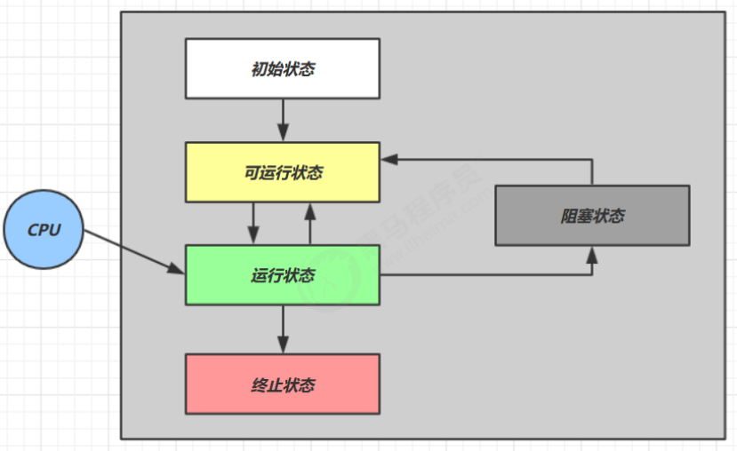
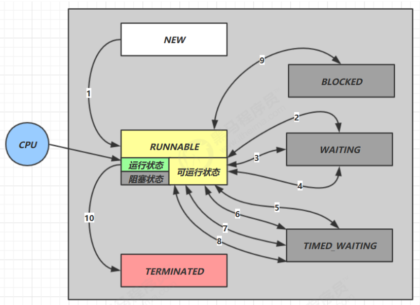

# Java

## 基础

[使用javaguide进行复习][https://snailclimb.gitee.io/javaguide/#/docs/java/basis/Java%E5%9F%BA%E7%A1%80%E7%9F%A5%E8%AF%86%E7%96%91%E9%9A%BE%E7%82%B9]

### 关键字

final

static

### equal、==、hashcode

### 基本类型的包装类与常量池

```java
Integer i1 = 40;

Integer i2 = new Integer(40);

System.out.println(i1==i2); //false
```

### BigDecimal的用处

### String、StringBuffer、StringBuilder

### 枚举

### 反射

### 代理

#### JDK的Proxy

#### CGlib

## 容器

### List、Set、Map

#### 关系


### HashMap

HashSet底层就是HashMap

#### 1.8源码

#### 1.7和1.8的区别

### ArrayList

#### 源码

#### 扩容机制

### ConcurrentHashMap

#### 源码

#### 怎么解决并发的线程安全问题

* volatile+cas解决竞争
* syn锁链表头

#### 1.7与1.8的区别

* 锁粒度，1.8锁粒度细化到到链表头
* 结构

## 反射

## 泛型

## 注解


# JVM

[宋红康JVM](https://www.bilibili.com/video/BV1PJ411n7xZ?p=182)

## 内存模型

### 方法区的演变

### 每个区的作用

### 与类加载及对象创建过程的联系

## 垃圾回收

### 分配与回收

为什么要分新生代和老年代？

* 对应不同的GC算法，新生代，大量对象死亡，剩余少量对象，标记-复制效率高
* 老年代，无额外空间，无法使用标记复制，一般用标记整理或清除

### 如何判断对象死亡

### 四大引用类型

### 垃圾收集算法

### 垃圾收集器

#### CMS

## 监控工具

### jps、jstat、jconsole、jvisualvm

## 类的生命周期

### 类加载的过程

### 静态与非静态变量创建

### 类初始化与对象初始化

## 类加载器

# JUC

结合《黑马并发编程.pdf》进行复习

## java线程

### 创建与启动线程

* 继承Thread子类，重写run方法
* 实现Runnable的run方法，作为参数传入Thread
* 实现Callable的call方法，传入futuretask

### Thread常见几种方法

#### run、start

#### sleep、yeild

#### join

* 同步案例

#### interrupt

* 优雅地打断——两阶段终止模式

### 线程状态

#### 操作系统

五种状态



#### JDK

六种状态



## 共享模型之管程

### 共享带来的问题

### 变量的线程安全分析

### synchronized

* 不同的锁对象头
  * 用在普通方法上
  * 用在静态方法上
  * 用在代码块
* 如何解决同步与互斥
* 原理
* 锁升级
  * 轻量锁
    * 不用monitor
    * 锁记录lock record+ CAS
    * 发生竞争升级到重锁
  * 偏向锁
    * 不用CAS用ThreadId
  * 自旋锁
  * 重锁
* 锁消除
* 锁粗化

### Monitor

* 原理与结构
* 对象头
  * mark word

### wait notify

* 原理

### ReentryLock

#### 模式之保护性暂停

#### 模式之生产者消费者

### Park & Unpark

* 原理
* 与wait notify区别
  * park不需要上锁
  * park可以指定线程

### 线程状态转换

### 多锁存在的问题

* 死锁
* 活锁
* 饥饿
* 哲学家就餐问题
* 查看死锁
  * jconcle
  * jps

## 共享模型之内存

### Java内存模型

* 工作内存与主内存

### 可见性

* 内存屏障原理
* 模式之Balking

### 有序性

* volatile原理

### 原子性

* 可见性不保证原子性

## 共享模型之无锁

### 锁与无锁

* 效率比较

### CAS与volatile

* CAS必须搭配volatile
* ABA问题
* CAS锁

### 原子整数

### 原子引用

* 加入时间戳解决ABA问题 AtomicStampedReferencr

### 原子数组

### 原子累加器

* Longadder
* 伪共享

### Unsafe 类

# Mysql

https://www.bilibili.com/video/BV19a4y1W7y8?from=search&seid=2249342956695065801


## 引擎

### MyISAM 与 InnoDB的区别

## 索引

### 底层原理

### B+树与Hash表效率比较

## 日志

### redo log

### bin log

### undo log

## 事务

### ACID

### 隔离级别

### MVCC

## 范式

# Redis

## 原理

### 单线程Reactor模式

## 持久化机制

### RDB

### AOF

## 过期机制

### 过期时间

### 删除策略

### 内存淘汰策略

## 缓存问题

### 缓存击穿

### 缓存穿透

### 缓存雪崩

### 缓存一致性

# RestFul API

# Spring

## IOC原理与源码

## AOP原理与源码

## 事务原理与源码

# SpringMVC

## 与Spring的区别

## Web原理与源码

# SpringBoot

## 自动装配原理与源码

# SpringCloud

# Mybatis

# Dubbo

## 框架原理与源码


# Netty与NIO

[《黑马netty》](https://www.bilibili.com/video/BV1py4y1E7oA?p=142)

## NIO、BIO、AIO

## 零拷贝

## 非阻塞IO模型

## Reactor模式

## Netty原理

##  Netty源码

### 服务启动、Channel注册、accept事件、read事件

### NioEventLoop

### ByteBuffer

#### 堆内存与直接内存

#### 池化与非池化


# 分布式理论

## CAP

## BASE

## Raft分布式一致性策略

# 秒杀系统

## 认证服务

## 高并发

### 消息队列

###  读写分离&分库分表

### 负载均衡

### 分布式锁

## 高可用

### 限流

### 降级

### 熔断

# 手写RPC框架

## 服务暴露

## 服务引用

## 服务调用

## Spring结合

### 注解开发

## SPI机制

# Zookeeper

## 节点类型

## 选举方式


# 算法

# 计算机网络

# 操作系统

## 线程与进程

### 区别

### 进程之间通信的方法

### 线程同步的方法

### 进程状态

### 调度算法

## 死锁

### 四个条件

#### 解决办法

## 虚拟内存

### 逻辑地址、物理地址

### 页式存储

#### 缺页中断

#### 页面置换算法

### 段式存储

### 段页式存储

# 

