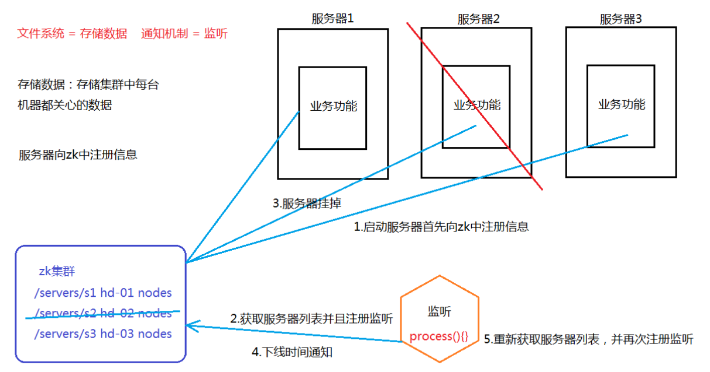

# 前言

Zookeeper常用于多数框架的注册中心，为了实现手写RPC，了解一下zookeeper

[学习链接](https://www.bilibili.com/video/BV1PW411r7iP?p=21&spm_id_from=pageDriver)

# 工作机制

1. 文件系统
   1. 能够存储一些数据在zkNode中
2. 通知机制
   1. 观察者模式
   2. 客户端注册到zk中，能够监听zkNode发生的变化
   3. 一旦Node发生了改变就会立刻通知客户端



# 选举机制

类似Raft算法

# 节点类型

* 持久节点（客户端断开连接，创建的zkNode依然保留）

  * 带序持久节点
  * 不带序持久节点

* 临时节点（客户端断开连接，zkNode不保留）

  * 带序临时节点
  * 不带序临时节点

  

可以使用临时节点作为服务器上下线的监控

* 服务器上线，往zkNode中创建一个临时有序节点
* 客户端启动，到zk中监听服务器路径
* 当服务器掉线后，zk通知正在监听的客户端路径下的节点发生了改变，客户端执行process方法完成相应操作


# 使用

要注意的是，每次监听只会被通知一次，因此为了不断监听，在被通知后需重新监听

创建与监听

```java
package com.css.zk;

import java.io.IOException;
import java.util.List;

import org.apache.zookeeper.CreateMode;
import org.apache.zookeeper.KeeperException;
import org.apache.zookeeper.WatchedEvent;
import org.apache.zookeeper.Watcher;
import org.apache.zookeeper.ZooDefs.Ids;
import org.apache.zookeeper.ZooKeeper;
import org.apache.zookeeper.data.Stat;
import org.junit.Before;
import org.junit.Test;

public class ZkClient {

    private String connectString = "192.168.146.132:2181,192.168.146.133:2181,192.168.146.134:2181";
    private int sessionTimeout = 3000;
    ZooKeeper zkCli = null;

    // 初始化客户端
    @Before
    public void init() throws IOException {                    // 监听器，能监听路径下所有事件
        zkCli = new ZooKeeper(connectString, sessionTimeout, new Watcher() {
            // 回调监听
            @Override
            public void process(WatchedEvent event) {
                // System.out.println(event.getPath() + "\t" + event.getState() + "\t" + event.getType());
                try {
                    List<String> children = zkCli.getChildren("/", true);
                    for (String c : children) {
                        // System.out.println(c);
                    }
                } catch (KeeperException e) {
                    e.printStackTrace();
                } catch (InterruptedException e) {
                    e.printStackTrace();
                }
            }
        });
    }

    // 创建子节点
    @Test
    public void createZnode() throws KeeperException, InterruptedException {
        String path = zkCli.create("/hello", "world".getBytes(), Ids.OPEN_ACL_UNSAFE, CreateMode.PERSISTENT);
        System.out.println(path);
    }

    // 获取子节点
    @Test
    public void getChild() throws KeeperException, InterruptedException {
        List<String> children = zkCli.getChildren("/", true);
        for (String c : children) {
            System.out.println(c);
        }
        Thread.sleep(Long.MAX_VALUE);
    }

    // 删除节点
    @Test
    public void rmChildData() throws KeeperException, InterruptedException {
        // byte[] data = zkCli.getData("/bbq", true, null);
        // System.out.println(new String(data));
        zkCli.delete("/hello", -1);
    }

    // 修改数据
    @Test
    public void setData() throws KeeperException, InterruptedException {
        zkCli.setData("/hello", "17".getBytes(), -1);
    }

    // 判断节点是否存在
    @Test
    public void testExist() throws KeeperException, InterruptedException {
        Stat exists = zkCli.exists("/hello", false);
        System.out.println(exists == null ? "not exists" : "exists");
    }
}
```


