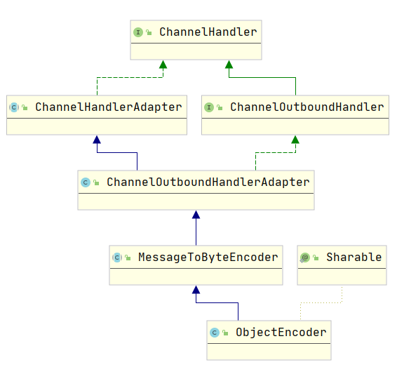
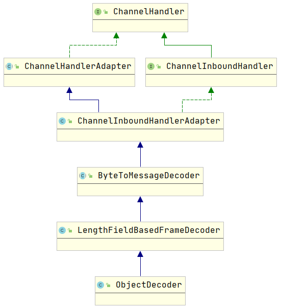
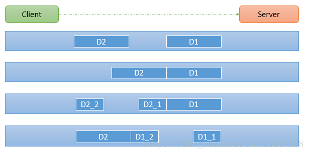
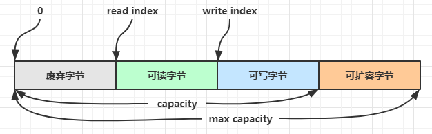

# 前言

由于大部分框架都涉及netty，故对其进行初步的学习，由于netty概念较多，流程易混淆，在此做个记录

[《Netty学习手册》](https://dongzl.github.io/netty-handbook/#/_content/chapter01) 已经说得比较详细了，主要记录一些自己的理解

[《尚硅谷Netty教程》](https://www.bilibili.com/video/BV1DJ411m7NR?from=search&seid=10485791587797894083)

# NIO与Netty

## NIO 非阻塞网络编程

从`NIO`开始，根据一个`demo`来感受整个非阻塞架构的变化，从而过度到`Netty`，便于理解

*先上代码，再上原理图*

服务端

```java
public class NIOServer {
    public static void main(String[] args) throws IOException {
        ServerSocketChannel serverSocketChannel = ServerSocketChannel.open();

        Selector selector = Selector.open();
		// 监听端口
        serverSocketChannel.socket().bind(new InetSocketAddress(6666));

        serverSocketChannel.configureBlocking(false);
		// 将Channel注册到selector
        serverSocketChannel.register(selector, SelectionKey.OP_ACCEPT);

        while (true){
            // select查询当前时刻是否有事件触发
            if (selector.select(1000)==0){
                System.out.println("服务器等待了1秒，无连接");
                continue;
            }
            // 如果有，则返回关注事件的集合 selectionKeys
            Set<SelectionKey> selectionKeys = selector.selectedKeys();
            Iterator<SelectionKey> keyIterator = selectionKeys.iterator();

            while (keyIterator.hasNext()){
                // 事件key绑定了与该事件相关的变量，如Channel,buffer
                SelectionKey key = keyIterator.next();
                if (key.isAcceptable()){
                  // accept方法能够返回触发accept的socketChannel，即client用于connect的channel
                    SocketChannel socketChannel = serverSocketChannel.accept();
                    System.out.println("客户端连接成功");
                    // 设置channel为非阻塞
                    socketChannel.configureBlocking(false);
                    // 将socketChannel注册到selector
                    socketChannel.register(selector,SelectionKey.OP_READ, ByteBuffer.allocate(1024));
                }
                // 某个channel发生了读事件
                if (key.isReadable()) {
                    // 从事件key可以获取发生该事件的channel，从而读取数据
                    SocketChannel channel = (SocketChannel)key.channel();
                    ByteBuffer buffer = (ByteBuffer) key.attachment();
                    channel.read(buffer);
                    System.out.println("from 客户端"+new String(buffer.array()));
                }
                // 要手动将key删除，不然下轮还会触发
                keyIterator.remove();
            }
        }

    }
}
```

客户端

```java
public class NIOClient {
    public static void main(String[] args) throws IOException {
        // 获取一个socketChannel,服务器事件绑定的也是这个channel
        SocketChannel socketChannel = SocketChannel.open();

        socketChannel.configureBlocking(false);

        InetSocketAddress inetSocketAddress = new InetSocketAddress("127.0.0.1",6666);
		// 向指定端口请求连接
        if (!socketChannel.connect(inetSocketAddress)){
            // 由于accept事件被触发后需要排队等待selector处理，不会立刻响应，故需要查看是否已经成功响应才能往channel中写数据
            while (!socketChannel.finishConnect()){
                System.out.println("因为连接需要时间，客户端不会阻塞，可以做其它工作。。。。");
            }
        }

        String str = "hello,尚硅谷~";
        // 根据字节数组大小创建一个buffer
        ByteBuffer buffer = ByteBuffer.wrap(str.getBytes());
        socketChannel.write(buffer);
        System.in.read();
    }
}
```

原理图


执行流程分析：

1. `ServerSocketChannel`向`Selector`注册，`Selector`会监听`ServerSocketChannel`上的请求
2. `ServerSocketChannel`此时正在监听`8888`端口
3. `Client`想要连接`8888`端口，需要开启一个`SocketChannel`进行`connect`
4. 这时`Client1`开启`SocketChannel`试图连接`8888`端口
5. `ServerSocketChannel`感受到有`Client`试图连接，会发送`accept`事件到`Selector`
6. `Selector`先获取`SelectionKey`，其中会涵盖当前时刻发生的事件集合，遍历事件集合发现事件为`accept`，执行下述方法
   1. 调用`ServerSocketChannel.accept()`方法获取`Client1`的`SocketChannel`，该通道是`Client`与`Server`的全局唯一桥梁
   2. 并将该`SocketChannel`注册到`Selector`中
7. 当有多个`Client`试图连接`8888`时，`Selector`都会捕获`accept`事件并执行上述方法
8. 当`Client1`给`Server`发送数据时，触发`READ`事件
9. `Selector`监听到该事件，获取该事件的`key`，根据`key`能够找到与`Client1`绑定的`SocketChannel`
10. 找到了`SocketChannel`则可以获取`Client1`发过来的消息，并回写数据
11. `Selector`可以看成一个操作中心，根据不同的事件执行不同的操作


## 单Reactor单线程

需要注意的是，上述方式，从始至终，都是同一个线程在执行一个`Selector`，这种模式有什么问题？

* 多个`Client`来访问都得由一个`Selector`根据事件进行处理
* 如果`Selector`正在处理某个`Client`的写事件，十分耗时，此时有另一个`Client`想要建立连接，触发的`accept`事件只能排队，等待前面的写事件结束了才会被处理
* 那么该`Client`就要很久才能获得连接
  * 不过`Client`不需要阻塞等待，因为`Channel` 是非阻塞的
  * 可以通过```socketChannel.finishConnect()```判断是否已连接，连接了再往`channel`中写数据，否则可以干别的事情

上述流程图可以总结为`单Reactor单线程`


* `Reactor`指的是`Selector`
* 处理`accept`的方法独立称为`Acceptor`
* 处理非`accept`方法称为`Handler`

## 单Reactor多线程

为了利用多核CPU的优势，希望加入多线程，那么上述架构就变成单`Reactor`多线程


* 以前面的例子为例，单`Reactor`多线程相当于`selector`接受到非`accept`事件时，根据事件获取到对应`Channel`后（Handler1/Handler2），便启动新的线程处理对应`channel`的业务，那么`selector`所在线程只需要为当前事件启动新的线程进行处理，就能够处理下一个事件
* 但这种模式仍然存在问题，即`selector`既要处理连接事件`accept`还要处理业务事件，如果处理业务事件发生了卡壳，那么还是会导致一段时间没法`accept`，这并不是一个好的服务器提供的服务

## 主从Reactor多线程

因此在单`Reactor`多线程的基础上，改进为主从`Reactor`多线程，主从`Reactor`表示使用两个`selector`


* 如此一来，相当于一个`selector`专门处理`accept`请求（selectorParent），另一个`selector`专门处理业务（selectorSon）
* 这样即使`selectorSon`因为业务导致阻塞，也不会影响`accept`的进行，对于`Client`而言，能够很快地与服务器建立连接
* 但要注意的是，建立连接后发送消息并不能保证消息能立刻被服务器处理，因为处理消息由第二个`selector`控制，这也是为什么要在`connect`的时候加入一个`listener`，以便于告知client什么时候服务器才处理自己的消息，而不是傻傻的等

==主从Reactor模式是目前非阻塞IO的首选方案，能够保证快速响应并且分工明确==

## 主从多Reactor多线程

但我们进一步去思考，如果有`1000`个`Channel`，全注册在一个`subreactor`上有没有问题呢？还是有的，如果`subreator`刚好被`kill`了，那么所有`channel`都会失效了，为了解决这个问题，可以考虑多个`subreactor`，当然也可以多个主`reactor`，但一般接受请求的只需要一个`reactor`即可

而多个`reator`的模式，就是`netty`的框架了，只是其重新定义了名字

* `Reactor`线程----》`NioEventLoop`
* 多个`主reactor`就是多个`NioEventLoop`，因为都是处理`连接`的，给了个名字  `Boss Group`，指的是`一组`reactor
* 多个`subreactor`，用于处理`非连接`业务，给了个名字，叫  `Worker Group`
* 流程图如下，虽然名字变了，但还是处理那些相同的工作


根据上图，重新梳理一下`netty`如何完成非阻塞IO：

1. `Boss Group`的`NioEventGroup`（虽然叫Group，但其实就是一个线程）会对应一个`ServerSocketChannel`，该`Channel`会注册到当前`NioEventGroup`的`Selector`中，并监听`8888`端口
2. `Client`请求连接`8888`端口，`selector`接收到`accept`事件，进入`NioEventLoop`，执行`processSelectedKeys()`方法(其实就是前面代码中while循环做的事)，从`SelectedKeys`中获取对应事件`key`相关的变量（是可以获得的，请看前面NIo编写的Server代码）
3. `accept`事件就是调用`Selector`对应的`ServerSocketChannel`执行`accept`方法就能获得`Client`的`SocketChannel`
4. 从`WorkerGroup`中选择一个`NioEventGroup`，将该`SocketChannel`注册到该`NioEventGroup`的`Selector`中（为了区分称为`SelectorB`）
5. 这样，`Client`往`Channel`写数据时，触发`READ`事件，`SelectorB`就能够感知到，不需要经过`Boss Group`
6. 处理时，同样是进入`NioEventLoop`，经过`processSelectoedKeys（）`时，能够获得事件对应的`Channel`，此时为该`Channel`新建一个线程，线程中执行`Pipline`的`ChannelHandler`真正执行业务
  * 这里的`pipline`可以理解为按顺序存放着一系列的`ChannelHandler`的集合
  * 经过`pipline`就会依次执行`ChannelHandler`
7. 要注意的是，一个`Client`对应一个`SocketChannel`对应一个`Pipeline`，一个`Pipline`中有多个`Handler`，`Selector`处理事件并获取`Channel`只会在同一个线程`NioEventGroup`中进行，获取到`Channel`后才会创建新的线程执行`pipline`
8. 补充：哪里体现了多`Reactor`?
   * 注意到`Worker Group`中有多个`NioEventGroup`，对应多个`Selector`
   * `第4步`涉及`NioEventGroup`的时候体现了多`Reactor`，可以根据不同策略选择将`Channel`交给哪一个`Selector`进行绑定
   * 默认的策略是，如果`Worker Group`有8个`NioEventGroup`，则每来一个`Client`都会将其绑定到剩余的`NioEventGroup`中，如果有8个`Client`，则刚好每个`NioEventGroup`的`Selector`都绑定了一个`Channel`
   * 此时如果来了第9个`Client`，则绑定给第一个`NioEventGroup`，依次类推


基于上述逻辑，我们修改原来的Server代码，得到一个主从多Reactor多线程Server

NIOServerMutiRMutiT.java

```java
public class NIOServerMutiRMutiT {
    private ExecutorService executor = Executors.newFixedThreadPool(5);

    private ServerSocketChannel serverSocketChannel = ServerSocketChannel.open();

    private Selector selectorParent = Selector.open();

    private Selector selectorSon1 = Selector.open();
    private Selector selectorSon2 = Selector.open();

    public NIOServerMutiRMutiT() throws IOException {
        serverSocketChannel.socket().bind(new InetSocketAddress(6666));

        serverSocketChannel.configureBlocking(false);

        serverSocketChannel.register(selectorParent, SelectionKey.OP_ACCEPT);
    }


    public static void main(String[] args) throws IOException {
        NIOServerMutiRMutiT nioServerTwoRMutiT = new NIOServerMutiRMutiT();

        new Thread(() -> {
            try {
                nioServerTwoRMutiT.LoopForAccept();
            } catch (IOException e) {
                e.printStackTrace();
            }
        }, "parent").start();
        new Thread(() -> {
            try {
                nioServerTwoRMutiT.LoopForReadAndWrite1();
            } catch (IOException e) {
                e.printStackTrace();
            }
        }, "son1").start();
        new Thread(() -> {
            try {
                nioServerTwoRMutiT.LoopForReadAndWrite2();
            } catch (IOException e) {
                e.printStackTrace();
            }
        }, "son2").start();
    }

    public void LoopForAccept() throws IOException {
        int count = 0;
        while (true) {
            if (selectorParent.select(1000) == 0) {
//                System.out.println("服务器Parent等待了1秒，无连接");
                continue;
            }
            // 返回关注事件的集合
            Set<SelectionKey> selectionKeys = selectorParent.selectedKeys();
            Iterator<SelectionKey> keyIterator = selectionKeys.iterator();


            while (keyIterator.hasNext()) {
                SelectionKey key = keyIterator.next();
                if (key.isAcceptable()) {
                    SocketChannel socketChannel = serverSocketChannel.accept();
                    System.out.println("客户端连接成功");
                    socketChannel.configureBlocking(false);
                    if (count%2==0) {
                        try {
                            socketChannel.register(selectorSon1, SelectionKey.OP_READ, ByteBuffer.allocate(1024));
                        } catch (ClosedChannelException e) {
                            System.out.println(e);
                        }
                        System.out.println("注册到son1");
                    }
                    else {
                        socketChannel.register(selectorSon2, SelectionKey.OP_READ, ByteBuffer.allocate(1024));
                        System.out.println("注册到son2");
                    }
                    count++;
                }
                keyIterator.remove();
            }
        }
    }

    public void LoopForReadAndWrite1() throws IOException {
        while (true) {
            if (selectorSon1.select(1000) == 0) {
//                System.out.println("服务器Son等待了1秒，无连接");
                continue;
            }
            // 返回关注事件的集合
            Set<SelectionKey> selectionKeys = selectorSon1.selectedKeys();
            Iterator<SelectionKey> keyIterator = selectionKeys.iterator();

            while (keyIterator.hasNext()) {
                SelectionKey key = keyIterator.next();
                if (key.isReadable()) {
                    SocketChannel channel = (SocketChannel) key.channel();
                    executor.submit(() -> {
                        ByteBuffer buffer = (ByteBuffer) key.attachment();
                        try {
                            channel.read(buffer);
                        } catch (IOException e) {
                            e.printStackTrace();
                        }
                        System.out.println("from 客户端" + new String(buffer.array())+"\t Thread:"+Thread.currentThread().getName());
                    });
                }
                keyIterator.remove();
            }
        }
    }
    public void LoopForReadAndWrite2() throws IOException {
        while (true) {
            if (selectorSon2.select(1000) == 0) {
//                System.out.println("服务器Son等待了1秒，无连接");
                continue;
            }
            // 返回关注事件的集合
            Set<SelectionKey> selectionKeys = selectorSon2.selectedKeys();
            Iterator<SelectionKey> keyIterator = selectionKeys.iterator();

            while (keyIterator.hasNext()) {
                SelectionKey key = keyIterator.next();
                if (key.isReadable()) {
                    SocketChannel channel = (SocketChannel) key.channel();
                    executor.submit(() -> {
                        ByteBuffer buffer = (ByteBuffer) key.attachment();
                        try {
                            channel.read(buffer);
                        } catch (IOException e) {
                            e.printStackTrace();
                        }
                        System.out.println("from 客户端" + new String(buffer.array())+"\t Thread:"+Thread.currentThread().getName());
                    });
                }
                keyIterator.remove();
            }
        }
    }
}
```


# 执行流程

那么根据前面的分析，对netty整个框架有了初步的认识，基于此，不用注释也能够很轻松地理解以下netty服务器的demo

```java
public class NettyServer {

    public static void main(String[] args) throws Exception {

        EventLoopGroup bossGroup = new NioEventLoopGroup(1);
        EventLoopGroup workerGroup = new NioEventLoopGroup(); //8

        try {
            ServerBootstrap bootstrap = new ServerBootstrap();
            bootstrap.group(bossGroup, workerGroup) 
                    .channel(NioServerSocketChannel.class) 
                    .option(ChannelOption.SO_BACKLOG, 128)
                    .childOption(ChannelOption.SO_KEEPALIVE, true) /
                    .childHandler(new ChannelInitializer<SocketChannel>() {
                        @Override
                        protected void initChannel(SocketChannel ch) throws Exception {
                            ch.pipeline().addLast(new NettyServerHandler());
                        }
                    }); 

            System.out.println(".....服务器 is ready...");
            ChannelFuture cf = bootstrap.bind(6668).sync();
            cf.addListener(new ChannelFutureListener() {
                @Override
                public void operationComplete(ChannelFuture future) throws Exception {
                    if (cf.isSuccess()) {
                        System.out.println("监听端口 6668 成功");
                    } else {
                        System.out.println("监听端口 6668 失败");
                    }
                }
            });
            cf.channel().closeFuture().sync();
        }finally {
            bossGroup.shutdownGracefully();
            workerGroup.shutdownGracefully();
        }
    }
}
```


💡 提示

> 一开始需要树立正确的观念
>
> * 把 channel 理解为数据的通道
> * 把 msg 理解为流动的数据，最开始输入是 ByteBuf，但经过 pipeline 的加工，会变成其它类型对象，最后输出又变成 ByteBuf
> * 把 handler 理解为数据的处理工序
>   * 工序有多道，合在一起就是 pipeline，pipeline 负责发布事件（读、读取完成...）传播给每个 handler， handler 对自己感兴趣的事件进行处理（重写了相应事件处理方法）
>   * handler 分 Inbound 和 Outbound 两类
> * 把 eventLoop 理解为处理数据的工人
>   * 工人可以管理多个 channel 的 io 操作，并且一旦工人负责了某个 channel，就要负责到底（绑定）
>   * 工人既可以执行 io 操作，也可以进行任务处理，每位工人有任务队列，队列里可以堆放多个 channel 的待处理任务，任务分为普通任务、定时任务
>   * 工人按照 pipeline 顺序，依次按照 handler 的规划（代码）处理数据，可以为每道工序指定不同的工人

# 组件

## EventLoopGroup

## Channel

## Pipline & Handler

## Future & Promise

## ByteBuf


# 异步机制

主要指`bootstrap`启动监听后，不会阻塞等待，而是直接返回`ChannelFuture`对象作为执行结果，此时有没有客户端请求连接main线程暂时不需要关心

```java
ChannelFuture cf = bootstrap.bind(6668).sync();
```

理解netty的异步之前，得先理解java的异步一般怎么实现？以FutureTask为例，具体解析可以复习之前写的博客[《java源码浅析之FutureTask》](https://blog.csdn.net/m0_37637511/article/details/116895847)

* FutureTask实现了Future接口
* Future相当于一个仓库，先把定义好的Callable任务提交给Thread执行后，要求其将返回值写入Future的res变量中
* 调用Future的get方法就会阻塞等待，直到res不为空
* 如果不愿意阻塞等待，则不调用get方法，计算好Callable任务返回结果的时间，执行get即可立刻获取到res

那么Future这种方式有什么问题呢？

* 当无法估计Callable任务执行时间，又不想阻塞等待时，难以在res刚有值时立刻获取
* 如果bootstrap使用Future这种方式异步监听端口，客户端请求连接了bootstrap可能都不知道

因此，解决办法就是往Future中加入观察者模式，ChannelFuture就是一种Future-Listener

ChannelFuture继承了`Future<Void>`这一抽象类，而`Future<Void>`实现了`java.util.concurrent.Future<V>`接口，看`Future<Void>`这一抽象类定义了什么方法

```java
public interface ChannelFuture extends Future<Void> {

    /**
     * Returns a channel where the I/O operation associated with this
     * future takes place.
     */
    Channel channel();

    @Override
    ChannelFuture addListener(GenericFutureListener<? extends Future<? super Void>> listener);

    @Override
    ChannelFuture addListeners(GenericFutureListener<? extends Future<? super Void>>... listeners);

    @Override
    ChannelFuture removeListener(GenericFutureListener<? extends Future<? super Void>> listener);

    @Override
    ChannelFuture removeListeners(GenericFutureListener<? extends Future<? super Void>>... listeners);
    ----------------------------省略------------------------------
}
```

可见定义了一些添加监听者的方法，可以往真正在监听端口的线程中加入监听者，一旦监听事件发生，调用监听者定义好的回调函数完成通知逻辑

# 编码与解码

编写网络应用程序时，因为数据在网络中传输的都是二进制字节码数据，在发送数据时就需要编码，接收数据时就需要解码[示意图]

`codec`（编解码器）的组成部分有两个：`decoder`（解码器）和 `encoder`（编码器）。`encoder` 负责把业务数据转换成字节码数据，`decoder` 负责把字节码数据转换成业务数据


1. `Netty` 自身提供了一些 `codec`(编解码器)
2. `Netty` 本身自带的 `ObjectDecoder` 和 `ObjectEncoder` 可以用来实现 `POJO` 对象或各种业务对象的编码和解码，底层使用的仍是Java序列化技术,而Java序列化技术本身效率就不高，存在如下问题
   - 无法跨语言
   - 序列化后的体积太大，是二进制编码的5倍多。
   - 序列化性能太低
3. 引出新的解决方案`Google` 的 `Protobuf`

需要用时就参考视频好了

# 处理顺序

## 出站与入站

前面介绍框架时也提到了，`Netty`执行数据处理主要是通过`ChannelHandler`，而一组`ChannelHandler`可以按顺序放入`Pipline`中，依次进行调用

那么`codec`（编解码器）也是对数据进行处理的，因此其也是一个ChannelHandler，由于得客户端先写数据，服务端才能读，所以ChannelHandler又细分为ChannelInboundHandler、ChannelOutboundHandler，对应的顺序为入站和出站

出站：

* 将请求对象序列化-》Encoder(编码)-》Socket传输

入站：

* Socket传输-》Decoder(解码)-》将请求对象反序列化

以ObjectEncoder为例，看看父结构



ObjectDecoder如下



## 自定义编解码器

一般自定义编解码器只需分别实现ByteToMessageDecoder与MessageToByteEncoder即可，重写decode与encode方法，如下

```java
public class MyMessageEncoder extends MessageToByteEncoder<MessageProtocol> {
    
    @Override
    protected void encode(ChannelHandlerContext ctx, MessageProtocol msg, ByteBuf out) throws Exception {
        System.out.println("MyMessageEncoder encode 方法被调用");
        out.writeInt(msg.getLen());
        out.writeBytes(msg.getContent());
    }
}
```

```java
public class MyMessageDecoder extends ReplayingDecoder<Void> {
    
    @Override
    protected void decode(ChannelHandlerContext ctx, ByteBuf in, List<Object> out) throws Exception {
        System.out.println("MyMessageDecoder decode 被调用");
        //需要将得到二进制字节码-> MessageProtocol 数据包(对象)
        int length = in.readInt();

        byte[] content = new byte[length];
        in.readBytes(content);

        //封装成 MessageProtocol 对象，放入 out， 传递下一个handler业务处理
        MessageProtocol messageProtocol = new MessageProtocol();
        messageProtocol.setLen(length);
        messageProtocol.setContent(content);
        out.add(messageProtocol);
    }
}
```


# TCP粘包与丢包

## 基本介绍

`TCP` 是面向连接的，面向流的，提供高可靠性服务。收发两端（客户端和服务器端）都要有一一成对的 `socket`，因此，发送端为了将多个发给接收端的包，更有效的发给对方，使用了优化方法（`Nagle` 算法），将多次间隔较小且数据量小的数据，合并成一个大的数据块，然后进行封包。这样做虽然提高了效率，但是接收端就难于分辨出完整的数据包了，因为面向流的通信是无消息保护边界的

由于 `TCP` 无消息保护边界,需要在接收端处理消息边界问题，也就是我们所说的粘包、拆包问题,看一张图

示意图 `TCP` 粘包、拆包图解



对图的说明: 假设客户端分别发送了两个数据包 `D1` 和 `D2` 给服务端，由于服务端一次读取到字节数是不确定的，故可能存在以下四种情况：

1. 服务端分两次读取到了两个独立的数据包，分别是 `D1` 和 `D2`，没有粘包和拆包
2. 服务端一次接受到了两个数据包，`D1` 和 `D2` 粘合在一起，称之为 `TCP` 粘包
3. 服务端分两次读取到了数据包，第一次读取到了完整的 `D1` 包和 `D2` 包的部分内容，第二次读取到了 `D2` 包的剩余内容，这称之为 `TCP` 拆包
4. 服务端分两次读取到了数据包，第一次读取到了 `D1` 包的部分内容 `D1_1`，第二次读取到了 `D1` 包的剩余部分内容 `D1_2` 和完整的 `D2` 包。

## 解决方案

只需要以body长度+body的方式发送数据，接受数据时先以长度具体数值类型的长度获取内容，得到body长度后，获取body长度的数据即可

### 自定义协议

### 自定义编解码器


# 心跳机制

通常连接双方都需要通过心跳机制确认对方是否存活，由于Server发生中断会导致Client连接中断，因此Client无需通过心跳感知Server是否存活，而Client中断Server不会有所感知，此时Server的SocketChannel还是打开的，需要通过心跳机制让Server判断Client是否存活，若不存活则关闭Channel

```IdleStateHandler```可以感知在当前Channel中n秒内是否有写事件、读事件

那么只需要让客户端往Channel中定时发送一个自定义的心跳消息，Server通过IdleStateHandler感知到在规定时间内有事件发生，那么继续保持连接，否则中断即可

## Server

首先在Server的Pipline中添加IdleStateHandler（参数不展开）

```java
            b.group(bossGroup, workerGroup)
                    .channel(NioServerSocketChannel.class)
                    // TCP默认开启了 Nagle 算法，该算法的作用是尽可能的发送大数据快，减少网络传输。TCP_NODELAY 参数的作用就是控制是否启用 Nagle 算法。
                    .childOption(ChannelOption.TCP_NODELAY, true)
                    // 是否开启 TCP 底层心跳机制
                    .childOption(ChannelOption.SO_KEEPALIVE, true)
                    //表示系统用于临时存放已完成三次握手的请求的队列的最大长度,如果连接建立频繁，服务器处理创建新连接较慢，可以适当调大这个参数
                    .option(ChannelOption.SO_BACKLOG, 128)
                    .handler(new LoggingHandler(LogLevel.INFO))
                    // 当客户端第一次进行请求的时候才会进行初始化
                    .childHandler(new ChannelInitializer<SocketChannel>() {
                        @Override
                        protected void initChannel(SocketChannel ch) {
                            // 30 秒之内没有收到客户端请求的话就关闭连接
                            ChannelPipeline p = ch.pipeline();
                            p.addLast(new IdleStateHandler(30, 0, 0, TimeUnit.SECONDS));
                            p.addLast(new RpcMessageEncoder());
                            p.addLast(new RpcMessageDecoder());
                            p.addLast(serviceHandlerGroup, new NettyRpcServerHandler());
                        }
                    });
```

并在自定义的NettyRpcServerHandler中重写userEventTriggered方法进行感知即可

```java
@Override
public void userEventTriggered(ChannelHandlerContext ctx, Object evt) throws Exception {
    if (evt instanceof IdleStateEvent) {
        IdleState state = ((IdleStateEvent) evt).state();
        if (state == IdleState.READER_IDLE) {
            log.info("idle check happen, so close the connection");
            ctx.close();
        }
    } else {
        super.userEventTriggered(ctx, evt);
    }
}
```

## Client

客户端怎么定时发送心跳呢？

* 新启线程定时发送（有点浪费）
* Client也监听Channel在m秒内是否有事件发生，如果没有事件则给Server发送一个心跳，前提m要小于n

因此可以往Client的Pipline添加IdleStateHandler，然后重写NettyRpcClientHandler的userEventTriggered方法

```java
@Override
public void userEventTriggered(ChannelHandlerContext ctx, Object evt) throws Exception {
    if (evt instanceof IdleStateEvent) {
        IdleState state = ((IdleStateEvent) evt).state();
        if (state == IdleState.WRITER_IDLE) {
            log.info("write idle happen [{}]", ctx.channel().remoteAddress());
            Channel channel = nettyRpcClient.getChannel((InetSocketAddress) ctx.channel().remoteAddress());
            RpcMessage rpcMessage = new RpcMessage();
            rpcMessage.setCodec(SerializationTypeEnum.PROTOSTUFF.getCode());
            rpcMessage.setCompress(CompressTypeEnum.GZIP.getCode());
            rpcMessage.setMessageType(RpcConstants.HEARTBEAT_REQUEST_TYPE);
            rpcMessage.setData(RpcConstants.PING);
            channel.writeAndFlush(rpcMessage).addListener(ChannelFutureListener.CLOSE_ON_FAILURE);
        }
    } else {
        super.userEventTriggered(ctx, evt);
    }
}
```


# NIO补充

##  ByteBuffer

### 直接内存 vs 堆内存

可以使用下面的代码来创建池化基于堆的 ByteBuf

```java
ByteBuf buffer = ByteBufAllocator.DEFAULT.heapBuffer(10);
```

也可以使用下面的代码来创建池化基于直接内存的 ByteBuf

```java
ByteBuf buffer = ByteBufAllocator.DEFAULT.directBuffer(10);
```

* 直接内存创建和销毁的代价昂贵，但读写性能高（少一次内存复制），适合配合池化功能一起用
* 直接内存对 GC 压力小，因为这部分内存不受 JVM 垃圾回收的管理，但也要注意及时主动释放

### 池化 vs 非池化

池化的最大意义在于可以重用 ByteBuf，优点有

* 没有池化，则每次都得创建新的 ByteBuf 实例，这个操作对直接内存代价昂贵，就算是堆内存，也会增加 GC 压力
* 有了池化，则可以重用池中 ByteBuf 实例，并且采用了与 jemalloc 类似的内存分配算法提升分配效率
* 高并发时，池化功能更节约内存，减少内存溢出的可能

池化功能是否开启，可以通过下面的系统环境变量来设置

```java
-Dio.netty.allocator.type={unpooled|pooled}
```

* 4.1 以后，非 Android 平台默认启用池化实现，Android 平台启用非池化实现
* 4.1 之前，池化功能还不成熟，默认是非池化实现

### 组成

ByteBuf 由四部分组成



最开始读写指针都在 0 位置

## 零拷贝

### 传统 IO 问题

传统的 IO 将一个文件通过 socket 写出

```java
File f = new File("helloword/data.txt");
RandomAccessFile file = new RandomAccessFile(file, "r");

byte[] buf = new byte[(int)f.length()];
file.read(buf);

Socket socket = ...;
socket.getOutputStream().write(buf);
```

内部工作流程是这样的：


1. java 本身并不具备 IO 读写能力，因此 read 方法调用后，要从 java 程序的**用户态**切换至**内核态**，去调用操作系统（Kernel）的读能力，将数据读入**内核缓冲区**。这期间用户线程阻塞，操作系统使用 DMA（Direct Memory Access）来实现文件读，其间也不会使用 cpu

   > DMA 也可以理解为硬件单元，用来解放 cpu 完成文件 IO

2. 从**内核态**切换回**用户态**，将数据从**内核缓冲区**读入**用户缓冲区**（即 byte[] buf），这期间 cpu 会参与拷贝，无法利用 DMA

3. 调用 write 方法，这时将数据从**用户缓冲区**（byte[] buf）写入 **socket 缓冲区**，cpu 会参与拷贝

4. 接下来要向网卡写数据，这项能力 java 又不具备，因此又得从**用户态**切换至**内核态**，调用操作系统的写能力，使用 DMA 将 **socket 缓冲区**的数据写入网卡，不会使用 cpu


可以看到中间环节较多，java 的 IO 实际不是物理设备级别的读写，而是缓存的复制，底层的真正读写是操作系统来完成的

* 用户态与内核态的切换发生了 3 次，这个操作比较重量级
* 数据拷贝了共 4 次

### NIO 优化

通过 DirectByteBuf 

* ByteBuffer.allocate(10)  HeapByteBuffer 使用的还是 java 内存
* ByteBuffer.allocateDirect(10)  DirectByteBuffer 使用的是操作系统内存


大部分步骤与优化前相同，不再赘述。唯有一点：java 可以使用 DirectByteBuf 将堆外内存映射到 jvm 内存中来直接访问使用

* 这块内存不受 jvm 垃圾回收的影响，因此内存地址固定，有助于 IO 读写
* java 中的 DirectByteBuf 对象仅维护了此内存的虚引用，内存回收分成两步
  * DirectByteBuf 对象被垃圾回收，将虚引用加入引用队列
  * 通过专门线程访问引用队列，根据虚引用释放堆外内存
* 减少了一次数据拷贝，用户态与内核态的切换次数没有减少


进一步优化（底层采用了 linux 2.1 后提供的 sendFile 方法），java 中对应着两个 channel 调用 transferTo/transferFrom 方法拷贝数据


1. java 调用 transferTo 方法后，要从 java 程序的**用户态**切换至**内核态**，使用 DMA将数据读入**内核缓冲区**，不会使用 cpu
2. 数据从**内核缓冲区**传输到 **socket 缓冲区**，cpu 会参与拷贝
3. 最后使用 DMA 将 **socket 缓冲区**的数据写入网卡，不会使用 cpu

可以看到

* 只发生了一次用户态与内核态的切换
* 数据拷贝了 3 次


进一步优化（linux 2.4）


1. java 调用 transferTo 方法后，要从 java 程序的**用户态**切换至**内核态**，使用 DMA将数据读入**内核缓冲区**，不会使用 cpu
2. 只会将一些 offset 和 length 信息拷入 **socket 缓冲区**，几乎无消耗
3. 使用 DMA 将 **内核缓冲区**的数据写入网卡，不会使用 cpu

整个过程仅只发生了一次用户态与内核态的切换，数据拷贝了 2 次。所谓的【零拷贝】，并不是真正无拷贝，而是在不会拷贝重复数据到 jvm 内存中，零拷贝的优点有

* 更少的用户态与内核态的切换
* 不利用 cpu 计算，减少 cpu 缓存伪共享
* 零拷贝适合小文件传输

## IO模型

同步阻塞、同步非阻塞、同步多路复用、异步阻塞（没有此情况）、异步非阻塞

* 同步：线程自己去获取结果（一个线程）
* 异步：线程自己不去获取结果，而是由其它线程送结果（至少两个线程）


当调用一次 channel.read 或 stream.read 后，会切换至操作系统内核态来完成真正数据读取，而读取又分为两个阶段，分别为：

* 等待数据阶段
* 复制数据阶段


* 阻塞 IO

  

* 非阻塞  IO

  

* 多路复用

  

* 信号驱动

* 异步 IO

  

* 阻塞 IO vs 多路复用

  

  
