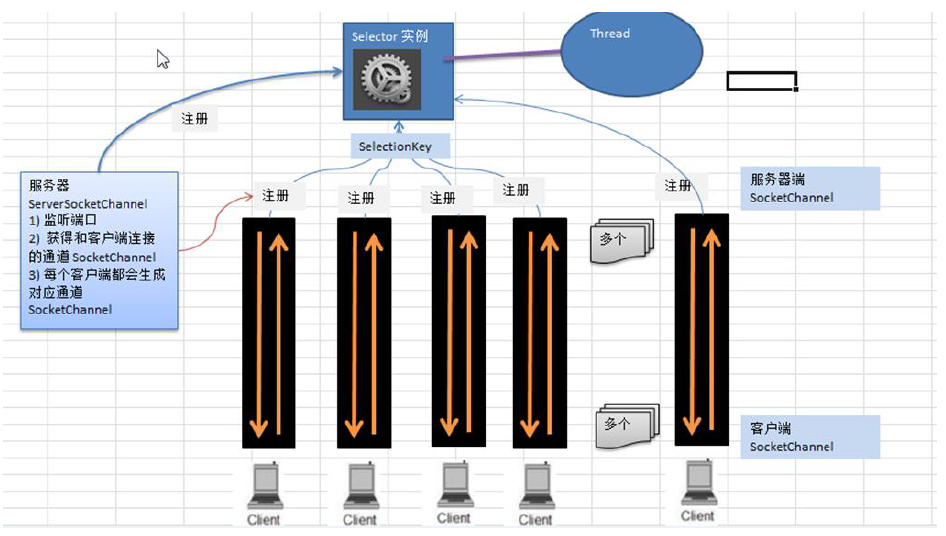

# 前言

由于大部分框架都涉及netty，故对其进行初步的学习，由于netty概念较多，流程易混淆，在此做个记录

[Netty学习手册](https://dongzl.github.io/netty-handbook/#/_content/chapter01) 已经说得比较详细了，主要记录一些自己的理解

# NIO与Netty

## NIO 非阻塞网络编程

从`NIO`开始，根据一个`demo`来感受整个非阻塞架构的变化，从而过度到`Netty`，便于理解

*先上代码，再上原理图*

服务端

```java
public class NIOServer {
    public static void main(String[] args) throws IOException {
        ServerSocketChannel serverSocketChannel = ServerSocketChannel.open();

        Selector selector = Selector.open();
		// 监听端口
        serverSocketChannel.socket().bind(new InetSocketAddress(6666));

        serverSocketChannel.configureBlocking(false);
		// 将Channel注册到selector
        serverSocketChannel.register(selector, SelectionKey.OP_ACCEPT);

        while (true){
            // select查询当前时刻是否有事件触发
            if (selector.select(1000)==0){
                System.out.println("服务器等待了1秒，无连接");
                continue;
            }
            // 如果有，则返回关注事件的集合 selectionKeys
            Set<SelectionKey> selectionKeys = selector.selectedKeys();
            Iterator<SelectionKey> keyIterator = selectionKeys.iterator();

            while (keyIterator.hasNext()){
                // 事件key绑定了与该事件相关的变量，如Channel,buffer
                SelectionKey key = keyIterator.next();
                if (key.isAcceptable()){
                  // accept方法能够返回触发accept的socketChannel，即client用于connect的channel
                    SocketChannel socketChannel = serverSocketChannel.accept();
                    System.out.println("客户端连接成功");
                    // 设置channel为非阻塞
                    socketChannel.configureBlocking(false);
                    // 将socketChannel注册到selector
                    socketChannel.register(selector,SelectionKey.OP_READ, ByteBuffer.allocate(1024));
                }
                // 某个channel发生了读事件
                if (key.isReadable()) {
                    // 从事件key可以获取发生该事件的channel，从而读取数据
                    SocketChannel channel = (SocketChannel)key.channel();
                    ByteBuffer buffer = (ByteBuffer) key.attachment();
                    channel.read(buffer);
                    System.out.println("from 客户端"+new String(buffer.array()));
                }
                // 要手动将key删除，不然下轮还会触发
                keyIterator.remove();
            }
        }

    }
}
```

客户端

```java
public class NIOClient {
    public static void main(String[] args) throws IOException {
        // 获取一个socketChannel,服务器事件绑定的也是这个channel
        SocketChannel socketChannel = SocketChannel.open();

        socketChannel.configureBlocking(false);

        InetSocketAddress inetSocketAddress = new InetSocketAddress("127.0.0.1",6666);
		// 向指定端口请求连接
        if (!socketChannel.connect(inetSocketAddress)){
            // 由于accept事件被触发后需要排队等待selector处理，不会立刻响应，故需要查看是否已经成功响应才能往channel中写数据
            while (!socketChannel.finishConnect()){
                System.out.println("因为连接需要时间，客户端不会阻塞，可以做其它工作。。。。");
            }
        }

        String str = "hello,尚硅谷~";
        // 根据字节数组大小创建一个buffer
        ByteBuffer buffer = ByteBuffer.wrap(str.getBytes());
        socketChannel.write(buffer);
        System.in.read();
    }
}
```

原理图



执行流程分析：

1. `ServerSocketChannel`向`Selector`注册，`Selector`会监听`ServerSocketChannel`上的请求
2. `ServerSocketChannel`此时正在监听`8888`端口
3. `Client`想要连接`8888`端口，需要开启一个`SocketChannel`进行`connect`
4. 这时`Client1`开启`SocketChannel`试图连接`8888`端口
5. `ServerSocketChannel`感受到有`Client`试图连接，会发送`accept`事件到`Selector`
6. `Selector`先获取`SelectionKey`，其中会涵盖当前时刻发生的事件集合，遍历事件集合发现事件为`accept`，执行下述方法
   1. 调用`ServerSocketChannel.accept()`方法获取`Client1`的`SocketChannel`，该通道是`Client`与`Server`的全局唯一桥梁
   2. 并将该`SocketChannel`注册到`Selector`中
7. 当有多个`Client`试图连接`8888`时，`Selector`都会捕获`accept`事件并执行上述方法
8. 当`Client1`给`Server`发送数据时，触发`READ`事件
9. `Selector`监听到该事件，获取该事件的`key`，根据`key`能够找到与`Client1`绑定的`SocketChannel`
10. 找到了`SocketChannel`则可以获取`Client1`发过来的消息，并回写数据
11. `Selector`可以看成一个操作中心，根据不同的事件执行不同的操作


## 单Reactor单线程

需要注意的是，上述方式，从始至终，都是同一个线程在执行一个`Selector`，这种模式有什么问题？

* 多个`Client`来访问都得由一个`Selector`根据事件进行处理
* 如果`Selector`正在处理某个`Client`的写事件，十分耗时，此时有另一个`Client`想要建立连接，触发的`accept`事件只能排队，等待前面的写事件结束了才会被处理
* 那么该`Client`就要很久才能获得连接
  * 不过`Client`不需要阻塞等待，因为`Channel` 是非阻塞的
  * 可以通过```socketChannel.finishConnect()```判断是否已连接，连接了再往`channel`中写数据，否则可以干别的事情

上述流程图可以总结为`单Reactor单线程`


* `Reactor`指的是`Selector`
* 处理`accept`的方法独立称为`Acceptor`
* 处理非`accept`方法称为`Handler`

## 单Reactor多线程

为了利用多核CPU的优势，希望加入多线程，那么上述架构就变成单`Reactor`多线程


* 以前面的例子为例，单`Reactor`多线程相当于`selector`接受到非`accept`事件时，根据事件获取到对应`Channel`后（Handler1/Handler2），便启动新的线程处理对应`channel`的业务，那么`selector`所在线程只需要为当前事件启动新的线程进行处理，就能够处理下一个事件
* 但这种模式仍然存在问题，即`selector`既要处理连接事件`accept`还要处理业务事件，如果处理业务事件发生了卡壳，那么还是会导致一段时间没法`accept`，这并不是一个好的服务器提供的服务

## 主从Reactor多线程

因此在单`Reactor`多线程的基础上，改进为主从`Reactor`多线程，主从`Reactor`表示使用两个`selector`


* 如此一来，相当于一个`selector`专门处理`accept`请求（selectorParent），另一个`selector`专门处理业务（selectorSon）
* 这样即使`selectorSon`因为业务导致阻塞，也不会影响`accept`的进行，对于`Client`而言，能够很快地与服务器建立连接
* 但要注意的是，建立连接后发送消息并不能保证消息能立刻被服务器处理，因为处理消息由第二个`selector`控制，这也是为什么要在`connect`的时候加入一个`listener`，以便于告知client什么时候服务器才处理自己的消息，而不是傻傻的等

==主从Reactor模式是目前非阻塞IO的首选方案，能够保证快速响应并且分工明确==

## 主从多Reactor多线程

但我们进一步去思考，如果有`1000`个`Channel`，全注册在一个`subreactor`上有没有问题呢？还是有的，如果`subreator`刚好被`kill`了，那么所有`channel`都会失效了，为了解决这个问题，可以考虑多个`subreactor`，当然也可以多个主`reactor`，但一般接受请求的只需要一个`reactor`即可

而多个`reator`的模式，就是`netty`的框架了，只是其重新定义了名字

* `Reactor`线程----》`NioEventLoop`
* 多个`主reactor`就是多个`NioEventLoop`，因为都是处理`连接`的，给了个名字  `Boss Group`，指的是`一组`reactor
* 多个`subreactor`，用于处理`非连接`业务，给了个名字，叫  `Worker Group`
* 流程图如下，虽然名字变了，但还是处理那些相同的工作


根据上图，重新梳理一下`netty`如何完成非阻塞IO：

* `Boss Group`的`NioEventGroup`（虽然叫Group，但其实就是一个线程）会对应一个`ServerSocketChannel`，该`Channel`会注册到当前`NioEventGroup`的`Selector`中，并监听`8888`端口
* `Client`请求连接`8888`端口，`selector`接收到`accept`事件，进入`NioEventLoop`，执行`processSelectedKeys()`方法(其实就是前面代码中while循环做的事)，从`SelectedKeys`中获取对应事件`key`相关的变量（是可以获得的，请看前面NIo编写的Server代码）
* `accept`事件就是调用`Selector`对应的`ServerSocketChannel`执行`accept`方法就能获得`Client`的`SocketChannel`
* 从`WorkerGroup`中选择一个`NioEventGroup`，将该`SocketChannel`注册到该`NioEventGroup`的`Selector`中（为了区分称为`SelectorB`）
* 这样，`Client`往`Channel`写数据时，触发`READ`事件，`SelectorB`就能够感知到，不需要经过`Boss Group`
* 处理时，同样是进入`NioEventLoop`，经过`processSelectoedKeys（）`时，能够获得事件对应的`Channel`，此时为该`Channel`新建一个线程，线程中执行`Pipline`的`ChannelHandler`真正执行业务
  * 这里的`pipline`可以理解为按顺序存放着一系列的`ChannelHandler`的集合
  * 经过`pipline`就会依次执行`ChannelHandler`
* 要注意的是，一个`Client`对应一个`SocketChannel`对应一个`Pipeline`，一个`Pipline`中有多个`Handler`，`Selector`处理事件并获取`Channel`只会在同一个线程`NioEventGroup`中进行，获取到`Channel`后才会创建新的线程执行`pipline`


基于上述逻辑，我们修改原来的Server代码，得到一个主从多Reactor多线程Server

NIOServerMutiRMutiT.java

```java
public class NIOServerMutiRMutiT {
    private ExecutorService executor = Executors.newFixedThreadPool(5);

    private ServerSocketChannel serverSocketChannel = ServerSocketChannel.open();

    private Selector selectorParent = Selector.open();

    private Selector selectorSon1 = Selector.open();
    private Selector selectorSon2 = Selector.open();

    public NIOServerMutiRMutiT() throws IOException {
        serverSocketChannel.socket().bind(new InetSocketAddress(6666));

        serverSocketChannel.configureBlocking(false);

        serverSocketChannel.register(selectorParent, SelectionKey.OP_ACCEPT);
    }


    public static void main(String[] args) throws IOException {
        NIOServerMutiRMutiT nioServerTwoRMutiT = new NIOServerMutiRMutiT();

        new Thread(() -> {
            try {
                nioServerTwoRMutiT.LoopForAccept();
            } catch (IOException e) {
                e.printStackTrace();
            }
        }, "parent").start();
        new Thread(() -> {
            try {
                nioServerTwoRMutiT.LoopForReadAndWrite1();
            } catch (IOException e) {
                e.printStackTrace();
            }
        }, "son1").start();
        new Thread(() -> {
            try {
                nioServerTwoRMutiT.LoopForReadAndWrite2();
            } catch (IOException e) {
                e.printStackTrace();
            }
        }, "son2").start();
    }

    public void LoopForAccept() throws IOException {
        int count = 0;
        while (true) {
            if (selectorParent.select(1000) == 0) {
//                System.out.println("服务器Parent等待了1秒，无连接");
                continue;
            }
            // 返回关注事件的集合
            Set<SelectionKey> selectionKeys = selectorParent.selectedKeys();
            Iterator<SelectionKey> keyIterator = selectionKeys.iterator();


            while (keyIterator.hasNext()) {
                SelectionKey key = keyIterator.next();
                if (key.isAcceptable()) {
                    SocketChannel socketChannel = serverSocketChannel.accept();
                    System.out.println("客户端连接成功");
                    socketChannel.configureBlocking(false);
                    if (count%2==0) {
                        try {
                            socketChannel.register(selectorSon1, SelectionKey.OP_READ, ByteBuffer.allocate(1024));
                        } catch (ClosedChannelException e) {
                            System.out.println(e);
                        }
                        System.out.println("注册到son1");
                    }
                    else {
                        socketChannel.register(selectorSon2, SelectionKey.OP_READ, ByteBuffer.allocate(1024));
                        System.out.println("注册到son2");
                    }
                    count++;
                }
                keyIterator.remove();
            }
        }
    }

    public void LoopForReadAndWrite1() throws IOException {
        while (true) {
            if (selectorSon1.select(1000) == 0) {
//                System.out.println("服务器Son等待了1秒，无连接");
                continue;
            }
            // 返回关注事件的集合
            Set<SelectionKey> selectionKeys = selectorSon1.selectedKeys();
            Iterator<SelectionKey> keyIterator = selectionKeys.iterator();

            while (keyIterator.hasNext()) {
                SelectionKey key = keyIterator.next();
                if (key.isReadable()) {
                    SocketChannel channel = (SocketChannel) key.channel();
                    executor.submit(() -> {
                        ByteBuffer buffer = (ByteBuffer) key.attachment();
                        try {
                            channel.read(buffer);
                        } catch (IOException e) {
                            e.printStackTrace();
                        }
                        System.out.println("from 客户端" + new String(buffer.array())+"\t Thread:"+Thread.currentThread().getName());
                    });
                }
                keyIterator.remove();
            }
        }
    }
    public void LoopForReadAndWrite2() throws IOException {
        while (true) {
            if (selectorSon2.select(1000) == 0) {
//                System.out.println("服务器Son等待了1秒，无连接");
                continue;
            }
            // 返回关注事件的集合
            Set<SelectionKey> selectionKeys = selectorSon2.selectedKeys();
            Iterator<SelectionKey> keyIterator = selectionKeys.iterator();

            while (keyIterator.hasNext()) {
                SelectionKey key = keyIterator.next();
                if (key.isReadable()) {
                    SocketChannel channel = (SocketChannel) key.channel();
                    executor.submit(() -> {
                        ByteBuffer buffer = (ByteBuffer) key.attachment();
                        try {
                            channel.read(buffer);
                        } catch (IOException e) {
                            e.printStackTrace();
                        }
                        System.out.println("from 客户端" + new String(buffer.array())+"\t Thread:"+Thread.currentThread().getName());
                    });
                }
                keyIterator.remove();
            }
        }
    }
}
```


# NettyServerDemo

那么根据前面的分析，对netty整个框架有了初步的认识，基于此，不用注释也能够很轻松地理解以下netty服务器的demo

```java
public class NettyServer {

    public static void main(String[] args) throws Exception {

        EventLoopGroup bossGroup = new NioEventLoopGroup(1);
        EventLoopGroup workerGroup = new NioEventLoopGroup(); //8

        try {
            ServerBootstrap bootstrap = new ServerBootstrap();
            bootstrap.group(bossGroup, workerGroup) 
                    .channel(NioServerSocketChannel.class) 
                    .option(ChannelOption.SO_BACKLOG, 128)
                    .childOption(ChannelOption.SO_KEEPALIVE, true) /
                    .childHandler(new ChannelInitializer<SocketChannel>() {
                        @Override
                        protected void initChannel(SocketChannel ch) throws Exception {
                            ch.pipeline().addLast(new NettyServerHandler());
                        }
                    }); 

            System.out.println(".....服务器 is ready...");
            ChannelFuture cf = bootstrap.bind(6668).sync();
            cf.addListener(new ChannelFutureListener() {
                @Override
                public void operationComplete(ChannelFuture future) throws Exception {
                    if (cf.isSuccess()) {
                        System.out.println("监听端口 6668 成功");
                    } else {
                        System.out.println("监听端口 6668 失败");
                    }
                }
            });
            cf.channel().closeFuture().sync();
        }finally {
            bossGroup.shutdownGracefully();
            workerGroup.shutdownGracefully();
        }
    }
}
```

