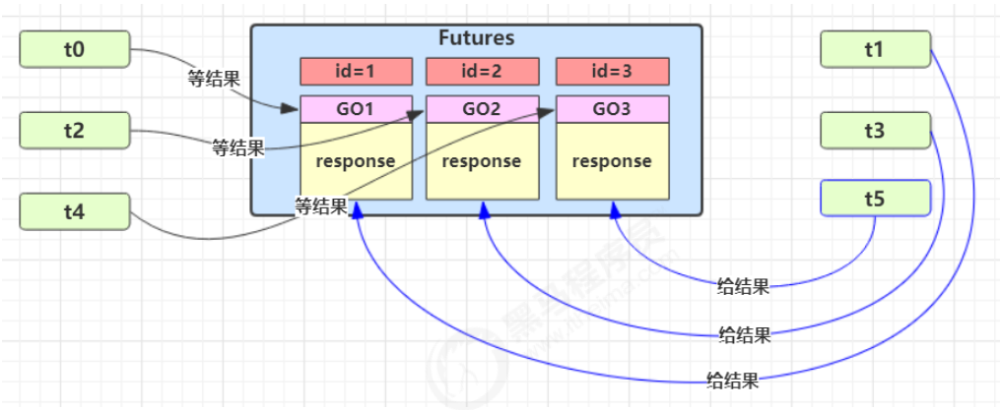
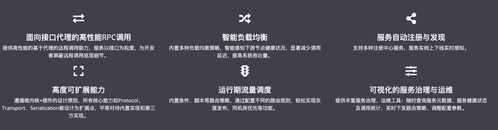

NettyRpcServer

ServiceProvider

```
NettyRpcServerHandler
@RpcService
SpringBeanPostProcessor
rpcClient
RpcServiceConfig
ServiceRegistry
RpcRequest
```


服务暴露

1. 从IOC中获取到NettyRpcServer，启动并监听9998端口
   * NettyRpcServer中通过SingletonFactory获取到ServiceProvider，用于进行服务注册
2. 服务暴露=服务注册+存入Map，两种方式，一种通过注解@RpcService完成暴露，一种直接使用ServiceProvider进行注册
   1. 通过注解@RpcService
      1. 在被暴露的服务类上添加@RpcService注解，前提该服务类被@Componen标识，能注入IOC容器
      2. 自定义SpringBeanPostProcessor，在被暴露的服务类Bean初始化前调用postProcessBeforeInitialization，该方法通过判断是否存在RpcService注解找到被暴露服务类Bean，将该Bean通过ServiceProvider注册到zk中，并存在本地Map里便于下次匹配使用
      3. 注册到zk的zkNode地址为/my-rpc/{rpcServiceName}+{group}+{version}/{inetSocketAddress}，且创建的是持久化节点，{group}+{version}两个参数在通过解析RpcService注解获得
   2. 直接注册
      1. 获取到NettyRpcServer后，直接调用其registerService方法，传入{rpcServiceName}+{group}+{version}/{inetSocketAddress}四个参数，ServiceProvider也可以直接根据参数注册
      2. 与注解方法不同之处在于，该方法存在本地Map的被暴露服务类就只是单纯的对象，而不是Bean


服务引用

1. 需要引用哪个服务，则像@Autowired一样注入该服务对应接口，只是将@Autowired改为自定义的@Reference

2. 自定义SpringBeanPostProcessor，在拥有注释了@Reference的属性的Bean被初始化后调用postProcessAfterInitialization方法

3. postProcessAfterInitialization方法利用反射获取到哪个属性被注释了@Reference，从而能获取到对应的接口类型，并且解析@Reference注解能够得到希望调用的是该接口的哪个{group}/{version}

4. {rpcServiceName}/{group}/{version}封装为一个RpcServiceConfig对象，与RpcRequestTransport一起传入RpcClientProxy，新建一个代理对象，并将该代理对象注入到该接口属性中

   1. RpcRequestTransport在SpringBeanPostProcessor创建时就作为final成员变量存在，且为单实例

   2. RpcRequestTransport是一个接口只有一个sendRpcRequest方法，通过SPI的方式进行初始化，SPI可以根据用户条件自动导入实现了该接口方法的类，类似IOC功能吧，Dubbo中用得很多，用于提供扩展性

   3. 在这里RpcRequestTransport导入的是NettyRpcClient

      

服务调用（调用端）

1. 调用远程服务的某个方法Method时，会触发代理对象的invoke方法
2. invoke方法将Method、参数args、以及之前绑定好的RpcServiceConfig中{rpcServiceName}/{group}/{version}封装为RpcRequest
3. 调用RpcRequestTransport（NettyRpcClient）的sendRpcRequest方法，将该请求发送到服务提供方进行调用
4. sendRpcRequest做的事情是
   1. 先根据RpcRequest的rpcServiceName，利用ServiceDiscovery获取zk中对应的zkNode的内容
      1. 地址为/my-rpc/{rpcServiceName}+{group}+{version}/，如果在服务暴露时暴露了同一个{rpcServiceName}+{group}+{version}多个地址{inetSocketAddress}，那么此时就能够获得{rpcServiceName}+{group}+{version}下多个{inetSocketAddress}
      2. 使用负载均衡器LoadBalance，在这多个{inetSocketAddress}选择一个作为targetUrl
         1. LoadBalance同样是根据SPI加载的，扩展性很好
   2. 有了targetUrl，使用ChannelProvider根据Url获取是否有现存Channel，有的话则复用，没有则新建
   3. 利用获取到的Channel就能够向服务器发数据了，由于TCP存在粘包拆包问题，因此需要以内容长度+内容的方式发送数据包，解析的时候先根据int大小解析长度，获得长度后在根据该长度读取内容，关键就在于解析，netty提供LengthFieldBasedFrameDecoder解决了，可以自定义Decoder的时候继承LengthFieldBasedFrameDecoder来完成，就不赘述。在本框架中，封装成了
   4. 那么发送完数据后，只需要等待服务器执行好结果，将结果返回到Channel中，此时会触发NettyRpcClientHandler()的channelRead方法，该方法再将返回的结果捕获即可
   5. 上述过程会存在一个问题，因为一个大服务进行RPC服务调用时，不仅仅只会调用一个服务，可能@Reference注入了多个远程服务的代理对象，但绑定的都是同一个Client，它们之间的调度就需要进行管理
      1. 可以采用多任务版的GuardedObject模式，在学习JUC的时候有了解到
      2. 
      3. 即，使用一个Futures存储池来管理所有的Future，只有当返回结果时才将其拿出并返回
      4. 在本框架中，使用UnprocessedRequests来完成这一功能，内部定义了一个```Map<String, CompletableFuture<RpcResponse<Object>>>```存储```<id,future>```
   6. 所以在sendRpcRequest时，先将接受返回值的resultFuture存入UnprocessedRequests中，其中包括了当前请求的id
   7. 触发NettyRpcClientHandler()的channelRead方法时，根据请求id获取到UnprocessedRequests中的resultFuture，最后将结果写入
5. sendRpcRequest是异步调用，直接返回一个resultFuture，调用resultFuture.get()方法阻塞等待服务器将结果返回
6. 获取到返回值后，该返回值就能够作为invoke的结果，也就是代理对象执行该方法得到的结果了
7. 完成远程调用

服务调用（被调用端）

1. 调用端将RpcRequest包装成RpcMessage通过建立好的channel发送到服务端
2. 触发NettyRpcServerHandler的channelRead方法，先将解码好的RpcMessage获取出RpcRequest，调用RpcRequestHandler的handle来处理RpcRequest
   1. 从RpcRequest中获取需要调用的方法名，通过ServiceProvider来根据方法名获取之前服务暴露时存在Map中的服务类，用该类处理RpcRequest
   2. 处理过程就很简单了，由于RpcRequest中包含了要调用的Method与args，只需要通过反射，根据Method名获取到该服务类中对应的方法，并利用反射将args传入并执行即可获得执行结果
3. 通过RpcRequestHandler获得执行结果后，就可以将结果封装成RpcResponse，通过RpcMessage再写入Channel中
4. 接着就触发NettyRpcClientHandler的channelRead方法，进入服务调用（调用端）的逻辑

至此，整个super-mini框架梳理完成

还差几部分没写

* RpcMessage的编解码器
* 心跳机制
* 序列化机制
* SPI实现可插拔用在了哪里


# 模拟面试

## 说说什么是RPC?你为什么要手写一个RPC框架？

RPC为Remote Procedure Call，远程过程调用，主要用于不在同一服务器上的服务互相调用，实现解耦

而目前大部分分布式应用框架都使用RPC进行远程调用，我想弄懂它的原理，并且巩固一下Spring和netty基础知识

## 你说你RPC框架类似Dubbo，那你先说说Dubbo有什么功能？架构是怎样的？



* 高性能的RPC调用
* 智能负载均衡
* 服务注册与发现
* 可扩展性强
* 可监控


其架构主要包括三大块，Consumer，Provider，Registry

Provider进行服务暴露注册到Registry中，Consumer通过服务引用可以从Registry中获取到Provider的地址并建立连接，通过该连接可以实现远程服务调用，除此之外还有提供了Monitor监控Consumer与Provider

## 那你是否知道Dubbo是如何实现这些功能的？底层原理是什么？

我粗略看过一遍源码，除了监控功能，其余功能知道一些大概

首先RPC调用是Dubbo最核心的功能，其中包括三大流程，分别为服务暴露，服务引用和服务调用

服务暴露指的是Provider注册到Registry这一过程

* 首先被暴露的Provider会被@Service注解进行标识
* Dubbo通过@Import注解往IOC中注入一个注册器，用于扫描@Service注解所标识的所有Provider，将其作为一个ServiceBean注入容器中
* 而ServiceBean中继承了ApplicationListener，其监听了onApplicationEvent事件，即在IOC初始化完成后监听到该事件，并执行暴露export方法
* export方法会完成Provider注册，并启动Netty服务器监听端口

服务引用指的是Consumer从Registry获取Provider地址并建立连接生成代理对象的过程

* 首先，像@Autowired一样使用@Reference注解，说明该属性是一个consumer
* 类似解析@Autowired一样，解析@Reference通过一个ReferenceAnnotationxxx，在当前Bean的注入属性过程中时完成@Reference的解析
* 解析过程主要就是根据该接口创建一个代理对象并注入到容器中
* 创建代理对象的过程中，可以通过接口类型从Registry中找到对应的zknode，从而获取相同接口的Provider地址
* 有了地址就能够创建一个netty客户端与其建立连接，该连接与代理对象绑定，代理对象称为invoker

服务调用指的是Consumer调用Provider这一过程

* Consumer调用具体方法时，相当于执行代理对象的invoke方法
* invoke方法先根据负载均衡器，从多个invoker中选择一个作为本次调用的invoker
* 利用该invoker将参数和方法发送到服务器完成调用
* 服务器根据请求找到对应的provider进行执行，返回结果


扩展性对应的是SPI机制

* dubbo强化了SPI机制，不同于原生JDK的SPI机制会根据接口创建并返回所有文件中定义好的实现类，而是根据需要返回单个实现类
* 提高了框架的扩展性

## 你说Dubbo的底层是Netty，那你对Netty了解多少？

Netty是一个基于NIO的网络编程框架，提供给用户更方便的NIO使用方式

源码我还没看，只能聊聊Netty整体架构，整个架构使用的是主从Reactor多线程模式，主Reactor称为Boss Group，从Reactor称为WorkerGroup，Group的意思是一组多线程的集合，多线程在该模式中被称为NioEventGroup，BossGroup的作用是接受请求，并根据每个请求生成一个NIOSocketChannel注册到WorkerGroup的NioEventGroup上，WorkerGroup负责注册在其上的所有Channel的响应，每个NioEventGroup都执行一个EventLoop，本质就是NIO编程中的Selcet轮询，监听到事件后，启动一个Worker执行响应的Handler

这种方式将非阻塞的IO发挥到了极致

## 你的基础不错，那你给我说说你自己写的框架怎么实现RPC功能的吧

我的框架流程也分为三个过程，服务暴露，服务引用和服务调用，同样也实现了注解开发

服务暴露

* 我通过自定义一个BeanPostProcessor并重写其初始化前方法，让Spring在初始化每个Bean之前查看其是否被@Service修饰，如果是，则将该Bean注册到zk中，并记录在一个Map里，并获取NettyServer的Bean，如果是第一次获取则会创建NettyServer的Bean，如果没有开启则开启，如果已经开启则略过

服务引用

* 服务引用的代码关键点在于，Connection什么时候建立，dubbo是在初始化容器时就建立了Connection，我暂时没有这么做，在初始化容器时，我只将全局唯一的Client绑定到代理对象中，方法真正调用时再建立Connection，当然，需要设计一个连接池来缓存已经建立的连接

* 我通过自定义一个BeanPostProcessor并重写其初始化后方法，让Spring在初始化每个Bean后查看其属性是否被@Reference修饰，如果是，则根据接口类型获取Bean，获取不到则为其创建代理对象并注册到容器中，最后将代理对象赋值给该属性
* 创建代理对象时，将全局唯一的客户端与该代理对象绑定

服务调用

* 代理对象创建时，定义invoke方法，该方法通过负载均衡器选出一个Channel进行使用，将被调用的Method与args作为消息体写入该channel
* 服务器的handler中，channelread会监听channel的read事件，监听到事件后将解析消息体，根据接口类型找到对应方法进行执行，再返回执行结果

难点与细节在于服务调用部分，主要是Netty相关的编写，还包括心跳机制，编解码器，序列化机制等，以及考虑自定义协议解决粘包与拆包问题，这部分跳出框架来聊会好聊一些

