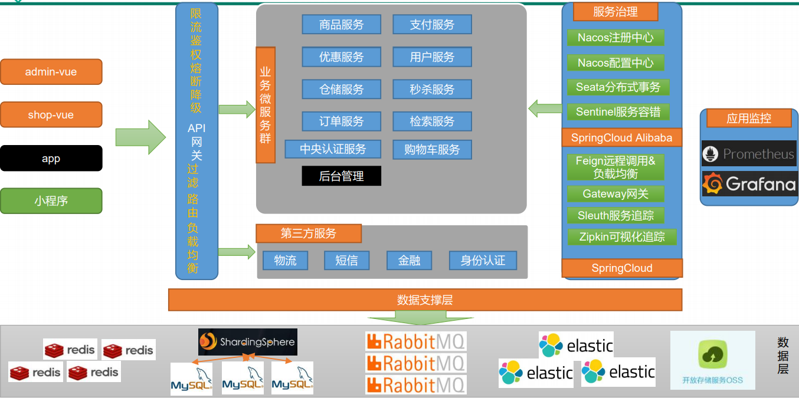

# 谷粒商城技术栈记录

##  1. 整体框架




## 2. 环境搭建

p6

> 好处

可以快速使用组件，省去搭建的烦恼，通过docker暴露相同端口，就可以直接通过访问虚拟机ip及端口号进行使用

> 流程

1. 使用vagrant创建linux虚拟机
2. linux安装docker
3. docker安装大部分组件
   * mysql
   * redis
   * elasticsearch
   * rabbitmq

## 3. 逆向工程

p17

> 好处

可以快速生成三层架构的代码，相当于整个代码模板自动生成，从而快速开发

> 流程

1. 通过renren-generator生成器，可以为每个服务对应的数据库生成基本的三层架构，可以对每个表进行相应的增删改查
2. 所以我们只需要在其上面进一步进行开发即可


## 4. 注册与配置中心及网关

p20


> 好处

由于是微服务架构，所以需要考虑多个服务如何协作，注册与配置中心相当于一个调度者，调度每个服务的协作

==注册中心==

* 将所有服务注册到注册中心，每个服务只通过服务名互相联系
  * 运行在某个端口上的服务A如果宕机了，由于高可用会有其他端口的服务A替代，这个过程对于其他服务是无感的，不会影响运行
* 网关可以直接通过服务名访问各个服务
* 一个注册中心能够把各个服务盘活，类似DNS与ip

==配置中心==

* 注册到注册中心的服务可以访问配置中心的配置，可以做到动态更新配置，不需要重新部署

==网关==

* 将网关注册到注册中心，就能够作为所有服务的入口，根据不同路径将请求分发给不同服务

* 同样也不需要考虑服务对应的端口号以及其他配置

* 还能完成统一配置，如限流，登录验证等

  

> 使用

注册中心和配置中心都用的```Alibaba nacos```，具体流程官方文档很清楚

网关用的是```Spring Cloud Gateway```，同样只需要将网关服务注册到注册中心，通过网关服务的路由配置，就能够对进来的请求进行分发

## 5. 远程调用

P22

> 好处

网关通过注册中心能够作为各个服务的入口，但服务之间如何互相协作呢？

就要靠```Spring Cloud OpenFeign```来进行相互调用，同样的，互相调用也只需要知道目标服务的名字即可，无需关注端口号

> 使用

## 网关解决跨域

P47

由于项目登录页地址为localhost:8001，而登录则会发送请求给网关localhost:88，此时端口号发生了变化，会被浏览器判断为跨域访问，遭到拒绝

> 跨域介绍

跨域：指的是浏览器不能执行其他网站的脚本。它是由浏览器的同源策略造成的，是浏览器对javascript施加的安全限制

同源策略：是指协议，域名，端口都要相同，其中有一个不同都是跨域

> 跨域流程


[跨域详解](https://developer.mozilla.org/zh-CN/docs/Web/HTTP/Access_control_CORS)

CROS: 跨源资源共享策略

* 只有当浏览器需要跨域时才会采用该策略
* 浏览器必须首先使用 [`OPTIONS`](https://developer.mozilla.org/zh-CN/docs/Web/HTTP/Methods/OPTIONS) 方法发起一个预检请求（preflight request），从而获知服务端是否允许该跨源请求。服务器确认允许之后，才发起实际的 HTTP 请求。在预检请求的返回中，服务器端也可以通知客户端，是否需要携带身份凭证
* 简单请求不会被认为是跨域

原因分析：登录等POST操作都不属于简单请求，因此被浏览器认为要跨域访问，所以会使用CROS策略判断是否可以跨域，如果不进行相关配置，则会被浏览器认为服务器不允许跨域访问而拒绝

> 解决方案

方案一 使用nginx部署为同一域（后面还会用到）


方案二 配置请求允许跨域

1. 往预检请求Option的返回体中添加响应头，即服务器告诉浏览器允许跨域，则浏览器会放行

2. 由于网关是所有服务的入口，因此只需要对网关地址进行跨域允许配置即可

3. 实操是往容器中注册一个```CorsWebFilter```

4. 那么服务器给Option请求的返回头中就会允许跨域

   ```java
   @Bean
       public CorsWebFilter corsWebFilter() {
           UrlBasedCorsConfigurationSource source = new UrlBasedCorsConfigurationSource();
   
           CorsConfiguration corsConfiguration = new CorsConfiguration();
   
           // 配置跨域
           corsConfiguration.addAllowedHeader("*");
           corsConfiguration.addAllowedMethod("*");
           // 允许所有来源跨域
           corsConfiguration.addAllowedOrigin("*");
           corsConfiguration.setAllowCredentials(true);
   
           source.registerCorsConfiguration("/**", corsConfiguration);
           return new CorsWebFilter(source);
       }
   ```


## 文件存储

P61

* 在分布式下存储，为了保证每个服务器数据的同步，无非两种做法
  * 数据同步复制
  * 存储到公共资源
* 文件存储一般采用存储到公共资源的方式，在这里使用云存储
  * 使用阿里云的OSS服务即可
  * 

存储流程

* 方案一：用户-》服务器-》OSS

  * 虽然能够保证OSS账号密码的安全，但服务器压力会增加
  * 

* 方案二：服务端签名后直传  

  * 这种方式将上传任务交给客户端，服务器只需要完成签名，效率高也安全
  * 

  

## ElasticSearch

P102

* 商城的检索功能需要满足
  * 查询速度快
  * 聚合速度快（将查询到的商品根据每个属性进行分组）
* 使用mysql进行查询的话
  * 速度不够快
  * 聚合也不够快
  * 性能有限
* 使用ElasticSearch
  * 基于内存，速度很快
  * 索引机制使得查询快并且聚合也快，有倒排表
* mysql适用于做持久化，ElasticSearch适合做检索，各司其职


## nginx搭建域名访问环境与动静分离

P139、P148

### 正向代理与反向代理


* 正向代理
  * 屏蔽客户端，访问互联网
* 反向代理
  * 屏蔽服务器，接受客户端
  * 只需反向代理服务器为公网IP，客户不会知道服务器地址
  * 
  * 转发效果

### 动静分离

* 静态资源太多，每次请求大部分带宽都耗费在了静态资源传输上
* 考虑将静态资源放在nginx中或者CDN中
* 

## 压力测试

P141

* 为什么要压力测试？指标？
  * 为了优化性能，最大化效率
  * 指标
    * SQL耗时越小越好，一般情况下微秒级别
    * 命中率越高越好，一般情况下不能低于95%
    * 锁等待次数越低越好，等待时间越短越好

* 怎么进行压力测试
  * Jmeter进行压测
    * 可模拟大并发访问
  * jconsole和jvisualvm观察JVM内存使用情况
    * 可以判断是否死锁
    * GC是否频繁
* 性能瓶颈会出现在哪里
  * 中间件越多越慢，性能大部分用于网络交互
  * 业务
    * DB（Mysql优化）
      * 多次重复查询等
  * 静态资源太多，没有动静分离
  * JVM
    * 内存过小，甚至会直接宕机
    * FullGC过于频繁，而该操作十分耗时
  * 没有使用缓存

## 本地缓存与分布式缓存

P151

### 原因

* 本地缓存
  * 每个服务器独立进行缓存，分布式场景下无法保证同步，不可取
* 分布式缓存
  * 要么同步并复制每个服务器的缓存，要么缓存到公共区域
  * 频繁的并发访问当然得采用后者，在此，缓存到 redis 中
  * 

### 高并发下缓存存在的问题

* #### 缓存穿透

  * 大量请求同时访问缓存不存在字段
  * 缓存不命中，访问数据库
  * 解决：
    * 为数据库中不存在的值缓存空值，并设置过期时间
      * 请求第一次访问，缓存不命中，数据库也不命中
      * 服务器为不命中的key设置空值缓存
      * 请求第二次访问，缓存命中，不会访问数据库
      * 下次数据库更新出了该字段，空值自动过期后，客户下一次请求即可在数据库命中，并缓存到缓存中
  * 

* #### 缓存击穿

  * 大量请求同时访问同一个缓存，该缓存前一秒刚好过期
  * 请求则并发访问到数据库，造成数据库压力骤增
  * 解决：
    * 加锁
  * 

* #### 缓存雪崩

  * 大量请求同时访问大量缓存，这批缓存同时过期
  * 解决：
    * 每个缓存设置随机的过期时间
  * 

* 穿透与击穿的区别

  * 穿透强调一个透，大面积地渗透进数据库
  * 击穿强调一个击，集中于某一点地击穿数据库

### 缓存一致性

* 双写模式
  * 数据更新时，同时更新缓存与数据库
  * 
* 失效模式
  * 数据更新时，更新数据库，删除缓存
  * 
* 解决方案
  * 

## 分布式锁

P158

### 本地锁在分布式场景下存在的问题

* 只能锁住当前线程操作数据库
* 让DB执行库粒度的锁，则并发大大降低
* 让DB执行表粒度的锁，则不便于业务编写
* 要在业务代码层完成锁只能使用分布式锁
* 

### 分布式锁的原理

* 所有服务都去redis中占锁
* 可以根据锁名控制锁的粒度，最大化并发效率
* 

### 分布式锁的演进

分布式锁必须保证以下几点

* 添加过期时间
* 占锁与添加过期时间必须为一组原子操作
* 占锁时添加UUID
* 

#### 第一阶段

---

* 占位不加过期时间
* 则占位后宕机无法解锁，锁仍存在，死锁


#### 第二阶段

---

* 占位+过期时间不是原子的
* 加过期时间前宕机，依旧死锁


#### 第三阶段

---

* 没有加uuid
* 被乱删锁


#### 第四阶段

---

* 先获取uuid确定是自己的锁，发送删除命令时由于网络延时卡住了
* 锁此时自动过期，别人抢到了锁
* 此时删除命令到达，将别人锁删除
* 故必须保证查询和删除的原子性，类似CAS


#### 第五阶段

---

* 不执行完业务不能释放锁，因此必须得考虑自动续期
* Redisson看门狗机制可以自动续期


## 异步编排

P193

* 执行查询业务时，需要调用多个服务进行查询
* 若A,B独立，然后到C，那么可以用异步将A,B并行执行

## 认证服务

P211

### 关键点

* 验证码防刷+重定向=防止表单重复提交
  * 使用阿里云的短信验证码服务
  * 如果只用重定向，则每次重定向还是会记录账号密码可以疯狂重复提交
  * 加了验证码，则每次重定向都需要不同的验证码，可以防止重复提交
* MD5&盐值
  * 每个字符串的MD5都不相同，用来保护用户信息
  * 但防止有人暴力枚举MD5的值破解密码，添加随机盐值再进行MD5
* 社交登录
  * 利用其他应用提供的API实现社交登录
  * OAuth2.0
  * 
* 单点登录
  * 在某个系统下登录账号，会自动同步到其他系统
  * 只需要使用一个认证中心来管理登录，每个系统登录时都向认证中心获取认证即可
  * 认证中心如果已经登陆过，则将token放到自己系统中
  * 

## 分布式Session

P226

### Session原理


* 要注意的是，服务器会管理一组session，而只会返回给浏览器sessionId，注意是id
* 所以我们可以在服务器的session中保存用户相关的信息，浏览器并不会获取到这部分信息
* 相当于浏览器下次访问，携带sessionId，tomcat会根据Id自动匹配到对应的session，并将其放入上下文，这样我们就可以直接从session中获取上次我们放进去的内容了
* 但tomcat管理session不会持久化，即服务若重启，session会被重置，那么浏览器携带的sessionId就匹配不上session了

### 分布式下session共享问题


* 分布式若还使用tomcat管理session
* 那么每个服务器独自管理session，负载均衡的请求到达不同服务器，session没有同步就能使用了

### 分布式session解决方案

#### 方案一

* session同步复制
* 

#### 方案二

* 客户端存储
* 

#### 方案三

* hash一致，即负载均衡时，客户请求上次被分配到哪个服务器，根据hash，下次还是会被分配到同一个
* 变相解决同步问题
* 

#### 方案四——最终方案

* 统一存储
* 
* 那么相当于session放在redis中，而不是tomcat自己管理
* 也就意味着，当tomcat重启后，浏览器的sessionId依然能够匹配到session，因为session在redis中
* SpringSession很好地给我们实现了这个功能，只需要开启SpringSession即可
* Spring在解析Controller参数时，就会自动将SpringSession替代原来的HttpSession

## ThreadLocal妙用

P239

* ThreadLocal能够让每个线程拥有自己的共享变量
* 即同一个线程能够从ThreadLocal中获取前一阶段放入的值，并且不同线程无法交叉获取
* 原理是用一个Entry<ThreadID，Object>进行存储，get的时候就看ThreadId是多少，返回对应的V即可
* 常用在下图流程，拦截器将用户信息放入ThreadLocal中，在service中能直接从ThreadLocal获取，保证线程安全，因为整个流程都是同一个线程执行的，在后面远程调用丢失请求头问题中，也用了ThreadLocal
* 

## Feign远程调用问题

P268

### 远程调用丢失请求头


* >  问题描述

  * order服务会使用Feign远程调用cart服务
  * 由于cart服务会先有登录拦截器对请求进行拦截，发现Feign传过来的请求并没有session
  * cart服务拒绝访问

* > 原因分析

  * feign在执行远程调用时会先新建一个空白请求，RequestTemplate
  * 然后遍历容器中的RequestInterceptor的apply方法
  * 上述过程相当于Feign将新建的请求直接转发给cart服务，所以没有session，无法登录

* > 解决办法

  * 自定义一个RequestInterceptor并注册到容器中
  * RequestInterceptor需要将老请求的session从一个ThreadLocal变量中拿出来，并放入Feign的新请求中。老请求的session是在执行order服务对应Controller时就被spring自动放入ThreadLocal变量中的
  * 那么Feign在远程调用时，新建的请求中就能够携带老请求的session完成登录验证了

---


### 异步调用丢失请求头


* > 问题描述

  * 使用异步优化远程调用方法时，尽管使用了上述方法但仍无法完成远程服务的登录验证

* > 原因分析

  * 如上图所示
  * 由于新请求是存在ThreadLocal中的，只能同一个线程进行访问
  * 那么异步之后就导致interceptor无法从ThreadLocal中获取到老请求

* > 解决办法

  * 编写异步调用方法时，将主线程的老请求set到自己线程的ThreadLocal中

代码编写细节还是看视频吧，在这部分又一次体会到**ThreadLocal的巧妙之处，主要作用就是同一线程会从Controller调到Service甚至Feign，将需要传递的数据放在ThreadLocal中就能让代码变得优美，并且使用简单**

## RabbitMq消息队列

P248

### 介绍

> 流程图


* Exchange根据route-key将消息转发到对应的Queue中，Consumer通过Channal与Queue建立连接并进行消费

> 消息确认机制——可靠抵达


* 确认模式需要手动进行配置开启，默认不开启
* confirmCallback：消息从 p->b **成功**了，则回调 confirmCallback 方法
* returnCallback：消息从 e->q **失败**了，回调 returnCallback 方法
* ack机制：
  * 默认自动ack：consumer即使消费过程中宕机了，也会自动向Broker确认消息已消费
  * 开启手动ack：只有consumer调用相应的ack方法才会向Broker确认消息已消费

**MQ的消息确认机制给后续分布式事务提供了可靠消息的保障**

---


### 消息队列的作用

> 系统解耦


> 异步调用


> 限流


## 分布式原理

P286

> CAP定理

* 一致性（Consistency）
  * 在分布式系统中的所有数据备份，在同一时刻是否同样的值
* 可用性（Availability）
  * 在集群中部分节点故障后，集群整体是否还能响应客户端的读写请求
* 分区容错性（Partition tolerance）
  * 大多数分布式系统都分布在多个子网络，每个子网络就叫做一个区
  * 能否充分利用集群每个区
  * 即时通信中断也不需要舍弃

CAP原则指的是，这三个要素最多只能同时实现两点，**不可能三者兼顾**

在分布式系统中，必须保证分区容错性，不然就不叫分布式了，所以只能有CP或者AP，以下图情况为例说明两者区别，此时A与C通信中断


* CP（一致性和分区容错性）
  * 保证容错性意味着ABC三个节点都能够被访问
  * 保证一致性则要求客户端访问ABC三个节点获得相同的值
  * 那么由于C与A通信中断，存储内容不同步，为了保证一致性，只能让整个系统不可用，这样客户访问每个节点返回都是失败
  * 所以可用性不可兼得
* AP（可用性和分区容错性）
  * 保证容错性意味着ABC三个节点都能够被访问
  * 保证可用性则要求系统必须可用
  * 那么客户端访问A\C会得到不同的数据，失去一致性
  * 所以一致性不可兼得
* 分布式系统中实现一致性的raft算法  

对于多数大型互联网应用的场景，主机众多、部署分散，而且现在的集群规模越来越大，所以节点故障、网络故障是常态，而且要**保证服务可用性达到99.9999%，即AP**

因此在大部分互联网分布式设计中，**保证AP并保证最终一致性**，原来的C表示强一致性

>BASE理论

对CAP理论的延伸，思想是即使无法做到强一致性，但可以采用适当的措施保证弱一致性，即最终一致性

BASE是指

* 基本可用（Basically Available)
  * 分布式系统在出现故障时，允许损失部分可用性，或者说损失性能的可用性
  * 如响应时间上的损失：
    * 正常情况下搜索引擎需要在0.5秒内返回用户查询结果，但由于故障（断电或者断网），查询的响应时间增加到1~2秒
  * 功能上的损失：
    * 购物网站在购物高峰（如双十一）时，为了保护系统的稳定性，部分消费者可能会被引导到一个降级页面，如繁忙操作页面
* 软状态（Soft State）
  * 软状态是指允许系统存在中间状态，而该中间状态不会影响系统整体可用性
  * 如分布式存储中一般一份数据会有多个副本，允许不同副本的延时同步就是软状态
* 最终一致性（Eventual Consistency）
  * 指系统中的所有数据副本经过一定时间后，最终能够达到一致的状态

后面会提到分布式事务的解决方案中，后两者是满足BASE的

> Raft算法

稍微记录一下分布式系统中保持一致性的raft算法，在很多分布式组件中都能看到该算法的思想

这里的一致性指的是最终一致性，因为在demo的log repilication演示部分，可以看到，当集群两个区不能通信时，会出现两个Leader，客户端访问两个Leader获得的响应肯定是不一样的，所以不能保证强一致性，但若通信恢复了，raft算法能够让集群又恢复一致性，可谓最终一致。所以保证的是AP和最终一致。

[demo模拟](http://thesecretlivesofdata.com/raft/)

主要分为两部分

* Leader Election 领导选举
  * 每个节点有一个自旋时间
  * 如果在自旋时间内都没有Leader向其发送消息，则认为当前没有Leader，节点结束自旋后将自身变为candidate
  * 成为candidate的节点向其他节点发送消息，要求他们给自己投票，最终得票数大于总数一半的candidate成为新的leader
  * leader向其余节点持续发送心跳，告知他们leader已存在，并确认他们的存活，其余节点称为follower
* Log repilication 日志复制
  * 客户端对集群的操作都会发给leader，如update id=8
  * leader不会先执行和提交该操作，而是先将操作指令通过心跳发送给follower
  * follower接到操作后发送ack给leader
  * leader收到的ack超过半数后可以进行执行和提交，并发送可以提交的命令给follower，以及将结果返回客户端


## 分布式事务

P284

> 业务场景与问题


业务流程如上图所示，订单服务需要依次调用两次远程服务才能完成整个逻辑

**事务保证**

* 本地事务+异常处理
  * 订单服务异常，后面两个服务都未执行，订单服务自行回滚
  * 库存服务异常，自行回滚，订单服务进行异常捕获，也能够回滚
* 问题
  * ==远程服务假失败：==
    * 库存服务执行成功，但由于网络异常导致订单服务没有接受到成功信号，判断库存异常，订单回滚
  * ==用户服务失败：==
    * 库存服务执行成功，用户服务执行失败，用户服务自行回滚，订单服务捕获异常也回滚
    * 但库存服务不会回滚

### 分布式事务几种解决方案

> 2PC 模式（两段式）


以阿里的```SEATA```为例 http://seata.io/zh-cn/docs/overview/what-is-seata.html

* TC作为一个总的事务管理器，负责管理子事务
* RM\TM为子事务管理器，负责处理每个服务的事务
* 子事务管理器需要先注册到TC中
* 只有当所有子事务管理器都成功提交后，TC才认为整个分布式事务提交
* 如果其中有一个子事务管理器失败了，那么会通知TC，TC会让所有子事务管理器回滚

这种方法TC需要一直等待事务完成，并且用了锁（去官网具体了解），因此不适合高并发场景

> 柔性事务

刚性事务：遵循ACID原则，强一致性

柔性事务：遵循BASE理论，最终一致性

柔性事务允许一定时间内，不同节点的数据不一致，但要求最终一致

* TCC事务补偿型
* 最大努力通知型
  * 按规律进行通知，不保证数据一定能通知成功，但会提供可查询操作接口进行核对
* 可靠消息+最终一致性（异步确保型）
  * 延时队列，自行回滚

> 最终方案——消息队列


库存服务锁定成功后发给消息队列消息（当前库存工作单），过段时间自动解锁，解锁时先查询订单的支付状态。解锁成功修改库存工作单详情项为已解锁。

下一章节会具体介绍

## RabbitMQ实现延时队列

P292

> 业务场景与问题


延时队列是用来执行定时任务的，而定时任务可以变相地完成分布式事务的需求，虽然只能保证最终一致性，但在高并发场景下有很好的效率

**定时任务如何解决分布式事务？**

* 订单服务创建了订单后调用库存服务锁库存
* 库存服务只需要再执行一个定时任务，如在30分钟后检查该订单是否被支付
* 如果没有则自行解锁库存
* 从而能够变相完成回滚的操作

**为什么要使用延时队列？**

* Spring定时任务存在的问题
  * 如果库存服务使用Spring的定时任务来轮询订单是否过期，意味着即使没有订单了，也会进行轮询
  * 这会使得资源利用率下降，效率变低
  * 并且定时任务无法保证检查订单的时效性，如下图，设置30分钟的轮询间隔，订单却在60分钟后被扫到
  * 
* 延时队列的优点
  * 资源利用率高。有多少订单，库存服务就检查多少次订单是否过期，不会像上述做无用功
  * 时效性强。订单过期时间一到，立刻能够启动线程去检查是否过期

---


### 延时队列的实现

使用```RabbitMQ```实现延时队列

> 核心思想


* 生产者将消息放入Queue1中，并设置过期时间，消息过期后转发到Queue2
* 此时消费者监听Queue2，就能够捕获到消息，执行定时任务

> 实现一


* x-dead-letter-exchange：指定了消息过期死亡后被分发到哪个Exchange
* x-dead-letter-routing-key：通上，保证死信能够分发到Exchange
* x-message-ttl：设置队列过期时间TTL，经过TTL该队列内消息会过期

P将消息发送至delay.5m.queue后，经过TTL会变成死信，由delay.exchange转发到test.queue中，从而C监听到消息执行定时任务

> 实现二


* expiration：消息过期时间TTL

> 最终流程图


延时队列就是分布式事务解决方案中的第四个方案：**柔性事务——可靠消息+最终一致性方案**

要想通过这种模式保证事务，保证最终一致性，前提是**可靠消息**，那么如何保证可靠消息？

---


### 如何保证消息的可靠性

> **消息丢失**

**丢失场景**

* 消息发送出去，由于网络问题没有抵达服务器
* 消息抵达Broker，Broker要将消息写入磁盘（持久化）才算成功。此时Broker未持久化完成，宕机
* 自动ACK的状态下，消费者收到消息，但没来得及消费然后宕机

**解决方案**

* 如何发现丢失
  * 创建一个消息状态日志记录数据库，每个消息是否都被服务器收到或者被消费都应该记录（其实就类似kafka的offset管理）
  * 在前面MQ的学习中，我们知道MQ有消息确认机制，通过执行每个步骤的回调方法，更新数据库中消息状态，就能够知道消息在什么时候丢失
  * 启动手动ack，避免消费者宕机导致MQ默认已消费
* 如何解决丢失
  * 定期扫描消息记录表，将未抵达的消息重发
* 由于保证消息丢失需要写不少代码，建议独立成一个消息服务

> 消息重复

**丢失场景**

* 消息消费成功，事务已经提交，ack时，机器宕机，导致没有ack成功，Broker的消息重新由unack变为ready，并发送给其他消费者
* 消息消费失败，由于重试机制，自动又将消息发送出去

**解决方案**

* 消费者的业务消费接口应该设计为幂等性的，重复操作都没问题
* 使用防重表

> 消息积压

**丢失场景**

* 消费者宕机
* 消费者消费能力不足
* 发送者发送流量太大

**解决方案**

* 上线更多消费者
* 上线专门的队列消费服务，先将消息批量取出来，记录数据库，离线慢慢处理
* 控制发送速度

---

**保证消息的可靠性最重要的就是防止消息丢失**


## 秒杀系统

P311

先记录流程与关键点，自己实现一个demo

### 秒杀业务

1. 秒杀商品上架到缓存中，而不是从数据库中拿，库存也上架到库存中
   * 将库存数设置为信号量
   * 每次减库存请求过来会减去一个信号量，意味着如果库存设置的信号量有100个，10000个请求过来只会有100个请求能够继续执行，剩下的可以立刻返回客户端无库存（限流）
   * 这与ThreadExcutorPool源码中，addWorker逻辑很类似，先占坑再执行逻辑是效率最高的
   * 这意味着先减库存再执行业务比先执行业务再减库存要高效得多
   * 随机码。为了防止被客户提前减库存，信号量要携带一个随机码
2. 利用定时任务完成秒杀商品上架（异步提交）
3. 分布式框架进行定时任务上架时，会存在重复上架的问题，加分布式锁
4. 

